# Event Handling

<details>
<summary>Relevant source files</summary>

The following files were used as context for generating this wiki page:

- [GlobalVariate.h](GlobalVariate.h)
- [MainWidget.cpp](MainWidget.cpp)
- [MainWidget.h](MainWidget.h)

</details>


## Purpose and Scope

This document describes the event handling architecture in the new-aoe game engine, focusing on how user input (mouse and keyboard) is captured, processed, and routed to appropriate game systems. Event handling is primarily managed through a global `EventFilter` system that intercepts Qt events and provides a unified interface for mouse state queries. The system supports both gameplay interaction and an integrated map editor with multiple selection modes.

For information about how events trigger game actions and commands, see [SelectWidget and Command Panel](#4.1). For rendering and visual feedback of selections, see [Rendering and Display](#4.3).

---

## System Architecture

The event handling system follows a layered architecture where Qt's native event system feeds into a custom `EventFilter` singleton, which is then polled by various subsystems:

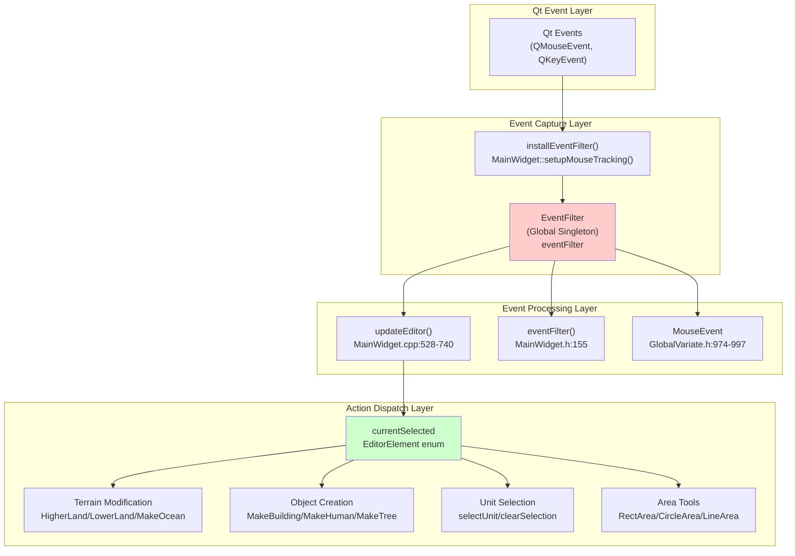

**Sources:** [MainWidget.cpp:528-740](), [MainWidget.h:155](), [GlobalVariate.h:258](), [GlobalVariate.h:974-997]()

---

## Global EventFilter System

The `EventFilter` class is a global singleton that captures all Qt events and provides a simple polling interface for mouse state queries.

### EventFilter Interface

The filter exposes the following key methods:

| Method | Return Type | Description |
|--------|-------------|-------------|
| `MouseX()` | int | Current mouse X position in global coordinates |
| `MouseY()` | int | Current mouse Y position in global coordinates |
| `LeftMousePress()` | bool | True if left mouse button is currently held down |
| `LeftMouseClicked()` | bool | True if left mouse button was clicked this frame |
| `RightMousePress()` | bool | True if right mouse button is currently held down |

The global instance is declared as `extern EventFilter *eventFilter` and initialized before the main game loop begins.

### EventFilter Installation

The filter is installed on the `GameWidget` during `MainWidget` initialization:

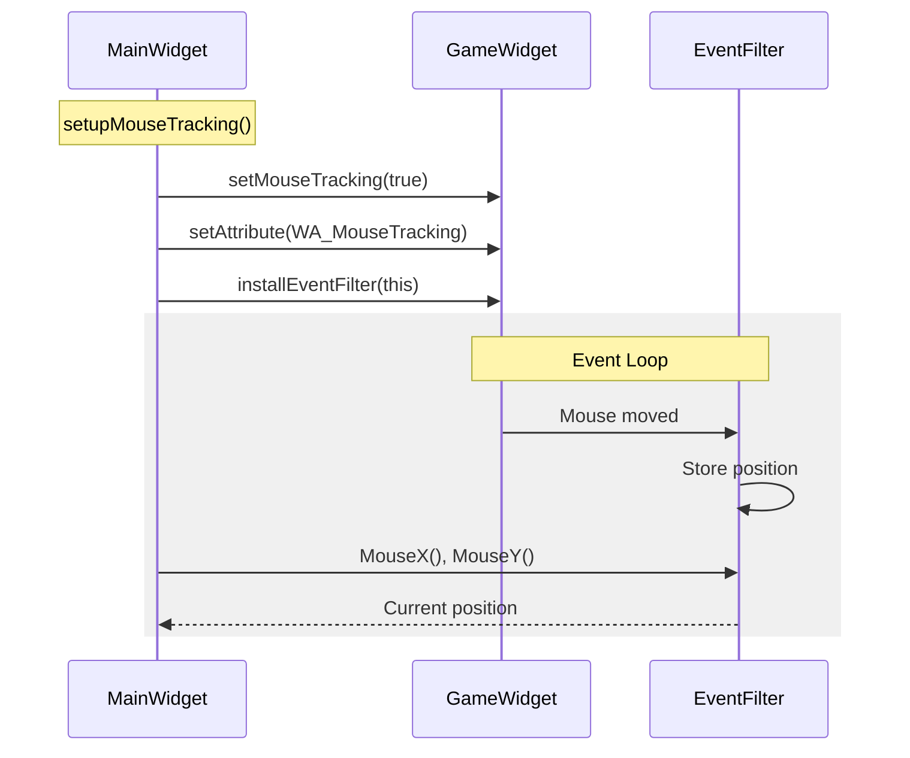

**Sources:** [MainWidget.cpp:1440-1445](), [MainWidget.h:258](), [GlobalVariate.h:258]()

---

## Mouse Event Processing

Mouse events are processed through two main pathways: editor mode and gameplay mode.

### Coordinate Transformation

Mouse positions are captured in global Qt coordinates and transformed into game world coordinates:

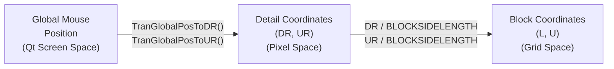

The transformations occur in the `updateEditor()` function:

- Line 538: `double DR = ui->Game->TranGlobalPosToDR(eventFilter->MouseX(), eventFilter->MouseY())`
- Line 539: `double UR = ui->Game->TranGlobalPosToUR(eventFilter->MouseX(), eventFilter->MouseY())`
- Lines 540: `int L = DR / BLOCKSIDELENGTH, U = UR / BLOCKSIDELENGTH`

### Mouse State Queries

The `updateEditor()` function polls the `EventFilter` to determine mouse state:

| Check | Line | Purpose |
|-------|------|---------|
| `eventFilter->LeftMousePress()` | 543 | Detect drag operations for terrain editing |
| `eventFilter->LeftMouseClicked()` | 581 | Detect single clicks for object placement |
| Bounds check `L < 0 \|\| L >= MAP_L \|\| U < 0 \|\| U >= MAP_U` | 541 | Ensure mouse is within map boundaries |

**Sources:** [MainWidget.cpp:538-541](), [MainWidget.cpp:543](), [MainWidget.cpp:581]()

---

## Editor Mode Event Handling

The editor mode processes mouse events through a state machine controlled by the `currentSelected` variable, which holds one of the `EditorElement` enum values.

### EditorElement State Machine

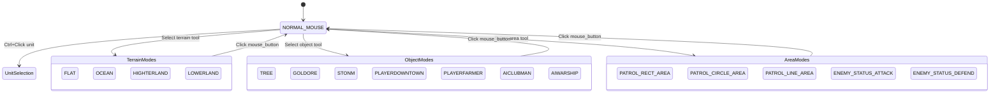

The `EditorElement` enum defines 50+ possible selection states including terrain types, building types, unit types, resource types, and area selection modes.

### Event Dispatch by State

The `updateEditor()` function contains two main switch statements that dispatch events based on `currentSelected`:

#### Drag Operations (Lines 548-575)

When the left mouse button is held down:

| State | Action Function | Description |
|-------|----------------|-------------|
| `HIGHTERLAND` | `HigherLand()` | Raise terrain height in 3x3 area |
| `LOWERLAND` | `LowerLand()` | Lower terrain height in 3x3 area |
| `OCEAN` | `MakeOcean()` | Convert terrain to ocean |
| `FLAT` | `MakeGrassland()` | Convert terrain to grassland |
| `DELETEOBJECT` | `clearArea()` | Remove all objects in area |
| `NORMAL_MOUSE` | No action | Prevent accidental editing |

#### Click Operations (Lines 606-724)

When the left mouse button is clicked once:

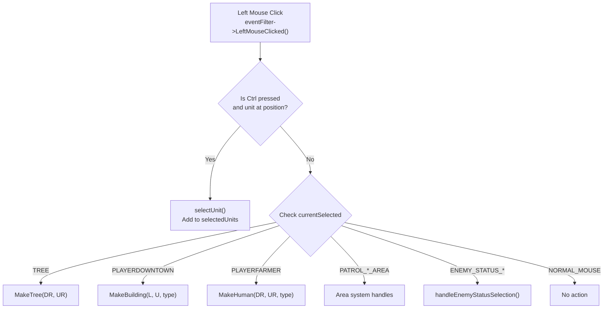

**Sources:** [MainWidget.cpp:548-575](), [MainWidget.cpp:606-724](), [MainWidget.h:80-129]()

---

## Area Selection Tools

The game supports three types of area selection for defining patrol zones and unit behavior limits:

### Area Types and Classes

| Area Type | Class | Global Instance | Purpose |
|-----------|-------|----------------|---------|
| Rectangular | `RectArea` | `g_rectArea` | Define rectangular patrol/limit zones |
| Circular | `CircleArea` | `g_circleArea` | Define circular patrol/limit zones |
| Freeform Line | `LineArea` | `g_lineArea` | Define curved path patrol zones |

Global instances are declared at [MainWidget.cpp:14-16]():

```cpp
RectArea* g_rectArea = nullptr;
CircleArea* g_circleArea = nullptr;
LineArea* g_lineArea = nullptr;
```

### Area Drawing System

The area drawing system activates when the user selects a patrol area mode from the editor UI. The system works as follows:

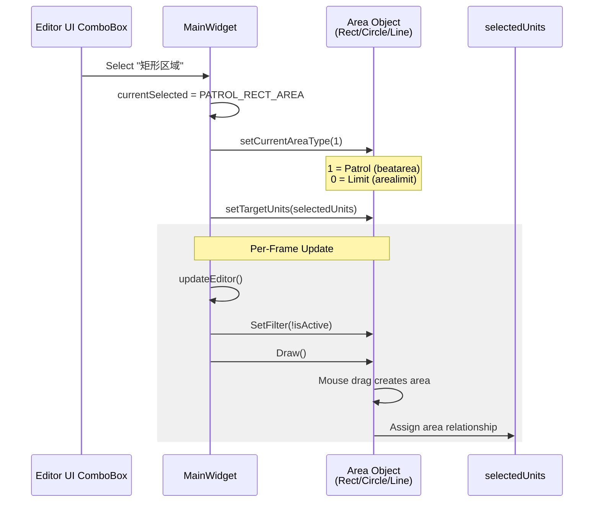

The activation logic at [MainWidget.cpp:727-736]() conditionally filters and draws each area type:

```cpp
bool isRectAreaActive = (currentSelected == RECT_AREA || currentSelected == PATROL_RECT_AREA);
bool isCircleAreaActive = (currentSelected == CIRCLE_AREA || currentSelected == PATROL_CIRCLE_AREA);
bool isLineAreaActive = (currentSelected == LINE_AREA || currentSelected == PATROL_LINE_AREA);

rectArea->SetFilter(!isRectAreaActive);
rectArea->Draw();
circleArea->SetFilter(!isCircleAreaActive);
circleArea->Draw();
lineArea->SetFilter(!isLineAreaActive);
lineArea->Draw();
```

**Sources:** [MainWidget.cpp:14-16](), [MainWidget.cpp:236-255](), [MainWidget.cpp:727-736]()

---

## Input Processing Pipeline

The complete input processing pipeline from hardware event to game action:

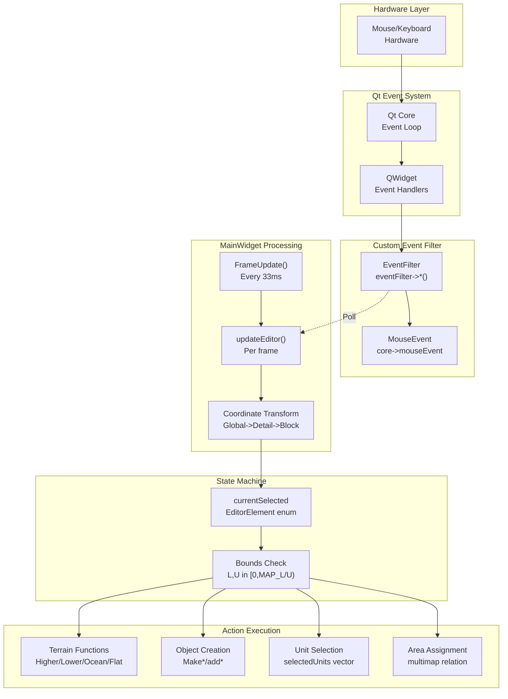

### Frame-Based Processing

Input is processed once per game frame in the `FrameUpdate()` slot, which is triggered by a `QTimer` at 30 FPS (33ms intervals):

1. Timer triggers `FrameUpdate()` [MainWidget.cpp:1379]()
2. If editor mode: `updateEditor()` is called
3. Mouse state is polled from `EventFilter`
4. Coordinates are transformed to game space
5. Actions are dispatched based on `currentSelected` state
6. Game state is updated and rendered

**Sources:** [MainWidget.cpp:1372-1380](), [MainWidget.cpp:528-740]()

---

## Unit Selection System

The unit selection system allows players to select enemy units in editor mode for assigning patrol areas and behavior states.

### Selection State Management

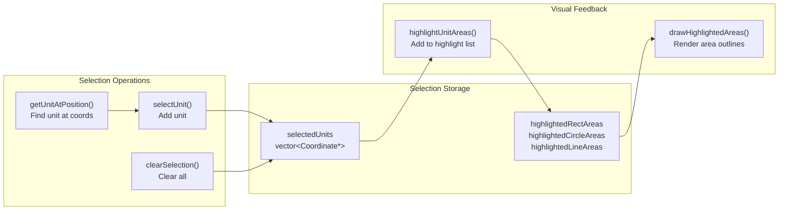

### Multi-Selection with Ctrl Key

The system supports multi-selection using the Ctrl modifier key [MainWidget.cpp:586-597]():

```cpp
bool isCtrlPressed = QApplication::keyboardModifiers() & Qt::ControlModifier;
Coordinate* clickedUnit = getUnitAtPosition(DR, UR);

if (clickedUnit && clickedUnit->getPlayerRepresent() == 1 && 
    (currentSelected == NORMAL_MOUSE || /* other valid states */)) {
    selectUnit(clickedUnit, isCtrlPressed);
    return;
}

if (!clickedUnit && !isCtrlPressed) {
    clearSelection();
}
```

**Behavior:**
- **Click without Ctrl**: Select single unit, clear previous selection
- **Click with Ctrl**: Add unit to existing selection
- **Click empty space without Ctrl**: Clear all selections
- **Click empty space with Ctrl**: Maintain current selection

### Selection Restrictions

Only enemy units (player index 1) can be selected in editor mode. The check at line 590 ensures:

```cpp
if (clickedUnit && clickedUnit->getPlayerRepresent() == 1 && /* ... */) {
    selectUnit(clickedUnit, isCtrlPressed);
}
```

This allows map creators to assign AI behaviors to enemy units without affecting player units.

**Sources:** [MainWidget.cpp:586-603](), [MainWidget.h:69-70](), [MainWidget.h:191-200]()

---

## Keyboard Modifiers

The system uses Qt's keyboard modifier detection to alter mouse click behavior:

### Modifier Detection

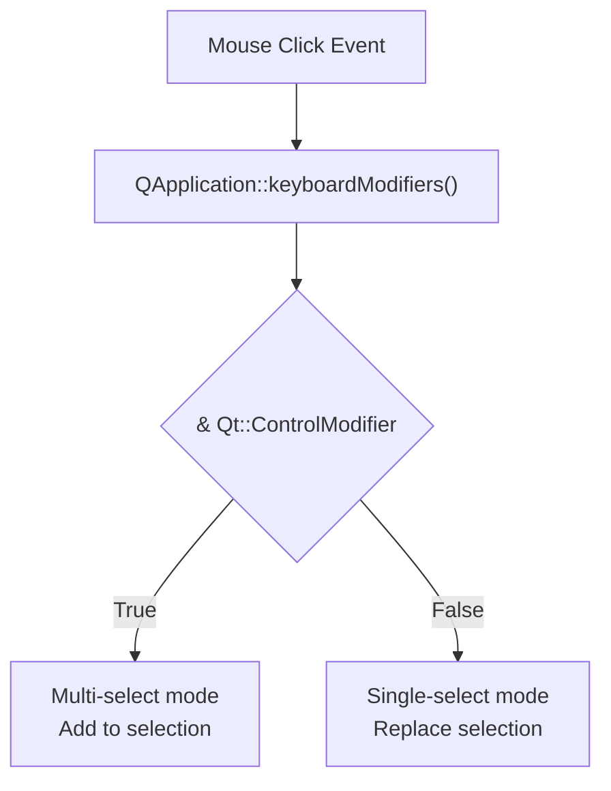

The modifier query is performed at [MainWidget.cpp:586]():

```cpp
bool isCtrlPressed = QApplication::keyboardModifiers() & Qt::ControlModifier;
```

Qt's `QApplication::keyboardModifiers()` returns a bitfield of currently pressed modifier keys, which is then masked with `Qt::ControlModifier` to detect Ctrl key state.

### Supported Modifiers

| Modifier | Qt Constant | Current Use |
|----------|-------------|-------------|
| Ctrl | `Qt::ControlModifier` | Multi-unit selection in editor |
| Shift | `Qt::ShiftModifier` | *(Not currently used)* |
| Alt | `Qt::AltModifier` | *(Not currently used)* |

**Sources:** [MainWidget.cpp:586]()

---

## Editor UI Integration

The editor UI connects to the event system through Qt signal/slot connections established during `MainWidget` construction.

### ComboBox Signal Connections

Each editor UI combo box emits `currentIndexChanged` signals that set the `currentSelected` state:

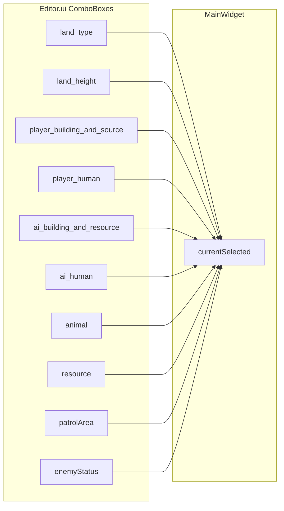

Example connection at [MainWidget.cpp:164-170]():

```cpp
connect(editor->ui->land_type, QOverload<const QString&>::of(&QComboBox::currentIndexChanged), 
    this, [=](const QString& text) {
        if (text == "草地") this->currentSelected = FLAT;
        else if (text == "海洋") this->currentSelected = OCEAN;
        if (text != "地皮类型") call_debugText("green", " " + text, 0);
    });
```

### Mode Reset Button

The `mouse_button` QPushButton resets the system to normal mouse mode [MainWidget.cpp:271-274]():

```cpp
connect(editor->ui->mouse_button, QPushButton::clicked, this, [=]() {
    this->currentSelected = NORMAL_MOUSE;
    call_debugText("green", " 普通鼠标模式", 0);
});
```

**Sources:** [MainWidget.cpp:164-275]()

---

## Event Filtering and Capture

The `MainWidget::eventFilter()` override intercepts events before they reach child widgets:

### Event Filter Override

```cpp
bool MainWidget::eventFilter(QObject *watched, QEvent *event) {
    // Process specific event types
    // Return true to block propagation, false to allow
}
```

This function is declared at [MainWidget.h:155]() and installed on multiple widgets during initialization:

- `ui->Game->installEventFilter(this)` [MainWidget.cpp:1444]()
- `acts[i]->installEventFilter(this)` [MainWidget.cpp:1354]() for each action button

### Event Flow Control

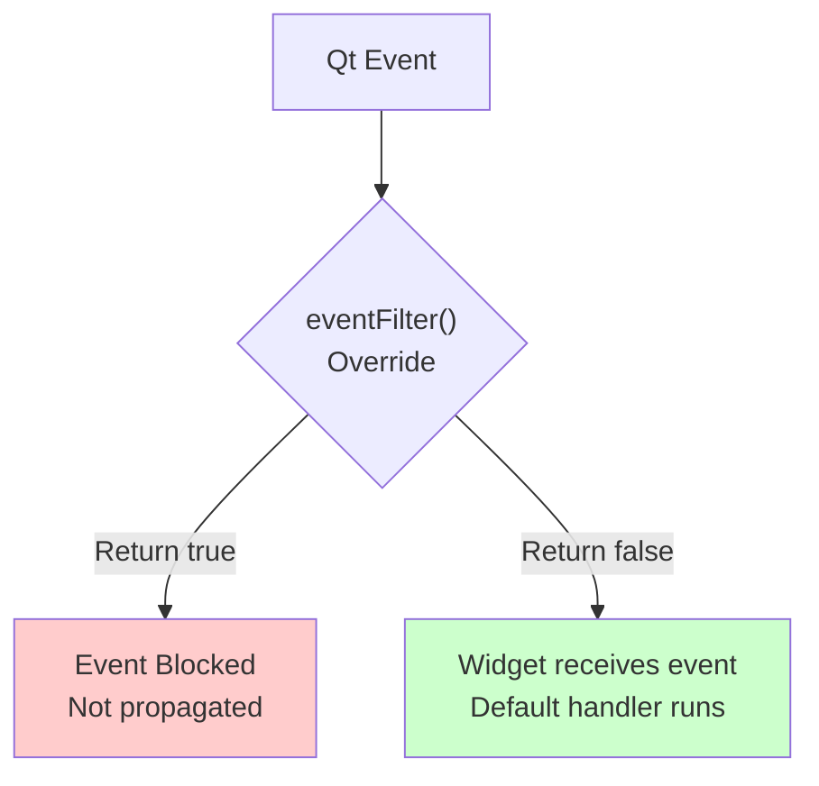

This allows `MainWidget` to intercept and potentially block events before they reach specific widgets, enabling global event handling logic.

**Sources:** [MainWidget.h:155](), [MainWidget.cpp:1354](), [MainWidget.cpp:1444]()

---

## Performance Considerations

### Event Polling vs Event-Driven

The system uses a **polling model** rather than purely event-driven:

**Advantages:**
- Predictable frame timing (30 FPS fixed)
- No race conditions between event handlers
- Simple state synchronization
- Consistent with game loop paradigm

**Trade-offs:**
- 33ms input latency (one frame delay)
- Continuous CPU polling even when idle
- Mouse position sampled rather than tracked continuously

### Frame Budget

With a 33ms frame time:
- Event processing: ~2-5ms
- Coordinate transformation: <1ms
- State machine dispatch: <1ms
- Action execution: Variable (5-20ms for terrain modification)

The `updateEditor()` function must complete within the frame budget to maintain 30 FPS.

**Sources:** [MainWidget.cpp:1376]()

---

## Summary Table

| Component | File Location | Key Functions | Purpose |
|-----------|---------------|---------------|---------|
| EventFilter | GlobalVariate.h:258 | `MouseX()`, `MouseY()`, `LeftMousePress()`, `LeftMouseClicked()` | Global mouse state capture |
| MainWidget::updateEditor | MainWidget.cpp:528-740 | Event processing loop | Dispatch mouse events to actions |
| MouseEvent | GlobalVariate.h:974-997 | `GetDR()`, `GetUR()`, `SetMouseEventType()` | Store processed mouse event data |
| currentSelected | MainWidget.h:67 | EditorElement enum | State machine for editor modes |
| Area Selection | MainWidget.cpp:14-16 | `SetFilter()`, `Draw()`, `setTargetUnits()` | Draw and assign patrol/limit areas |
| Unit Selection | MainWidget.h:70 | `selectUnit()`, `clearSelection()`, `getUnitAtPosition()` | Multi-select enemy units for editing |