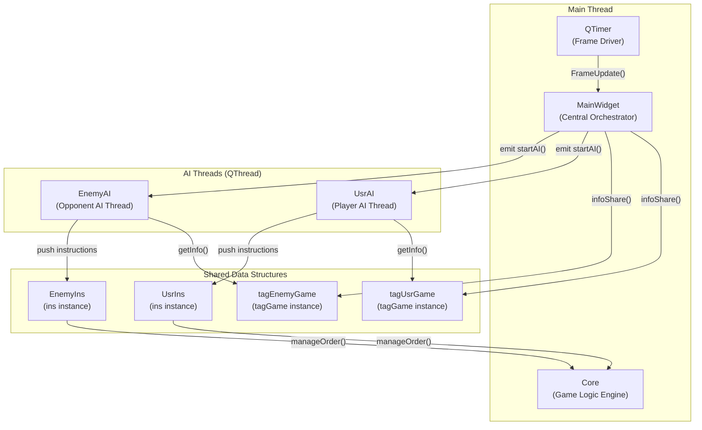
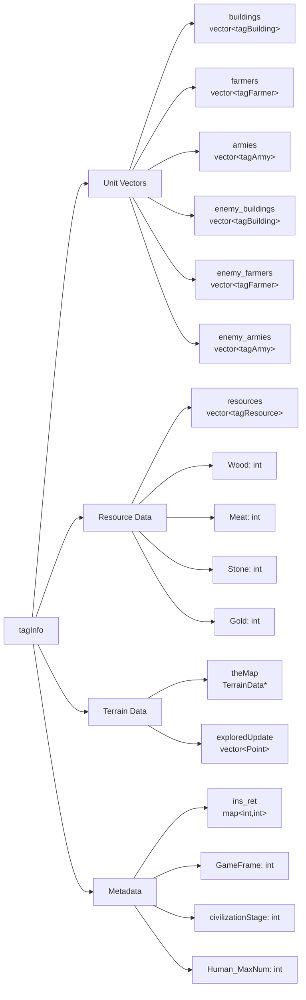
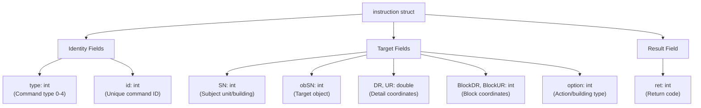
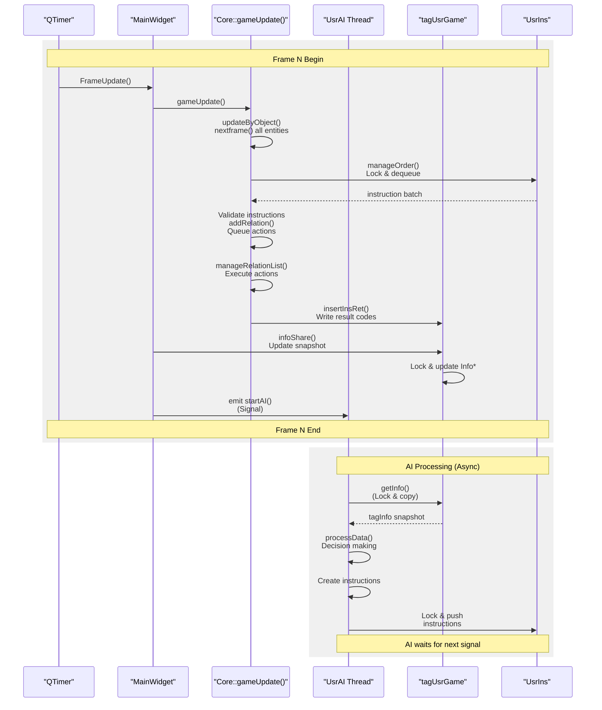

# AI System

<details>
<summary>Relevant source files</summary>

The following files were used as context for generating this wiki page:

- [GlobalVariate.h](GlobalVariate.h)
- [UsrAI.cpp](UsrAI.cpp)

</details>


## Purpose and Scope

This document describes the artificial intelligence architecture in the new-aoe codebase, including the threaded AI design, command processing, and synchronization mechanisms. The AI System enables computer-controlled players to make decisions and issue commands to their units and buildings.

For information about the game loop and frame updates that drive AI execution, see [MainWidget and Game Loop](#2.1). For details about the command system that players use (which shares structures with AI commands), see [SelectWidget and Command Panel](#4.1).

**Sources:** High-level Diagram 5 (AI and Instruction System)

---

## AI Architecture Overview

The AI System employs a threaded architecture where AI players run as separate `QThread` instances, completely isolated from the main game loop. This design prevents AI computation from blocking rendering or input processing while ensuring game state integrity through strict synchronization.

### Thread Structure



**Sources:** High-level Diagram 5, [GlobalVariate.h:914-972](), [UsrAI.cpp:7-8]()

### AI Base Classes

| Class | Type | Purpose | Key Methods |
|-------|------|---------|-------------|
| `UsrAI` | `QThread` subclass | Controls player (human) side AI | `processData()` |
| `EnemyAI` | `QThread` subclass | Controls opponent AI | `processData()` |
| AI Base | `QThread` | Common base class (assumed) | Thread lifecycle management |

Each AI thread has a corresponding global instance:
- `tagUsrGame` - Game state snapshot for player AI [UsrAI.cpp:7]()
- `tagEnemyGame` - Game state snapshot for enemy AI (assumed parallel structure)
- `UsrIns` - Instruction queue for player AI [UsrAI.cpp:8]()
- `EnemyIns` - Instruction queue for enemy AI (assumed parallel structure)

**Sources:** [UsrAI.cpp:7-8](), High-level Diagram 5

---

## Game State Snapshots

AI threads read game state through immutable snapshots stored in `tagGame` instances. This architecture prevents race conditions by ensuring AI only reads data, never writes directly to game objects.

### tagInfo Structure

The `tagInfo` struct contains all information visible to an AI player:



**Sources:** [GlobalVariate.h:847-910]()

### Tag Structures Detail

| Structure | Inherits | Key Fields | Purpose |
|-----------|----------|------------|---------|
| `tagObj` | - | `SN`, `BlockDR`, `BlockUR` | Base object with serial number and position [GlobalVariate.h:672-678]() |
| `tagBuilding` | `tagObj` | `Type`, `Blood`, `MaxBlood`, `Percent`, `Project`, `ProjectPercent`, `Cnt` | Building state [GlobalVariate.h:679-694]() |
| `tagResource` | `tagObj` | `DR`, `UR`, `Type`, `ProductSort`, `Cnt`, `Blood` | Resource node state [GlobalVariate.h:696-703]() |
| `tagHuman` | `tagObj` | `DR`, `UR`, `DR0`, `UR0`, `NowState`, `WorkObjectSN`, `Blood`, `attack`, `rangedDefense`, `meleeDefense` | Base human unit [GlobalVariate.h:705-727]() |
| `tagFarmer` | `tagHuman` | `ResourceSort`, `Resource`, `FarmerSort` | Farmer-specific data [GlobalVariate.h:729-740]() |
| `tagArmy` | `tagHuman` | `Sort`, `status`, timing fields, attack flags | Military unit data [GlobalVariate.h:742-759]() |

**Sources:** [GlobalVariate.h:672-759]()

### tagGame Wrapper

The `tagGame` class wraps `tagInfo` with thread-safe access:

```cpp
// Thread-safe game state wrapper
struct tagGame {
private:
    tagInfo* Info;
    QMutex Locker;
public:
    void update(tagInfo* newinfo);  // MainWidget updates snapshot each frame
    tagInfo getInfo();              // AI reads snapshot with mutex lock
    void insertInsRet(int id, instruction ins);  // Core writes result codes
    void clearInsRet();
};
```

Key methods:
- `update()` - MainWidget calls this to provide new snapshot [GlobalVariate.h:931-959]()
- `getInfo()` - AI calls this to read current state with mutex protection [GlobalVariate.h:964-967]()
- `insertInsRet()` - Core writes instruction results [GlobalVariate.h:960-963]()
- `WLHHunYao()` - Shuffles vectors to prevent exploitation [GlobalVariate.h:921-930]()

**Sources:** [GlobalVariate.h:914-972]()

### Fog of War and Information Hiding

Enemy data is filtered through `toEnemy()` methods that hide private information:

| Method | Structure | Hidden Fields |
|--------|-----------|---------------|
| `tagBuilding::toEnemy()` | `tagBuilding` | `Cnt`, `Project`, `ProjectPercent` [GlobalVariate.h:688-693]() |
| `tagFarmer::toEnemy()` | `tagFarmer` | `Resource`, `DR0`, `UR0` [GlobalVariate.h:734-739]() |
| `tagArmy::toEnemy()` | `tagArmy` | `DR0`, `UR0` [GlobalVariate.h:754-758]() |

This ensures AI only sees information visible through fog of war.

**Sources:** [GlobalVariate.h:688-693](), [GlobalVariate.h:734-739](), [GlobalVariate.h:754-758]()

---

## Instruction and Command System

AI issues commands by creating `instruction` structs and pushing them into thread-safe queues. The Core processes these instructions during its update cycle.

### Instruction Structure

The `instruction` struct defines a single command:



**Sources:** [GlobalVariate.h:765-791]()

### Command Types

| Type | Purpose | Required Parameters | Constructors |
|------|---------|---------------------|--------------|
| 0 | Stop unit action | `SN` | `instruction(int type, int SN, int option)` |
| 1 | Move unit to coordinates | `SN`, `DR`, `UR` | `instruction(int type, int SN, double DR, double UR)` |
| 2 | Set work object for farmer | `SN`, `obSN` | `instruction(int type, int SN, int obSN, bool twoCoordinate)` |
| 3 | Build structure | `SN`, `BlockDR`, `BlockUR`, `option` | `instruction(int type, int SN, int BlockDR, int BlockUR, int option)` |
| 4 | Building action | `SN`, `option` | `instruction(int type, int SN, int option)` |

Detailed descriptions from comments [GlobalVariate.h:768-773]():
- **Type 0**: Terminate actions for unit `self`
- **Type 1**: Command farmer `self` to move to coordinates `L0`, `U0`
- **Type 2**: Set object `obj` as work target for farmer `self`; farmer will automatically move and work
- **Type 3**: Command farmer `self` to build structure of type `option` at block coordinates `BlockL`, `BlockU`
- **Type 4**: Issue command `option` to building `self`

**Sources:** [GlobalVariate.h:765-791](), High-level Diagram 5

### Encapsulated AI Functions

The codebase provides high-level functions that wrap instruction creation (referenced in High-level Diagram 5):

| Function | Instruction Type | Purpose |
|----------|------------------|---------|
| `HumanMove` | Type 1 | Move unit to location |
| `HumanBuild` | Type 3 | Construct building |
| `HumanAction` | Type 0/2 | Unit actions (stop, work) |
| `BuildingAction` | Type 4 | Building commands (train, research) |
| `PinPointStrike` | Special | Targeted attack command |

Example usage from [UsrAI.cpp:32]():
```cpp
PinPointStrike(f.SN, f.DR - 32.0 * 8, f.UR);
```

**Sources:** High-level Diagram 5, [UsrAI.cpp:32]()

### Thread-Safe Instruction Queue

The `ins` struct provides thread-safe queueing:

```cpp
struct ins {
    int g_id = 0;                        // Global instruction ID counter
    std::queue<instruction> instructions; // FIFO queue of commands
    QMutex lock;                         // Mutex for thread safety
};
```

**Workflow:**
1. AI thread creates `instruction` object
2. AI locks `ins.lock` mutex
3. AI pushes instruction to `ins.instructions` queue
4. AI increments `ins.g_id` for unique command tracking
5. AI unlocks mutex
6. MainWidget's `manageOrder()` dequeues and processes instructions

**Sources:** [GlobalVariate.h:793-797](), High-level Diagram 5

---

## AI-Core Synchronization

The system uses a producer-consumer pattern where AI threads produce instructions and the Core consumes them synchronously within the game loop.

### Synchronization Flow



**Sources:** High-level Diagram 2, High-level Diagram 5

### Key Synchronization Points

1. **Read Phase**: AI calls `tagGame::getInfo()` to read snapshot with mutex [GlobalVariate.h:964-967]()
2. **Write Phase**: AI pushes instructions to `ins` queue with mutex [GlobalVariate.h:796]()
3. **Process Phase**: Core's `manageOrder()` dequeues instructions during game update
4. **Feedback Phase**: Core writes results to `ins_ret` map via `insertInsRet()` [GlobalVariate.h:960-963]()

This design guarantees:
- AI never directly modifies game state
- All commands execute in deterministic order
- No race conditions between threads
- AI can perform complex computation without blocking rendering

**Sources:** [GlobalVariate.h:793-797](), [GlobalVariate.h:914-972](), High-level Diagram 2

---

## Result Feedback and Error Handling

The Core provides feedback for each instruction through return codes stored in the `ins_ret` map within `tagInfo`.

### Return Codes

| Code | Meaning | Description |
|------|---------|-------------|
| 0 | Success | Instruction executed successfully |
| -1 | SN Not Found | Subject unit/building with given `SN` does not exist |
| -2 | Action Not Found | Requested action is not available for this object |
| -3 | Out of Bounds | Coordinates are outside valid map range |
| -4 | Target Not Found | Target object with `obSN` does not exist |
| -5 | Building Invalid | Building type is invalid or not unlocked |
| -6 | Insufficient Resources | Player lacks required resources |

**Sources:** [GlobalVariate.h:1291-1299]()

### Feedback Mechanism

The `ins_ret` map in `tagInfo` stores instruction results:

```cpp
map<int, int> ins_ret;  // map<instruction_id, return_code>
```

**Workflow:**
1. Core processes instruction from queue
2. Core validates instruction and executes if valid
3. Core calls `tagGame::insertInsRet(id, instruction)` to store result [GlobalVariate.h:960-963]()
4. On next frame, `infoShare()` includes updated `ins_ret` in snapshot
5. AI reads `ins_ret` in next `getInfo()` call
6. AI can check `info.ins_ret[command_id]` to verify success

The `tagGame::update()` method maintains `ins_ret` size below 100 entries by deleting oldest results [GlobalVariate.h:933-937](), preventing unbounded memory growth.

**Sources:** [GlobalVariate.h:857](), [GlobalVariate.h:933-937](), [GlobalVariate.h:960-963](), High-level Diagram 5

---

## AI Implementation Example

The `UsrAI` class demonstrates basic AI implementation patterns:

### Basic Structure

```cpp
void UsrAI::processData() {
    cheatAction();          // Helper functions for AI development
    
    auto info = getInfo();  // Get current game state snapshot
    
    // Decision logic
    for (auto x : info.armies) {
        if (x.Sort == AT_STONE_THROWER) {
            // Found stone thrower unit
            if (/* condition */) {
                // Issue attack command
                PinPointStrike(x.SN, x.DR - 32.0 * 8, x.UR);
            }
        }
    }
}
```

### AI Processing Pattern

1. **State Reading**: Call `getInfo()` to obtain `tagInfo` snapshot [UsrAI.cpp:21]()
2. **Analysis**: Iterate through available units/buildings [UsrAI.cpp:24-35]()
3. **Decision Making**: Apply logic to determine actions
4. **Command Issuance**: Call encapsulated functions or create instructions manually
5. **State Tracking**: Use static variables to maintain AI state between calls [UsrAI.cpp:22-23]()

**Sources:** [UsrAI.cpp:12-36]()

### Development Helpers

The AI system includes development utilities:
- `cheatAction()` - Testing function [UsrAI.cpp:15]()
- `cheatRes()` - Resource manipulation for testing [UsrAI.cpp:16-19]()
- `is_cheatAction` - Global flag to enable cheats [GlobalVariate.h:299]()

**Sources:** [UsrAI.cpp:15-19](), [GlobalVariate.h:299]()

---

## Global Variables and Flags

The AI system uses several global variables for state management:

| Variable | Type | Purpose | File |
|----------|------|---------|------|
| `AIfinished` | `bool` | Indicates AI processing completion | [GlobalVariate.h:510]() |
| `INSfinshed` | `bool` | Indicates instruction processing completion | [GlobalVariate.h:511]() |
| `tagUsrGame` | `tagGame` | Player AI game state | [UsrAI.cpp:7]() |
| `tagEnemyGame` | `tagGame` | Enemy AI game state (assumed) | - |
| `UsrIns` | `ins` | Player AI instruction queue | [UsrAI.cpp:8]() |
| `EnemyIns` | `ins` | Enemy AI instruction queue (assumed) | - |
| `IsExamining` | `bool` | Exam/evaluation mode flag | [GlobalVariate.h:501]() |

**Sources:** [GlobalVariate.h:501](), [GlobalVariate.h:510-511](), [UsrAI.cpp:7-8]()

---

## Integration with Other Systems

The AI System interfaces with multiple subsystems:

### MainWidget Integration
- MainWidget orchestrates AI thread lifecycle
- Emits `startAI()` signals to trigger AI processing each frame
- Calls `infoShare()` to update `tagGame` snapshots
- Manages `ins` queue processing through Core

**See:** [MainWidget and Game Loop](#2.1)

### Core Engine Integration
- Core's `manageOrder()` dequeues and validates instructions
- Core's `addRelation()` converts instructions to relations
- Relations execute over multiple frames through `manageRelationList()`

**See:** [Game Core Engine](#2.2)

### Development System Integration
- AI queries technology tree through `tagInfo::civilizationStage`
- AI checks resource availability before issuing construction/training commands
- Technology unlocks affect `ins_ret` codes (e.g., -5 for locked buildings)

**See:** [Technology Tree](#3.2)

**Sources:** High-level Diagram 1, High-level Diagram 2, High-level Diagram 5