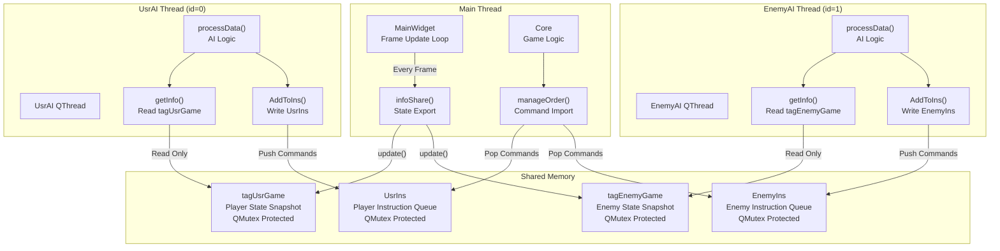
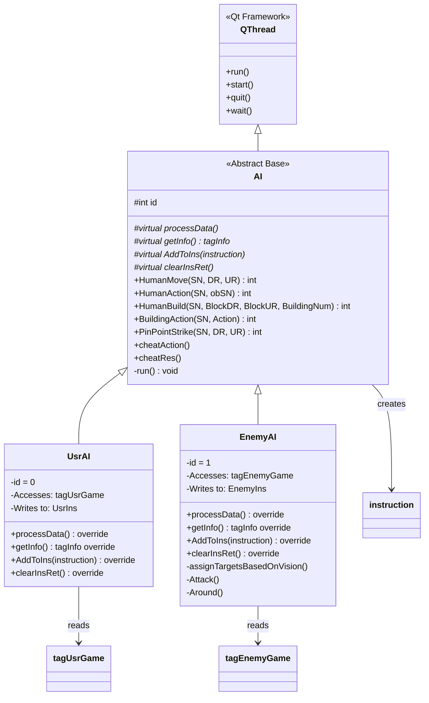
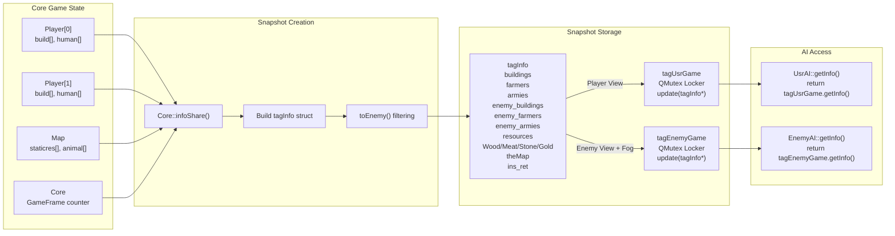
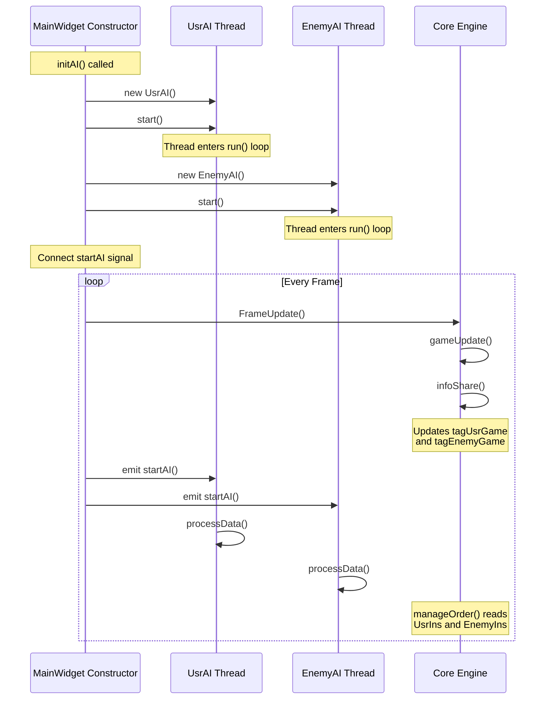
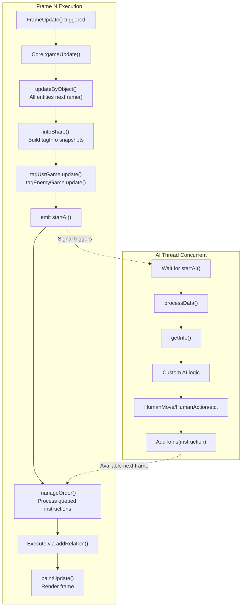

# AI Architecture

<details>
<summary>Relevant source files</summary>

The following files were used as context for generating this wiki page:

- [GlobalVariate.h](GlobalVariate.h)
- [MainWidget.cpp](MainWidget.cpp)
- [README.md](README.md)
- [UsrAI.cpp](UsrAI.cpp)

</details>


## Purpose and Scope

This document describes the threaded AI architecture that enables autonomous player and opponent behavior in the game. The architecture employs a producer-consumer pattern where AI threads run asynchronously, read game state snapshots, and queue commands that the game core processes synchronously.

For details on the command structures and instruction processing, see [Instruction and Command System](#5.2). For the game loop integration, see [MainWidget and Game Loop](#2.1). For AI programming guidance, refer to the external document `AI接口使用指南.md`.

---

## Thread Architecture Overview

The AI system uses **separate QThread instances** to prevent AI computation from blocking the main game loop. Each AI runs independently and communicates with the game core through thread-safe shared memory structures.



**Key Design Principles:**

| Principle | Implementation | Benefit |
|-----------|----------------|---------|
| **Thread Separation** | AI runs in separate QThread | No blocking of main game loop |
| **Read-Only Snapshots** | AI reads from `tagGame::getInfo()` | No race conditions on game state |
| **Write-Only Queues** | AI writes to `ins` queue | Thread-safe command submission |
| **Mutex Protection** | All shared structures use `QMutex` | Safe concurrent access |
| **One-Way Data Flow** | State flows Main→AI, Commands flow AI→Main | Clear ownership model |

Sources: [MainWidget.cpp:124-125](), [GlobalVariate.h:793-797](), [GlobalVariate.h:914-972](), README.md AI System section

---

## AI Class Hierarchy

The AI system follows an inheritance structure where `AI` provides the thread infrastructure and command interface, while `UsrAI` and `EnemyAI` implement player-specific logic.



**Class Responsibilities:**

| Class | File | Responsibility |
|-------|------|----------------|
| `AI` | `AI.h`, `AI.cpp` | Provides QThread infrastructure, implements command interface methods (`HumanMove`, `HumanAction`, etc.), runs `processData()` loop |
| `UsrAI` | `UsrAI.h`, `UsrAI.cpp` | Player AI (id=0), reads from `tagUsrGame`, writes to `UsrIns`, student-implementable logic |
| `EnemyAI` | `EnemyAI.h`, `EnemyAI.cpp` | Opponent AI (id=1), reads from `tagEnemyGame`, writes to `EnemyIns`, built-in strategies |

**Pure Virtual Methods (must implement):**

```cpp
// From AI base class - must be overridden by UsrAI/EnemyAI
virtual void processData() = 0;           // Main AI logic loop
virtual tagInfo getInfo() = 0;            // Access player-specific snapshot
virtual void AddToIns(instruction ins) = 0; // Push to player-specific queue
virtual void clearInsRet() = 0;           // Clear instruction return values
```

Sources: README.md Player and AI System sections, [GlobalVariate.h:765-791]() (instruction struct), [UsrAI.cpp:1-36]()

---

## State Snapshot System

The game state is copied to AI-accessible structures each frame, providing a consistent view without requiring locks during AI computation.



**tagInfo Structure Fields:**

| Field Category | Fields | Description |
|----------------|--------|-------------|
| **Own Units** | `farmers[]`, `armies[]` | Player's own farmers and military units |
| **Own Buildings** | `buildings[]` | Player's buildings with full info |
| **Enemy Units** | `enemy_farmers[]`, `enemy_armies[]` | Enemy units (fog-of-war filtered) |
| **Enemy Buildings** | `enemy_buildings[]` | Enemy buildings (fog-of-war filtered) |
| **Resources** | `resources[]` | All map resources (trees, gold, etc.) |
| **Terrain** | `theMap` | Pointer to terrain grid (const) |
| **Economy** | `Wood`, `Meat`, `Stone`, `Gold` | Current resource counts |
| **Meta** | `GameFrame`, `civilizationStage`, `Human_MaxNum` | Game state metadata |
| **Feedback** | `ins_ret` | Map of instruction ID → return code |
| **Exploration** | `exploredUpdate[]` | Newly explored areas this frame |

**Fog-of-War Filtering:**

Enemy data uses `toEnemy()` methods that hide sensitive information:

```cpp
// From tagBuilding, tagFarmer, tagArmy in GlobalVariate.h
tagBuilding toEnemy() {
    this->Cnt = -1;              // Hide resource count
    this->Project = -1;          // Hide production queue
    this->ProjectPercent = -1;   // Hide progress
    return *this;
}

tagFarmer toEnemy() {
    Resource = -1;    // Hide carried resources
    DR0 = -1.0;       // Hide destination
    UR0 = -1.0;
    return *this;
}
```

Sources: [GlobalVariate.h:672-759]() (tagObj, tagBuilding, tagResource, tagHuman, tagFarmer, tagArmy), [GlobalVariate.h:847-910]() (tagInfo), [GlobalVariate.h:914-972]() (tagGame)

---

## Thread Lifecycle and Synchronization

### Initialization Sequence



**Initialization Code Path:**

```cpp
// MainWidget::initAI() - called in constructor
void MainWidget::initAI() {
    usrAI = new UsrAI();
    usrAI->start();              // Starts QThread
    
    enemyAI = new EnemyAI();
    enemyAI->start();            // Starts QThread
    
    // Signal connects AI to frame updates
    connect(this, &MainWidget::startAI, usrAI, &AI::processDataSlot);
    connect(this, &MainWidget::startAI, enemyAI, &AI::processDataSlot);
}
```

Sources: [MainWidget.cpp:124-125]() (initAI call)

### Thread Synchronization Mechanisms

The system uses three synchronization primitives to ensure thread safety:

| Mechanism | Structure | Purpose |
|-----------|-----------|---------|
| **QMutex in tagGame** | `tagGame::Locker` | Protects read access to `tagInfo*` during `getInfo()` and write during `update()` |
| **QMutex in ins** | `ins::lock` | Protects instruction queue during push (AI) and pop (Core) |
| **QMutex in ins_ret** | Via `tagGame::Locker` | Protects return value map when inserting results and reading feedback |

**Mutex Usage Pattern:**

```cpp
// tagGame::getInfo() - Thread-safe read
tagInfo tagGame::getInfo() {
    QMutexLocker locker(&Locker);  // Auto-locks on entry
    return *Info;                   // Returns copy
}                                   // Auto-unlocks on exit

// tagGame::update() - Thread-safe write  
void tagGame::update(tagInfo* newinfo) {
    QMutexLocker locker(&Locker);
    // Preserve ins_ret across updates
    if (this->Info != NULL)
        newinfo->ins_ret = this->Info->ins_ret;
    Info = newinfo;
}

// ins queue - Thread-safe command push/pop
struct ins {
    std::queue<instruction> instructions;
    QMutex lock;
    // AI: lock.lock(); instructions.push(cmd); lock.unlock();
    // Core: lock.lock(); cmd = instructions.front(); instructions.pop(); lock.unlock();
};
```

Sources: [GlobalVariate.h:793-797]() (ins struct), [GlobalVariate.h:914-972]() (tagGame)

---

## AI-Core Integration

The AI threads integrate with the main game loop through signal emission and instruction processing.



**Frame Timing Considerations:**

| Timing Aspect | Behavior |
|---------------|----------|
| **AI Execution** | Asynchronous - may take longer than one frame |
| **State Snapshot** | Always from previous frame (N-1) when AI reads in frame N |
| **Command Availability** | Commands queued in frame N processed in frame N+1 or later |
| **ins_ret Updates** | Return codes added to `tagInfo.ins_ret` after execution, visible in next `getInfo()` |
| **No Blocking** | Game loop never waits for AI to complete |

**Command Flow Example:**

```
Frame 100: AI reads state → decides to move unit SN=5
           AI calls HumanMove(5, 100.0, 200.0)
           Instruction added to queue with id=123

Frame 101: Core's manageOrder() pops instruction
           Validates unit exists, position valid
           Calls addRelation() to start movement
           Sets ins_ret[123] = 0 (success)

Frame 102: AI reads getInfo(), sees ins_ret[123] = 0
           Knows movement command accepted
```

Sources: README.md Diagram 2 (Data Flow and Update Cycle), [GlobalVariate.h:765-791]() (instruction struct comments)

---

## Implementing Custom AI Logic

The primary extension point for custom AI is the `processData()` method in `UsrAI` or `EnemyAI`.

### Basic Implementation Pattern

```cpp
// UsrAI::processData() - main AI loop
void UsrAI::processData() {
    // 1. Get current game state snapshot
    auto info = getInfo();
    
    // 2. Implement decision logic using state
    for (auto& farmer : info.farmers) {
        if (farmer.NowState == HUMAN_STATE_IDLE) {
            // Find nearest tree
            for (auto& res : info.resources) {
                if (res.Type == RESOURCE_TREE) {
                    // Command farmer to gather
                    HumanAction(farmer.SN, res.SN);
                    break;
                }
            }
        }
    }
    
    // 3. Check instruction return codes
    for (auto& [id, ret] : info.ins_ret) {
        if (ret != 0) {
            // Handle failed commands
            // ret codes: -1=SN not found, -2=action invalid, 
            //           -3=out of bounds, -4=target not found,
            //           -5=building invalid, -6=insufficient resources
        }
    }
}
```

### Available Command Methods

All command methods are implemented in the `AI` base class and return an instruction ID:

| Method | Signature | Purpose |
|--------|-----------|---------|
| `HumanMove` | `int HumanMove(int SN, double DR, double UR)` | Move unit to coordinate |
| `HumanAction` | `int HumanAction(int SN, int obSN)` | Attack/gather target object |
| `HumanBuild` | `int HumanBuild(int SN, int BlockDR, int BlockUR, int BuildingNum)` | Build structure at block |
| `BuildingAction` | `int BuildingAction(int SN, int Action)` | Train unit or research tech |
| `PinPointStrike` | `int PinPointStrike(int SN, double DR, double UR)` | Catapult ground attack |

**Return Value Usage:**

```cpp
int id = HumanMove(farmerSN, targetDR, targetUR);
// Store id to check result in future frames

// Later, in subsequent processData() call:
auto info = getInfo();
if (info.ins_ret.count(id)) {
    int result = info.ins_ret[id];
    if (result == 0) {
        // Command succeeded
    } else {
        // Command failed, see error code
    }
}
```

### Cheat Functions

For debugging and testing, AI provides cheat functions (only active when enabled):

| Function | Effect |
|----------|--------|
| `cheatAction()` | Reveals all enemy actions |
| `cheatRes()` | Grants additional resources |

Sources: [UsrAI.cpp:1-36](), [GlobalVariate.h:765-791]() (instruction struct and return codes)

---

## Best Practices and Considerations

### Performance Guidelines

| Guideline | Rationale |
|-----------|-----------|
| **Keep processData() Fast** | Long computation delays command issuance; aim for <16ms |
| **Cache Expensive Queries** | Don't recalculate distances/paths every frame |
| **Batch Similar Commands** | Group related actions to reduce queue operations |
| **Check ins_ret Periodically** | Don't check every frame; every 5-10 frames is sufficient |
| **Limit Command Rate** | Avoid issuing 100+ commands per frame |

### Thread Safety Rules

| Rule | Reason |
|------|--------|
| **Never modify getInfo() result** | It's a copy, modifications have no effect |
| **Only use provided command methods** | Direct queue access bypasses synchronization |
| **Don't store pointers from tagInfo** | Pointers invalid after frame update |
| **Don't access Core/Player directly** | Thread-unsafe; use snapshots only |

### Common Patterns

**State Machine Example:**

```cpp
enum AIState { GATHER_RESOURCES, BUILD_BASE, TRAIN_ARMY, ATTACK };
AIState currentState = GATHER_RESOURCES;

void UsrAI::processData() {
    auto info = getInfo();
    
    switch(currentState) {
        case GATHER_RESOURCES:
            if (info.Wood >= 500 && info.Meat >= 300) {
                currentState = BUILD_BASE;
            }
            manageFarmers(info);
            break;
            
        case BUILD_BASE:
            if (info.buildings.size() >= 5) {
                currentState = TRAIN_ARMY;
            }
            buildStructures(info);
            break;
            
        // ... etc
    }
}
```

Sources: [UsrAI.cpp:12-36]() (example processData implementation)

---

## Summary

The AI architecture provides:

- **Thread isolation** via QThread for non-blocking autonomous behavior
- **Safe state access** through read-only snapshots with fog-of-war filtering  
- **Command interface** with five core methods for all game actions
- **Feedback mechanism** via `ins_ret` for command validation
- **Extension points** in `processData()` for custom logic

For command structure details and instruction processing, see [Instruction and Command System](#5.2). For state structure field reference, see [Game State Structures](#8.1).