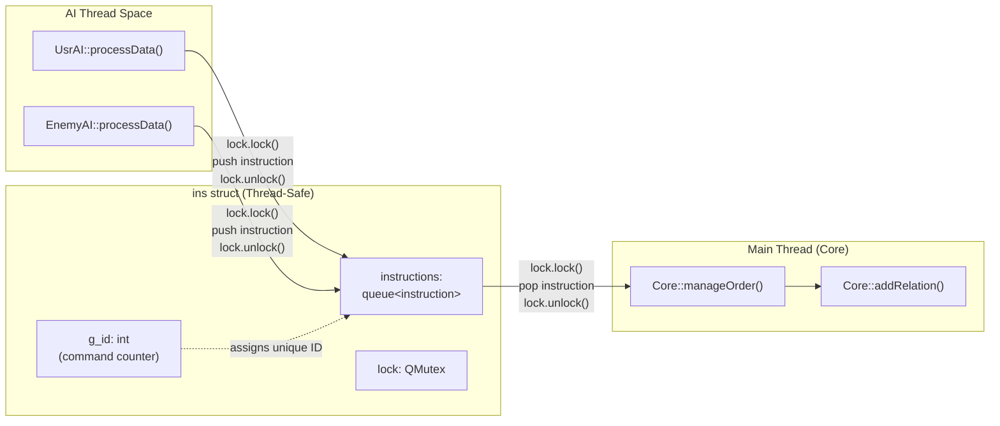
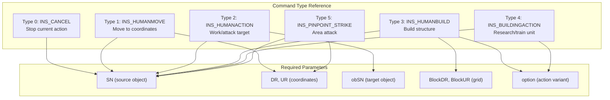
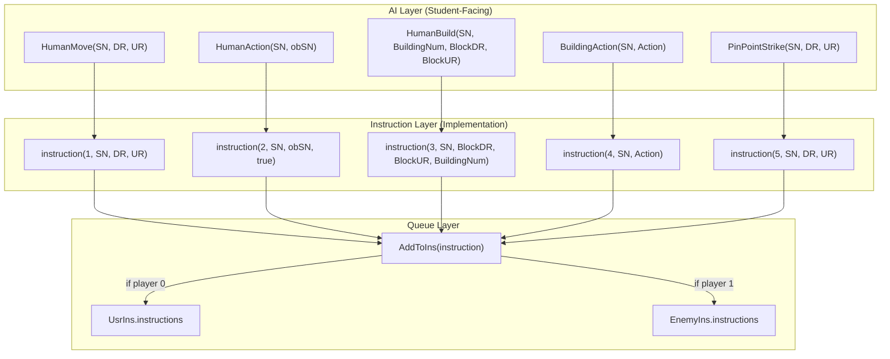
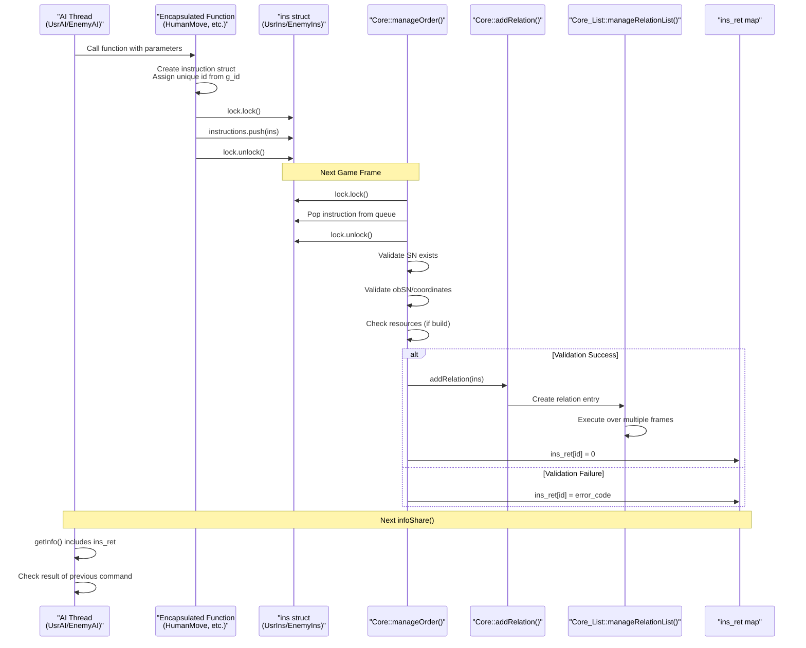
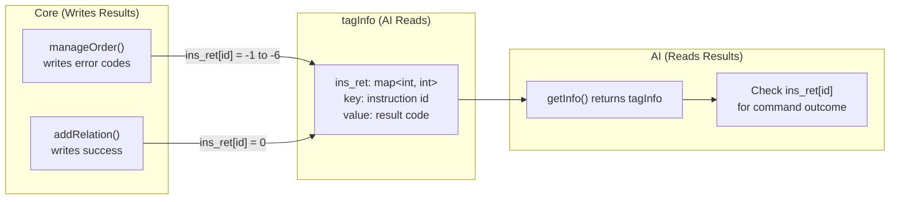
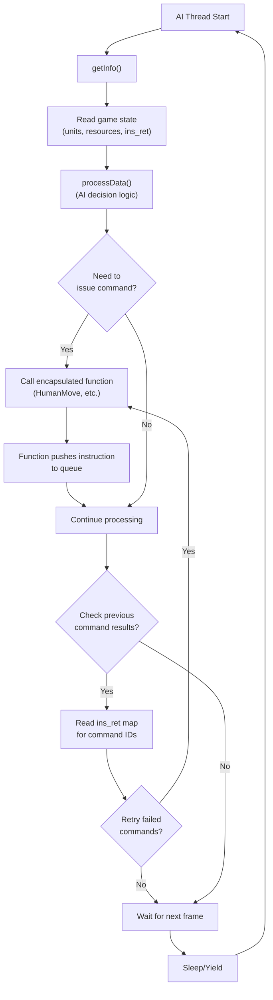
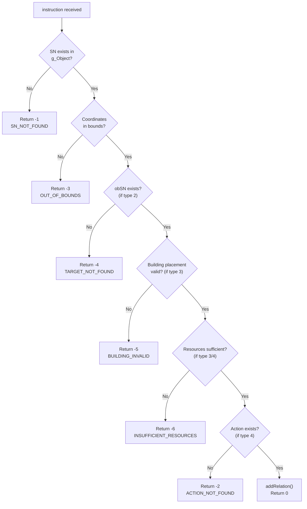

# Instruction and Command System

<details>
<summary>Relevant source files</summary>

The following files were used as context for generating this wiki page:

- [GlobalVariate.h](GlobalVariate.h)
- [MainWidget.cpp](MainWidget.cpp)
- [README.md](README.md)
- [UsrAI.cpp](UsrAI.cpp)

</details>


The instruction and command system provides the communication interface between AI threads and the game Core. It defines how AI players (both user and enemy) issue commands to control units and buildings, how these commands are queued safely across threads, and how execution results are reported back. This system enables AI decision-making code to run asynchronously without blocking the game loop while maintaining deterministic command execution.

**Related pages:** For the overall AI architecture and thread design, see [AI Architecture](#5.1). For game state structures that AI reads from, see [Game State Structures](#8.1).

---

## Instruction Structure

The `instruction` struct is the fundamental data structure representing a single command from AI to the game engine. It encapsulates all parameters needed to execute an action on a game object.

```mermaid
graph TD
    subgraph "instruction struct"
        ret["ret: int<br/>(return code)"]
        type["type: int<br/>(0-5 command types)"]
        id["id: int<br/>(unique command ID)"]
        self["self: Coordinate*<br/>(source object)"]
        obj["obj: Coordinate*<br/>(target object)"]
        SN["SN: int<br/>(source serial number)"]
        obSN["obSN: int<br/>(target serial number)"]
        option["option: int<br/>(action variant)"]
        coords["DR, UR: double<br/>(detail coordinates)"]
        blocks["BlockDR, BlockUR: int<br/>(block coordinates)"]
    end
    
    type -->|"type 0"| cancel["Cancel/Stop Action"]
    type -->|"type 1"| move["Move to Coordinate"]
    type -->|"type 2"| action["Action on Object"]
    type -->|"type 3"| build["Build at Block"]
    type -->|"type 4"| bldact["Building Action"]
    type -->|"type 5"| strike["Pinpoint Strike"]
    
    cancel -.uses.-> SN
    move -.uses.-> SN
    move -.uses.-> coords
    action -.uses.-> SN
    action -.uses.-> obSN
    build -.uses.-> SN
    build -.uses.-> blocks
    build -.uses.-> option
    bldact -.uses.-> SN
    bldact -.uses.-> option
    strike -.uses.-> SN
    strike -.uses.-> coords
```



**Sources:** [GlobalVariate.h:765-791]()

### Instruction Constructors

The `instruction` struct provides multiple constructors for different command types:

| Constructor Signature | Command Type | Purpose |
|----------------------|--------------|---------|
| `instruction(int type, int SN, int option)` | Type 0, 4 | Cancel action or building action |
| `instruction(int type, int SN, double DR, double UR)` | Type 1, 5 | Move or pinpoint strike to coordinates |
| `instruction(int type, int SN, int obSN, bool)` | Type 2 | Action on target object |
| `instruction(int type, int SN, int BlockDR, int BlockUR, int option)` | Type 3 | Build structure at block location |

**Sources:** [GlobalVariate.h:787-790]()

---

## Thread-Safe Instruction Queue

The `ins` struct manages the thread-safe queueing of instructions between AI threads and the main game loop.



**Sources:** [GlobalVariate.h:793-797]()

### Global Instruction Queues

The system maintains two global instruction queue instances:

| Variable | Type | Player | Usage |
|----------|------|--------|-------|
| `UsrIns` | `ins` | Player 0 | Commands from user/player AI |
| `EnemyIns` | `ins` | Player 1 | Commands from enemy AI |

Both queues are accessed from separate AI threads using the `QMutex lock` to prevent race conditions. The main game loop's `Core::manageOrder()` dequeues and processes commands each frame.

**Sources:** [UsrAI.cpp:8](), [GlobalVariate.h:793-797]()

---

## Command Types and Parameters

The instruction system supports six command types, each with specific parameter requirements:



### Command Type Details

**Type 0 (INS_CANCEL):** Terminates the current action of unit `SN`. Used to interrupt gathering, construction, or movement.

**Type 1 (INS_HUMANMOVE):** Commands unit `SN` to move to detail coordinates `(DR, UR)`. Pathfinding is computed automatically.

**Type 2 (INS_HUMANACTION):** Commands unit `SN` to interact with object `obSN`. Behavior depends on unit type:
- Farmer → Resource: Gather
- Farmer → Building: Deposit resources
- Army → Enemy: Attack

**Type 3 (INS_HUMANBUILD):** Commands farmer `SN` to construct building type `option` at block coordinates `(BlockDR, BlockUR)`.

**Type 4 (INS_BUILDINGACTION):** Commands building `SN` to execute action `option` (research technology or train unit).

**Type 5 (INS_PINPOINT_STRIKE):** Commands siege unit `SN` to perform area attack at coordinates `(DR, UR)`. Currently used by stone throwers.

**Sources:** [GlobalVariate.h:765-791](), [config.h]() (INS_* enums)

---

## Encapsulated AI Functions

AI developers interact with the instruction system through five high-level encapsulated functions rather than creating `instruction` structs directly.



**Sources:** [AI.h](), [AI.cpp]()

### Function Signatures and Usage

| Function | Signature | Return | Purpose |
|----------|-----------|--------|---------|
| `HumanMove` | `void HumanMove(int SN, double DR, double UR)` | void | Move unit to coordinates |
| `HumanAction` | `void HumanAction(int SN, int obSN)` | void | Unit interacts with target |
| `HumanBuild` | `void HumanBuild(int SN, int BuildingNum, int BlockDR, int BlockUR)` | void | Farmer builds structure |
| `BuildingAction` | `void BuildingAction(int SN, int Action)` | void | Building research/trains |
| `PinPointStrike` | `void PinPointStrike(int SN, double DR, double UR)` | void | Siege unit area attack |

These functions internally create the appropriate `instruction` struct, assign a unique `id` from `ins.g_id`, and push it to the queue with mutex protection.

**Sources:** [AI.h](), [AI.cpp](), Referenced in [游戏编程玩法.md]()

---

## Command Processing Flow

The instruction system follows a producer-consumer pattern where AI threads produce commands and the main game loop consumes them.



**Sources:** [Core.cpp]() (manageOrder method), [Core_List.cpp]() (addRelation, manageRelationList)

### Processing Stages

**Stage 1: Command Queueing**
- AI thread calls encapsulated function
- Function creates `instruction` with unique `id`
- Mutex-protected push to `ins.instructions` queue
- Sources: [AI.cpp]()

**Stage 2: Command Dequeue**
- `Core::manageOrder()` called each frame in `Core::gameUpdate()`
- Locks mutex and pops one instruction per player per frame
- Sources: [Core.cpp]()

**Stage 3: Validation**
- Check `SN` exists in `g_Object` map
- Validate target `obSN` or coordinates in bounds
- Verify resource availability for build commands
- Write error code to `ins_ret[id]` if validation fails
- Sources: [Core.cpp]()

**Stage 4: Relation Creation**
- If validation passes, call `Core::addRelation()`
- Creates entry in `Core_List::relate_AllObject`
- Queues multi-frame execution based on action type
- Sources: [Core_List.cpp]()

**Stage 5: Execution**
- `Core_List::manageRelationList()` executes relations each frame
- Updates object positions, states, and resources
- Relation completes after designated frames/conditions met
- Sources: [Core_List.cpp]()

**Sources:** [Core.cpp](), [Core_List.cpp]()

---

## Result Feedback System

The `ins_ret` map provides asynchronous feedback on command execution results, allowing AI to verify whether commands succeeded or failed.

### Result Map Structure



**Sources:** [GlobalVariate.h:847-910]() (tagInfo), [Core.cpp]()

### Return Code Reference

The system uses standardized integer return codes to communicate command results:

| Code | Constant | Meaning | Cause |
|------|----------|---------|-------|
| `0` | Success | Command executed | Validation passed, relation created |
| `-1` | SN_NOT_FOUND | Source object missing | Unit `SN` does not exist or was destroyed |
| `-2` | ACTION_NOT_FOUND | Invalid action | `option` does not exist for building type |
| `-3` | OUT_OF_BOUNDS | Position invalid | Coordinates outside map boundaries |
| `-4` | TARGET_NOT_FOUND | Target object missing | Object `obSN` does not exist |
| `-5` | BUILDING_INVALID | Cannot build here | Block occupied or terrain unsuitable |
| `-6` | INSUFFICIENT_RESOURCES | Not enough resources | Wood/Food/Stone/Gold below requirement |

**Sources:** [GlobalVariate.h:1291-1299]()

### Result Map Lifecycle

**Population:**
- `Core::manageOrder()` writes result immediately after processing instruction
- Map limited to 100 entries; old entries removed when exceeded
- Sources: [Core.cpp](), [GlobalVariate.h:931-938]()

**Access:**
- AI receives copy of `ins_ret` in next `getInfo()` call
- `tagGame::update()` transfers map from previous info to new snapshot
- Sources: [GlobalVariate.h:931-971]()

**Clearing:**
- `tagGame::clearInsRet()` can manually empty the map
- Automatic pruning maintains maximum 100 entries
- Sources: [GlobalVariate.h:968-971]()

---

## Integration with AI Decision Loop

The instruction system integrates with the AI decision loop through the following pattern:



**Sources:** [AI.cpp](), [UsrAI.cpp](), [EnemyAI.cpp]()

### Example: Command Issuance and Verification

```
// AI decision code (student-written)
void UsrAI::processData() {
    tagInfo info = getInfo();
    
    // Find idle farmer
    for (auto& farmer : info.farmers) {
        if (farmer.NowState == HUMAN_STATE_IDLE) {
            // Find nearest tree
            for (auto& res : info.resources) {
                if (res.Type == RESOURCE_TREE && res.Cnt > 0) {
                    // Issue gather command
                    HumanAction(farmer.SN, res.SN);
                    break;
                }
            }
        }
    }
    
    // Check results from previous frame
    for (auto& [id, ret] : info.ins_ret) {
        if (ret == -1) {
            // Unit was destroyed, replan
        } else if (ret == -4) {
            // Target no longer exists, find new target
        }
    }
}
```

**Sources:** [UsrAI.cpp:12-36](), [游戏编程玩法.md]()

---

## Thread Safety Considerations

The instruction system ensures thread safety through several mechanisms:

### Mutex Protection

**Command Queue Access:**
- All `ins.instructions.push()` calls wrapped in `lock.lock()` / `lock.unlock()`
- All `ins.instructions.pop()` calls similarly protected
- Prevents corruption when AI thread and main thread access queue simultaneously
- Sources: [GlobalVariate.h:793-797]()

**Result Map Access:**
- `tagGame::update()` uses `QMutexLocker` for atomic updates
- `tagGame::insertInsRet()` locks before modifying `ins_ret`
- `tagGame::getInfo()` locks before copying state
- Sources: [GlobalVariate.h:931-971]()

### Pointer Safety

**Object References:**
- Instructions store integer `SN` (serial number) instead of raw pointers
- `Core::manageOrder()` validates `SN` → pointer mapping before use
- Prevents dangling pointer issues when objects destroyed between frames
- Sources: [Core.cpp](), [GlobalVariate.h:765-791]()

### Data Ownership

**State Snapshots:**
- AI reads from `tagInfo` snapshots, not live game objects
- `Core::infoShare()` creates deep copy each frame
- AI cannot accidentally modify game state
- Sources: [Core.cpp]() (infoShare method), [GlobalVariate.h:847-910]()

**Sources:** [Core.cpp](), [GlobalVariate.h:793-797](), [GlobalVariate.h:914-973]()

---

## Error Handling and Debugging

The instruction system provides multiple layers for error detection and debugging:

### Validation Hierarchy



**Sources:** [Core.cpp]() (manageOrder validation logic)

### Debugging Strategies

**Command Tracking:**
- Each instruction assigned unique `id` from incrementing `g_id`
- Track command from issuance through execution via `id`
- Sources: [GlobalVariate.h:793-797]()

**Logging:**
- `Logger` system can log instruction processing
- Filter by file to isolate AI-related messages
- Sources: [Logger.cpp](), [main.cpp]()

**Return Code Analysis:**
- Accumulate `ins_ret` results over time to identify patterns
- Common failures indicate AI logic issues (e.g., repeated -6 means resource management broken)
- Sources: [GlobalVariate.h:847-910]()

**Sources:** [Core.cpp](), [Logger.cpp](), [GlobalVariate.h:793-797]()