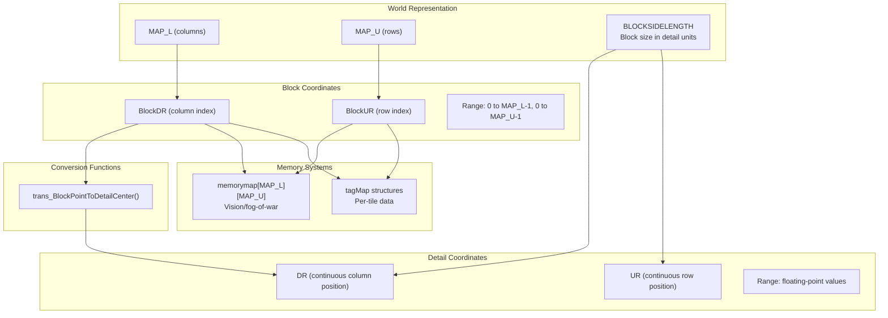
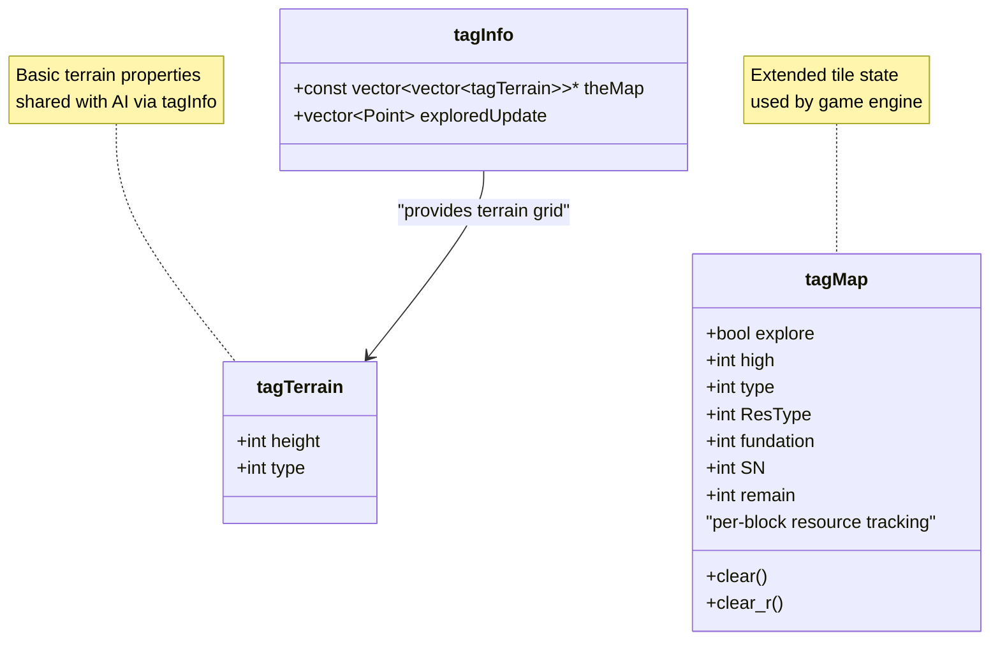
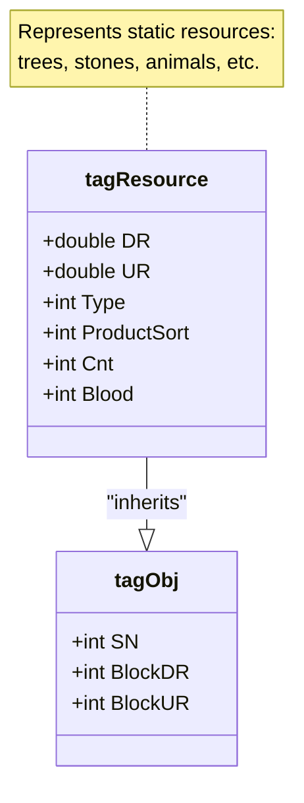
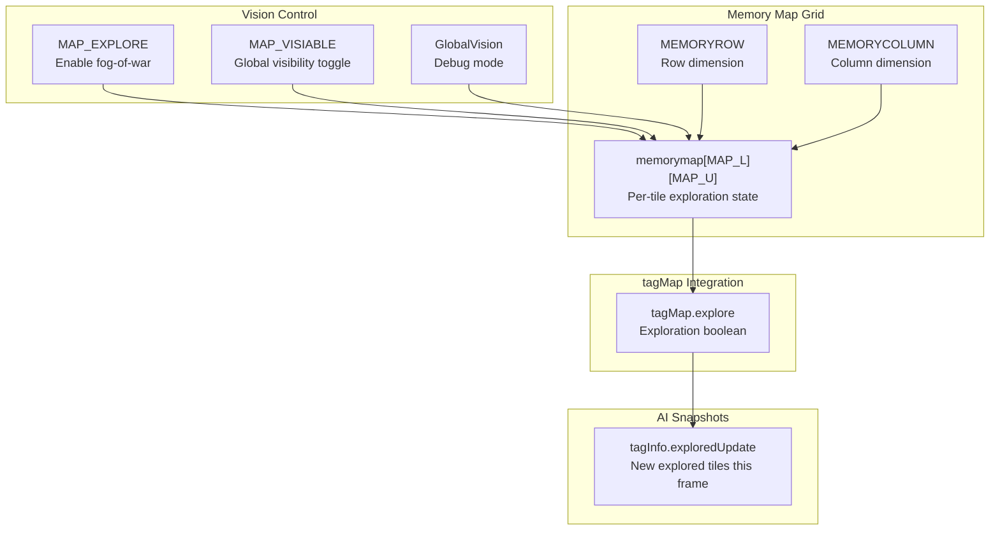
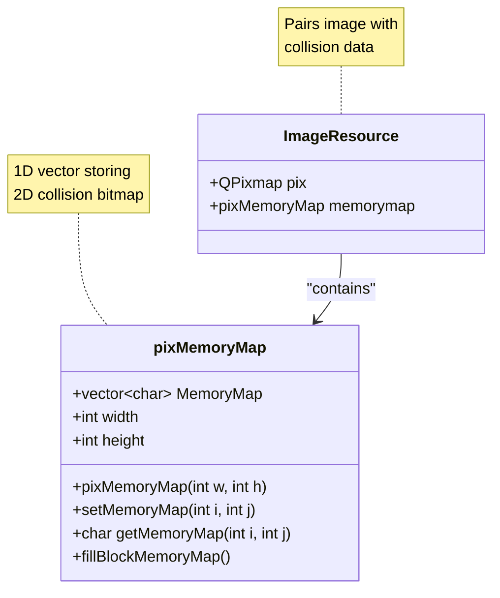
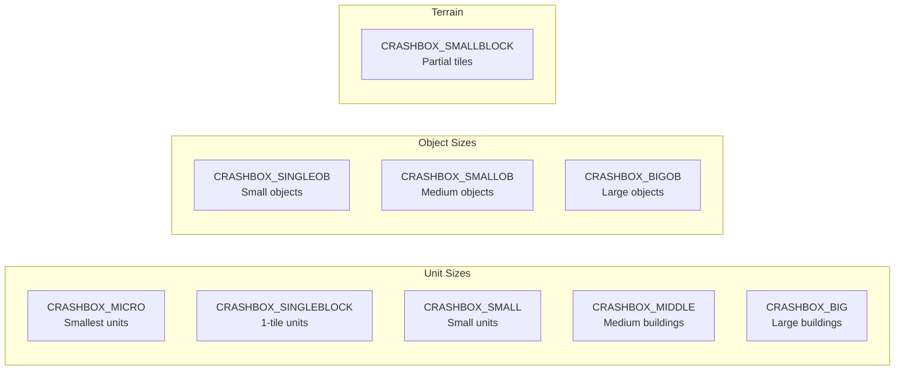
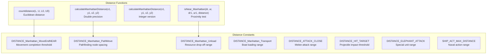

# Map and World

<details>
<summary>Relevant source files</summary>

The following files were used as context for generating this wiki page:

- [GlobalVariate.h](GlobalVariate.h)
- [map.njust](map.njust)

</details>


The Map and World system defines the spatial representation of the game environment, including terrain, static objects, and the coordinate systems used throughout the codebase. This system provides the foundation for unit movement, resource placement, collision detection, and fog-of-war implementation.

For player-specific resource management and gathering mechanics, see [Resource and Economy System](#3.1). For unit pathfinding and movement behavior, see [Units and Buildings](#3.3). For the map editor interface, see [Map Editor](#4.2).

---

## Map Dimensions and Coordinate Systems

The game world uses a dual coordinate system to represent positions at different granularities.

### Coordinate System Overview



**Sources:** [GlobalVariate.h:230-231](), [GlobalVariate.h:228](), [GlobalVariate.h:513-519](), [GlobalVariate.h:1318]()

### Global Map Variables

| Variable | Type | Purpose | Location |
|----------|------|---------|----------|
| `MAP_L` | `int` | Map width in blocks (columns) | [GlobalVariate.h:230]() |
| `MAP_U` | `int` | Map height in blocks (rows) | [GlobalVariate.h:231]() |
| `BLOCKSIDELENGTH` | `double` | Size of one block in detail coordinates | [GlobalVariate.h:228]() |
| `memorymap` | `int**` | 2D array for vision/explored tiles | [GlobalVariate.h:515]() |
| `MidX`, `MidY` | `int` | Current viewport center | [GlobalVariate.h:516-517]() |
| `MAP_LSide[2]`, `MAP_USide[2]` | `int[]` | Viewport boundaries | [GlobalVariate.h:518-519]() |

**Sources:** [GlobalVariate.h:228-231](), [GlobalVariate.h:513-519]()

### Coordinate Conversion

Block coordinates (`BlockDR`, `BlockUR`) are integer indices into the map grid, while detail coordinates (`DR`, `UR`) are floating-point positions used for precise object placement and movement.

**Conversion Function:**
- `trans_BlockPointToDetailCenter(int p)` converts a block index to the center detail coordinate of that block [GlobalVariate.h:1318]()

**Usage Pattern:**
```cpp
// Block coordinates identify a tile
int blockColumn = 10;  // BlockDR
int blockRow = 5;      // BlockUR

// Detail coordinates position within or between tiles
double detailColumn = trans_BlockPointToDetailCenter(10);  // DR
double detailRow = trans_BlockPointToDetailCenter(5);      // UR
```

**Sources:** [GlobalVariate.h:1318]()

---

## Terrain Data Structures

Terrain information is stored in two primary structures representing different levels of detail.

### tagTerrain Structure



**Sources:** [GlobalVariate.h:828-831](), [GlobalVariate.h:798-827](), [GlobalVariate.h:848-910]()

### tagTerrain Fields

The `tagTerrain` structure represents basic terrain properties [GlobalVariate.h:828-831]():

| Field | Type | Description |
|-------|------|-------------|
| `height` | `int` | Elevation level of the terrain |
| `type` | `int` | Terrain type identifier (grass, ocean, etc.) |

This structure is used in the `tagInfo` snapshot passed to AI threads, providing a read-only view of the terrain grid [GlobalVariate.h:858]().

**Sources:** [GlobalVariate.h:828-831](), [GlobalVariate.h:858]()

### tagMap Structure

The `tagMap` structure provides extended per-tile state information [GlobalVariate.h:798-827]():

| Field | Type | Description |
|-------|------|-------------|
| `explore` | `bool` | Whether this tile has been explored (fog-of-war) |
| `high` | `int` | Terrain height at this location |
| `type` | `int` | Resource type occupying this tile |
| `ResType` | `int` | Type of resource gathered (wood, food, stone, gold) |
| `fundation` | `int` | Size of resource/object footprint |
| `SN` | `int` | Serial number of object on this tile |
| `remain` | `int` | Remaining resource quantity |

**Member Functions:**
- `clear()`: Resets exploration and height data [GlobalVariate.h:812-817]()
- `clear_r()`: Clears resource-specific fields [GlobalVariate.h:819-826]()

**Sources:** [GlobalVariate.h:798-827]()

---

## Static Resources and Objects

Static world objects include harvestable resources and animals that occupy map tiles.

### Resource Type Constants

Resources are categorized by gather type in the global constants [GlobalVariate.h:267-298]():

| Category | Examples | Count Variables |
|----------|----------|-----------------|
| Animals | Gazelle, Lion, Elephant | `CNT_GAZELLE`, `CNT_LION`, `CNT_ELEPHANT` |
| Trees | Wood sources | `CNT_TREE` |
| Minerals | Stone, Gold ore | `CNT_STONE`, `CNT_GOLDORE` |
| Food | Bush (berries), Fish | `CNT_BUSH`, `CNT_FISH` |

Each resource type has associated properties defined in global variables:
- **Vision range**: `VISION_GAZELLE`, `VISION_LION`, etc.
- **Health**: `BLOOD_GAZELLE`, `BLOOD_TREE`, etc.
- **Spawn counts**: `CNT_*` variables control initial map generation

**Sources:** [GlobalVariate.h:265-298]()

### tagResource Structure

The `tagResource` structure represents a static world object [GlobalVariate.h:696-703]():



| Field | Type | Description |
|-------|------|-------------|
| `SN` | `int` | Unique serial number (from `tagObj`) |
| `BlockDR`, `BlockUR` | `int` | Block coordinates (from `tagObj`) |
| `DR`, `UR` | `double` | Detail coordinates for precise positioning |
| `Type` | `int` | Resource visual type identifier |
| `ProductSort` | `int` | Type of resource gathered (wood/food/stone/gold) |
| `Cnt` | `int` | Remaining resource quantity |
| `Blood` | `int` | Current health (for destructible resources) |

**Sources:** [GlobalVariate.h:672-703]()

### Resource Distribution Arrays

The game uses pre-defined arrays to store resource cluster patterns [GlobalVariate.h:520-522]():

```cpp
int Forest[3][15][15];    // Tree cluster templates
int Food[5][5][5];        // Food source patterns
int Stone[5][5][5];       // Stone deposit patterns
```

These arrays define spatial distributions used during map generation to create natural-looking resource clusters.

**Sources:** [GlobalVariate.h:520-522]()

---

## Vision and Memory Systems

The map tracks exploration state and visibility through the memory map system.

### Memory Map Structure



**Sources:** [GlobalVariate.h:15-16](), [GlobalVariate.h:253-254](), [GlobalVariate.h:260](), [GlobalVariate.h:515](), [GlobalVariate.h:800](), [GlobalVariate.h:860]()

### Vision System Variables

| Variable | Type | Default | Purpose |
|----------|------|---------|---------|
| `MAP_EXPLORE` | `bool` | Runtime | Enable/disable fog-of-war system |
| `MAP_VISIABLE` | `bool` | Runtime | Override for full map visibility |
| `GlobalVision` | `bool` | Runtime | Debug flag for unrestricted vision |
| `memorymap` | `int**` | Allocated | 2D array storing exploration state |
| `MEMORYROW` | `int` | Config | Number of rows in memory map |
| `MEMORYCOLUMN` | `int` | Config | Number of columns in memory map |

**Sources:** [GlobalVariate.h:15-16](), [GlobalVariate.h:253-254](), [GlobalVariate.h:260](), [GlobalVariate.h:515]()

### Exploration Tracking

Each tile's exploration state is tracked in two places:

1. **Global memory map** (`memorymap`): Integer array where non-zero values indicate explored tiles [GlobalVariate.h:515]()
2. **tagMap.explore**: Boolean field in the per-tile structure [GlobalVariate.h:800]()

The `tagInfo.exploredUpdate` vector tracks newly explored tiles each frame, allowing AI to be notified of map discoveries [GlobalVariate.h:860]().

**Sources:** [GlobalVariate.h:515](), [GlobalVariate.h:800](), [GlobalVariate.h:860]()

---

## Collision Detection System

Collision detection uses pixel-perfect memory maps generated from image alpha channels.

### pixMemoryMap Structure



**Sources:** [GlobalVariate.h:1002-1084](), [GlobalVariate.h:1086-1103]()

### pixMemoryMap Implementation

The `pixMemoryMap` class stores a 1-dimensional collision bitmap for 2D sprites [GlobalVariate.h:1002-1084]():

**Key Methods:**

| Method | Purpose | Implementation |
|--------|---------|----------------|
| `pixMemoryMap(int w, int h)` | Constructor allocating collision grid | [GlobalVariate.h:1009-1012]() |
| `setMemoryMap(int i, int j)` | Mark pixel as solid | [GlobalVariate.h:1031-1034]() |
| `getMemoryMap(int i, int j)` | Query pixel collision state | [GlobalVariate.h:1036-1039]() |
| `fillBlockMemoryMap()` | Generate diamond-shaped collision for isometric blocks | [GlobalVariate.h:1041-1083]() |

**Memory Layout:**
```cpp
// 2D coordinates (i, j) mapped to 1D index
int index = i * height + j;  // [GlobalVariate.h:1032]()
MemoryMap[index] = 1;        // Mark as solid
```

The `fillBlockMemoryMap()` method generates a diamond/rhombus collision shape for isometric tiles by iterating through quadrants and applying geometric constraints [GlobalVariate.h:1041-1083]().

**Sources:** [GlobalVariate.h:1002-1084]()

### ImageResource Integration

Each visual asset is paired with collision data [GlobalVariate.h:1086-1103]():

```cpp
struct ImageResource {
    QPixmap pix;              // Visual representation
    pixMemoryMap memorymap;   // Collision bitmap
};
```

The global `resMap` associates resource names with lists of `ImageResource` objects [GlobalVariate.h:525]():

```cpp
extern map<string, list<ImageResource>> resMap;
```

**Initialization Functions:**
- `InitImageResMap(QString path)`: Loads images and generates collision data [GlobalVariate.h:1301]()
- `initMemory(ImageResource* res)`: Builds collision bitmap from image alpha channel [GlobalVariate.h:1309]()

**Sources:** [GlobalVariate.h:1086-1103](), [GlobalVariate.h:525](), [GlobalVariate.h:1301](), [GlobalVariate.h:1309]()

---

## Crashbox and Distance Systems

The spatial query system defines interaction ranges and collision volumes.

### Crashbox Constants

"Crashbox" values define the collision radius for different object sizes [GlobalVariate.h:21-29]():



| Constant | Type | Usage |
|----------|------|-------|
| `CRASHBOX_MICRO` | `double` | Missiles and tiny objects |
| `CRASHBOX_SINGLEBLOCK` | `double` | Single-tile units (farmers) |
| `CRASHBOX_SMALLBLOCK` | `double` | Partial tile coverage |
| `CRASHBOX_SMALL` | `double` | Small units (military) |
| `CRASHBOX_MIDDLE` | `double` | Medium structures |
| `CRASHBOX_BIG` | `double` | Large buildings (town center) |
| `CRASHBOX_SINGLEOB` | `double` | Single-tile objects (trees) |
| `CRASHBOX_SMALLOB` | `double` | Medium objects |
| `CRASHBOX_BIGOB` | `double` | Large objects |

**Sources:** [GlobalVariate.h:21-29]()

### Distance Calculation Functions

The codebase provides multiple distance calculation utilities:



**Sources:** [GlobalVariate.h:1310-1314](), [GlobalVariate.h:300-307]()

### Distance Function Declarations

| Function | Parameters | Return | Purpose |
|----------|------------|--------|---------|
| `countdistance` | `double L, U, L0, U0` | `double` | Euclidean distance between two points |
| `calculateManhattanDistance` | `int x1, y1, x2, y2` | `int` | Integer Manhattan distance |
| `calculateManhattanDistance` | `double x1, y1, x2, y2` | `double` | Floating-point Manhattan distance |
| `isNear_Manhattan` | `double dr, ur, dr1, ur1, distance` | `bool` | Test if two points are within Manhattan distance |

**Sources:** [GlobalVariate.h:1310-1314]()

### Distance Threshold Constants

Behavioral thresholds controlling spatial interactions [GlobalVariate.h:300-307]():

| Constant | Type | Usage |
|----------|------|-------|
| `DISTANCE_Manhattan_MoveEndNEAR` | `double` | Units stop moving when this close to destination |
| `DISTANCE_Manhattan_PathMove` | `double` | Spacing between pathfinding waypoints |
| `DISTANCE_Manhattan_Unload` | `double` | Range for depositing resources |
| `DISTANCE_Manhattan_Transport` | `double` | Range for boarding transport ships |
| `DISTANCE_ATTACK_CLOSE` | `double` | Melee attack initiation range |
| `DISTANCE_HIT_TARGET` | `double` | Projectile impact detection threshold |
| `DISTANCE_ELEPHANT_ATTACK` | `double` | Special attack range for elephants |
| `SHIP_ACT_MAX_DISTANCE` | `double` | Maximum range for ship actions |

**Sources:** [GlobalVariate.h:300-307]()

### Coordinate Transformation Utilities

Additional spatial utilities [GlobalVariate.h:1316-1318]():

**Mirror Point Calculation:**
```cpp
void calMirrorPoint(double& dr, double& ur, 
                    double dr_mirror, double ur_mirror, 
                    double dis);
```
Computes a point reflected across another point at a specified distance.

**Block to Detail Center:**
```cpp
double trans_BlockPointToDetailCenter(int p);
```
Converts a block index to the detail coordinate of that block's center.

**Sources:** [GlobalVariate.h:1316-1318]()

---

## Spatial Query and Pathfinding Support

The map system provides foundational support for pathfinding and spatial queries.

### Global Object Registry

The game maintains a global registry of all spatial objects [GlobalVariate.h:514]():

```cpp
extern std::map<int, Coordinate*> g_Object;
```

This map associates serial numbers (`int` keys) with `Coordinate*` pointers, enabling fast lookup of any game object by its unique identifier.

**Related Variables:**
- `g_globalNum`: Global counter for assigning unique serial numbers [GlobalVariate.h:512]()
- `nowobject`: Currently selected object [GlobalVariate.h:531]()
- `LeftMouseObjCapture`: Object captured by left mouse button [GlobalVariate.h:532]()
- `RightMouseObjCaptrue`: Object captured by right mouse button [GlobalVariate.h:533]()

**Sources:** [GlobalVariate.h:512](), [GlobalVariate.h:514](), [GlobalVariate.h:531-533]()

### Angle Constants

The codebase defines angular constants for directional calculations [GlobalVariate.h:229](), [GlobalVariate.h:1000]():

```cpp
extern double UNLOAD_RADIAN;        // Angle for resource unloading
extern std::string direction[5];   // Direction name strings
```

These support directional movement and object orientation.

**Sources:** [GlobalVariate.h:229](), [GlobalVariate.h:1000]()

---

## Map State Data Structures

### Point Structure

The `Point` structure represents discrete 2D coordinates [GlobalVariate.h:833-845]():

```cpp
struct Point {
    int x;
    int y;
    
    Point(int x, int y);
    Point operator +(const Point& ps);
    Point operator -(const Point& ps);
    bool operator ==(const Point& ps) const;
    bool operator < (const Point& ps) const;
};
```

Used in `tagInfo.exploredUpdate` to track newly explored tiles [GlobalVariate.h:860]().

**Sources:** [GlobalVariate.h:833-845](), [GlobalVariate.h:860]()

### MouseEvent Structure

The `MouseEvent` structure captures spatial interaction events [GlobalVariate.h:974-997]():

| Method | Purpose |
|--------|---------|
| `GetMemoryMapX()`, `GetMemoryMapY()` | Retrieve memory map coordinates of click |
| `GetDR()`, `GetUR()` | Retrieve detail coordinates of click |
| `GetMouseEventType()` | Determine click type (left/right/drag) |
| `HaveEvent()` | Check if event is valid |
| `Reset()` | Clear event data |

This structure bridges user input to spatial queries on the map.

**Sources:** [GlobalVariate.h:974-997]()

---

## Configuration and Initialization

Map parameters are loaded from `config.json` at startup [GlobalVariate.h:1323]():

```cpp
void ReadConfig();  // Q_COREAPP_STARTUP_FUNCTION
```

**Configurable Map Parameters:**
- Map dimensions (`MAP_L`, `MAP_U`)
- Block size (`BLOCKSIDELENGTH`)
- Initial resource counts (`CNT_TREE`, `CNT_STONE`, etc.)
- Visibility settings (`MAP_EXPLORE`, `MAP_VISIABLE`)
- Collision radii (`CRASHBOX_*` family)
- Distance thresholds (`DISTANCE_*` family)

The `ReadConfig()` function is marked with `Q_COREAPP_STARTUP_FUNCTION`, ensuring it runs before the Qt event loop begins, populating all global variables from JSON.

**Sources:** [GlobalVariate.h:1323](), [GlobalVariate.h:15-307]()

---

## Summary Table: Key Map Components

| Component | Structure/Variable | Purpose | File Reference |
|-----------|-------------------|---------|----------------|
| **Dimensions** | `MAP_L`, `MAP_U` | Grid size in blocks | [GlobalVariate.h:230-231]() |
| **Coordinates** | `BlockDR/UR`, `DR/UR` | Dual coordinate system | Throughout codebase |
| **Terrain** | `tagTerrain` | Height and type per tile | [GlobalVariate.h:828-831]() |
| **Tile State** | `tagMap` | Extended per-tile information | [GlobalVariate.h:798-827]() |
| **Resources** | `tagResource` | Static world objects | [GlobalVariate.h:696-703]() |
| **Vision** | `memorymap`, `MAP_EXPLORE` | Fog-of-war system | [GlobalVariate.h:15-16](), [GlobalVariate.h:515]() |
| **Collision** | `pixMemoryMap` | Pixel-perfect detection | [GlobalVariate.h:1002-1084]() |
| **Spatial Queries** | `countdistance`, `isNear_Manhattan` | Distance calculations | [GlobalVariate.h:1310-1314]() |
| **Object Registry** | `g_Object` | Global object lookup | [GlobalVariate.h:514]() |

**Sources:** [GlobalVariate.h:15-1323]()