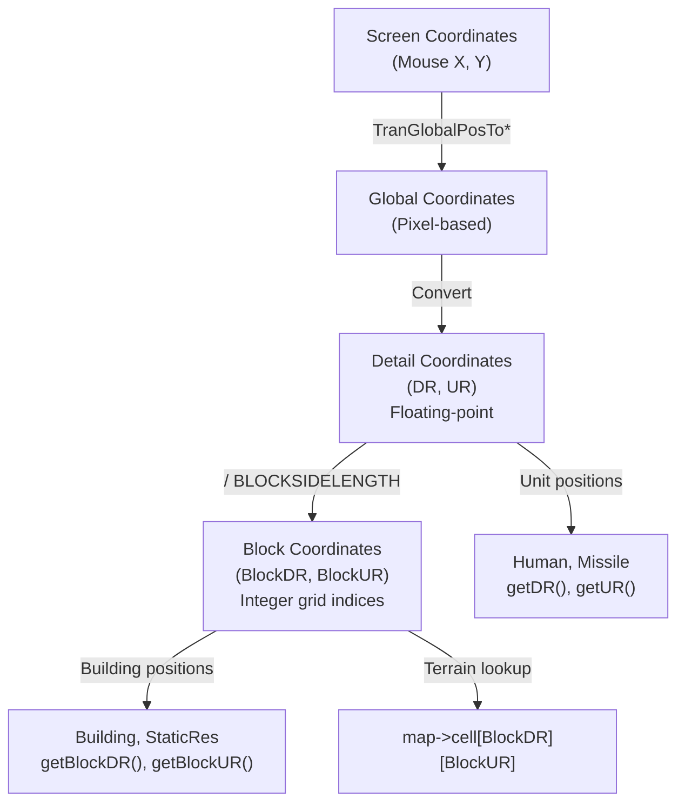
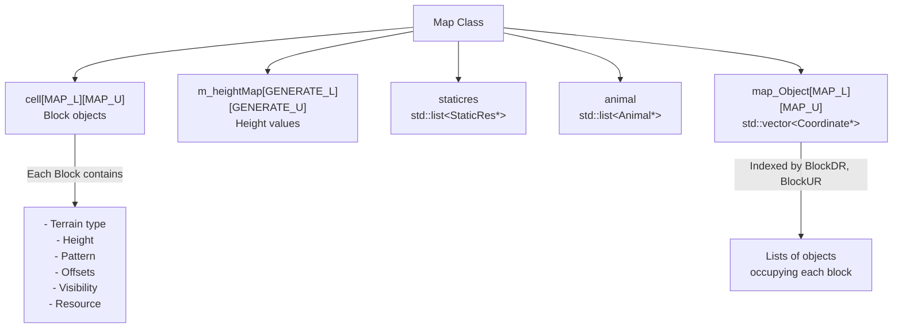
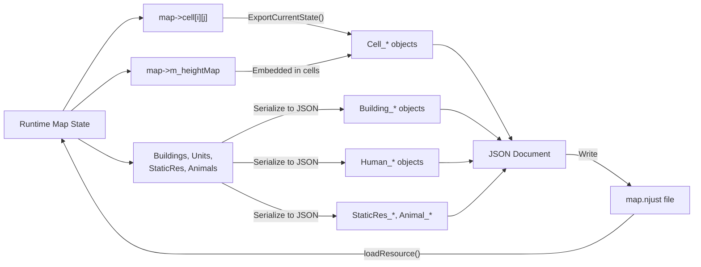

# Map Structure

<details>
<summary>Relevant source files</summary>

The following files were used as context for generating this wiki page:

- [GlobalVariate.h](GlobalVariate.h)
- [MainWidget.cpp](MainWidget.cpp)
- [README.md](README.md)
- [map.njust](map.njust)

</details>


This page documents the core map representation in the new-aoe game engine. It covers the `Map` class, coordinate systems, terrain grid organization, and memory maps used for vision and pathfinding.

For information about terrain types, static resources, and the `Block` class, see [Terrain and Objects](#6.2). For collision detection and pathfinding algorithms, see [Collision and Pathfinding](#6.3).

---

## Coordinate Systems

The game uses two coordinate systems that operate at different scales:

### Block Coordinates vs Detail Coordinates

**Block Coordinates** (`BlockDR`, `BlockUR`) represent discrete grid cells on the map. These are integer indices into the map grid array.

**Detail Coordinates** (`DR`, `UR`) represent precise pixel-level positions within the game world. These are floating-point values that allow smooth movement and positioning.

The relationship between these systems is defined by `BLOCKSIDELENGTH`:

```
DR = BlockDR * BLOCKSIDELENGTH + offset_within_block
UR = BlockUR * BLOCKSIDELENGTH + offset_within_block
```

**Conversion Example** (from MainWidget.cpp):

[MainWidget.cpp:538-540]()

```cpp
double DR = ui->Game->TranGlobalPosToDR(eventFilter->MouseX(),eventFilter->MouseY());
double UR = ui->Game->TranGlobalPosToUR(eventFilter->MouseX(),eventFilter->MouseY());
int L = DR / BLOCKSIDELENGTH, U = UR / BLOCKSIDELENGTH;
```

### Diagram: Coordinate System Hierarchy



Sources: [MainWidget.cpp:538-540](), [GlobalVariate.h:228]()

---

## Map Dimensions

The map size is configured at runtime through `config.json`:

| Parameter | Type | Description |
|-----------|------|-------------|
| `MAP_L` | `int` | Number of columns in the map grid |
| `MAP_U` | `int` | Number of rows in the map grid |
| `BLOCKSIDELENGTH` | `double` | Size of each block in detail coordinate units |

**Map Coverage**: The total playable area spans from `(0, 0)` to `(MAP_L * BLOCKSIDELENGTH, MAP_U * BLOCKSIDELENGTH)` in detail coordinates.

Sources: [GlobalVariate.h:230-231](), [GlobalVariate.h:228]()

---

## Map Grid Structure

The map is organized as a two-dimensional grid of `Block` objects stored in the `Map` class.

### Core Data Structures

**Cell Array**: `Block cell[MAP_L][MAP_U]`

Each `Block` in the grid stores:
- Terrain type (`getMapType()`, `setMapType()`)
- Height (`getMapHeight()`, `setMapHeight()`)
- Pattern/texture variant (`getMapPattern()`)
- Visual offsets (`getOffsetX()`, `getOffsetY()`)
- Visibility state (`Visible`, `Explored`)
- Resource information (`getMapResource()`)

**Height Map**: `int m_heightMap[GENERATE_L][GENERATE_U]`

A parallel array storing raw height values used for terrain generation and slope calculations. The dimensions `GENERATE_L` and `GENERATE_U` are typically `MAP_L + 8` and `MAP_U + 8` to provide border padding.

### Diagram: Map Class Internal Structure



Sources: [MainWidget.cpp:373-389](), [MainWidget.cpp:923-925]()

---

## Terrain Data Structure

### tagTerrain

The `tagTerrain` structure represents minimal terrain information for AI and pathfinding:

[GlobalVariate.h:828-831]()

```cpp
struct tagTerrain {
    int height;
    int type;
};
```

| Field | Type | Description |
|-------|------|-------------|
| `height` | `int` | Terrain elevation level |
| `type` | `int` | Terrain type constant (e.g., `MAPTYPE_FLAT`, `MAPTYPE_OCEAN`) |

This structure is used in:
- AI state snapshots (`tagInfo::theMap`)
- Pathfinding algorithms
- Terrain type queries

### Block Class

The `Block` class (inherited from `Coordinate`) provides the full terrain representation:

**Key Methods**:
- `getMapType()` / `setMapType(int)` - Terrain type (grass, ocean, etc.)
- `getMapHeight()` / `setMapHeight(int)` - Elevation level
- `getMapPattern()` / `setMapPattern(int)` - Texture variant
- `getOffsetX()` / `getOffsetY()` - Isometric rendering offsets
- `reset()` - Recalculate visual properties
- `resetOffset()` - Recalculate offset values

Sources: [GlobalVariate.h:828-831]()

---

## Memory Maps

The `Map` class maintains several auxiliary memory maps for efficient spatial queries:

### Vision and Fog-of-War

**Purpose**: Track which areas have been explored and are currently visible to each player.

**Implementation** (per-block flags):
- `Block::Visible` - Currently in vision range
- `Block::Explored` - Has been seen at some point

These flags are updated during `gameUpdate()` based on unit vision ranges.

### Object Placement Map

**Structure**: `map_Object[MAP_L][MAP_U]` - a 2D array where each cell contains a `std::vector<Coordinate*>` of objects occupying that block.

**Usage**:
- Fast spatial queries ("what's at this location?")
- Collision detection during placement
- Area clearing operations

[MainWidget.cpp:786-797]()

Example from building deletion:
```cpp
for(int mapX = buildingToDelete->getBlockDR(); 
    mapX < buildingToDelete->getBlockDR() + buildingToDelete->get_BlockSizeLen(); 
    mapX++) {
    for(int mapY = buildingToDelete->getBlockUR(); 
        mapY < buildingToDelete->getBlockUR() + buildingToDelete->get_BlockSizeLen(); 
        mapY++) {
        if(mapX >= 0 && mapX < MAP_L && mapY >= 0 && mapY < MAP_U) {
            auto& objects = map->map_Object[mapX][mapY];
            objects.erase(remove(objects.begin(), objects.end(), buildingToDelete), objects.end());
        }
    }
}
```

### tagMap Resource Map

**Structure**: `tagMap` (defined in [GlobalVariate.h:798-827]())

Used by AI to query resource information:

```cpp
struct tagMap {
    bool explore;      // Has this cell been explored?
    int high;          // Height
    int type;          // Resource type (RESOURCE_BUSH, RESOURCE_TREE, etc.)
    int ResType;       // Gathered resource type (HUMAN_WOOD, HUMAN_FOOD, etc.)
    int fundation;     // Resource footprint size
    int SN;            // Object serial number
    int remain;        // Remaining resource quantity
};
```

Sources: [GlobalVariate.h:798-827](), [MainWidget.cpp:786-797]()

---

## Map Initialization and Loading

### Initialization Flow

Maps are initialized in `MainWidget::initMap(int MapJudge)`:

**MapJudge Values**:
- `0` - Generate new default map
- `1` - Load last used map (`tmpMap.txt`)
- `2+` - Load specific map file

The map initialization involves:
1. Creating the `Block` grid
2. Generating or loading height map
3. Calculating terrain types based on height
4. Placing initial resources and units
5. Computing visual offsets for isometric rendering

### Terrain Modification Functions

The editor provides several terrain editing operations:

| Function | Purpose | Block Range |
|----------|---------|-------------|
| `HigherLand(blockL, blockU, height)` | Raise terrain | 3×3 centered on cursor |
| `LowerLand(blockL, blockU, height)` | Lower terrain | 3×3 centered on cursor |
| `MakeOcean(blockL, blockU)` | Convert to ocean | 3×3 centered on cursor |
| `MakeGrassland(blockL, blockU)` | Convert to grass | 3×3 centered on cursor |

**Example**: Raising terrain ([MainWidget.cpp:881-938]())

```cpp
void MainWidget::HigherLand(int blockL, int blockU, int height) {
    static const int width = 3;
    static const int half = width / 2;
    
    // Validate height constraints in surrounding area
    for (int i = -half; i <= half; ++i) {
        for (int j = -half; j <= half; ++j) {
            int ll = blockL + i, uu = blockU + j;
            // ... check adjacent blocks ...
        }
    }
    
    // Apply new height to 3x3 area
    for (int i = -half; i <= half; ++i) {
        for (int j = -half; j <= half; ++j) {
            int ll = blockL + i, uu = blockU + j;
            map->m_heightMap[ll + 4][uu + 4] = height;
            map->cell[ll][uu].setMapHeight(height);
            map->cell[ll][uu].reset();
        }
    }
    
    // Recalculate visual properties
    map->GenerateType();
    map->CalOffset();
    map->InitFaultHandle();
}
```

Sources: [MainWidget.cpp:881-938](), [MainWidget.cpp:1005-1034](), [MainWidget.cpp:1068-1107]()

---

## Map Serialization

Maps are saved to JSON format for persistence and sharing.

### Save Format

The `ExportCurrentState()` function ([MainWidget.cpp:279-525]()) serializes:

**Cell Data** (for each block):
```json
{
    "Cell_0": {
        "BlockDR": 0,
        "BlockUR": 0,
        "Num": 0,
        "Visible": false,
        "Explored": false,
        "Type": 0,
        "Pattern": 0,
        "Height": 0,
        "OffsetX": 0,
        "OffsetY": 0,
        "Resource": -1
    }
}
```

**Building Data**:
```json
{
    "Building_0": {
        "BlockDR": 10,
        "BlockUR": 10,
        "Num": 0,
        "Own": "WLH"
    }
}
```

**Human Data** (with optional area limits):
```json
{
    "Human_0": {
        "DR": 123.45,
        "UR": 678.90,
        "Num": 2,
        "Sort": "Army",
        "Own": "LZ",
        "AreaLimit": {
            "Type": "RectArea",
            "DR": 100,
            "UR": 100,
            "W": 200,
            "H": 200
        }
    }
}
```

### Diagram: Map Serialization Data Flow



Sources: [MainWidget.cpp:279-525](), [MainWidget.cpp:373-389](), [map.njust:1-100]()

---

## Key Map Operations

### Coordinate Conversion

| Operation | Input | Output | Formula |
|-----------|-------|--------|---------|
| Detail to Block | `(DR, UR)` | `(BlockDR, BlockUR)` | `BlockDR = DR / BLOCKSIDELENGTH` |
| Block to Detail Center | `(BlockDR, BlockUR)` | `(DR, UR)` | `DR = BlockDR * BLOCKSIDELENGTH + BLOCKSIDELENGTH/2` |

### Accessing Terrain Data

```cpp
// Get terrain at block coordinates
Block& block = map->cell[blockDR][blockUR];
int terrainType = block.getMapType();
int height = block.getMapHeight();

// Get terrain at detail coordinates
int blockDR = (int)(DR / BLOCKSIDELENGTH);
int blockUR = (int)(UR / BLOCKSIDELENGTH);
Block& block = map->cell[blockDR][blockUR];
```

### Bounds Checking

All map access should validate coordinates:

```cpp
if (blockL >= 0 && blockL < MAP_L && blockU >= 0 && blockU < MAP_U) {
    // Safe to access map->cell[blockL][blockU]
}
```

Sources: [MainWidget.cpp:538-541](), [MainWidget.cpp:889-900]()

---

## Integration with Game Systems

### Used By Core

- **Object Movement**: Units query terrain type and height for pathfinding
- **Visibility**: Core updates `Visible` flags based on unit vision ranges
- **Collision**: Building placement checks terrain type and occupancy

### Used By AI

- **State Snapshot**: `tagInfo::theMap` provides a `vector<vector<tagTerrain>>` view
- **Resource Queries**: AI uses `tagMap` to locate gatherable resources
- **Exploration**: AI tracks `explored` regions to guide scouting

### Used By Rendering

- **GameWidget**: Iterates `cell[][]` to draw terrain tiles
- **Isometric Offset**: Uses `getOffsetX()` and `getOffsetY()` for rendering
- **Fog of War**: Renders unexplored/invisible areas with darkness overlay

Sources: [MainWidget.cpp:373-389](), [GlobalVariate.h:848-910]()