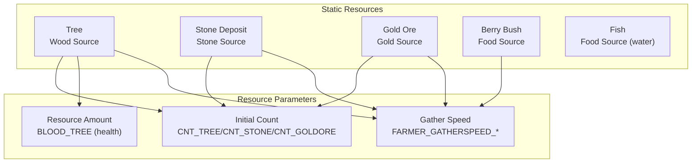
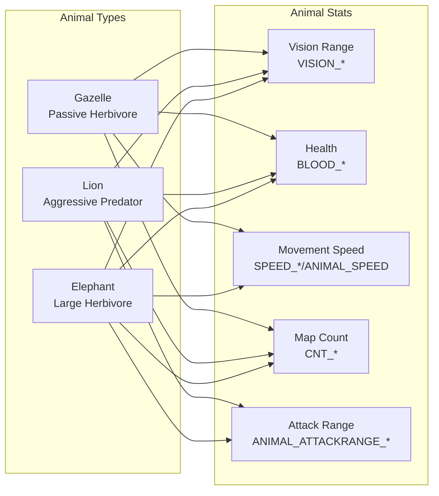
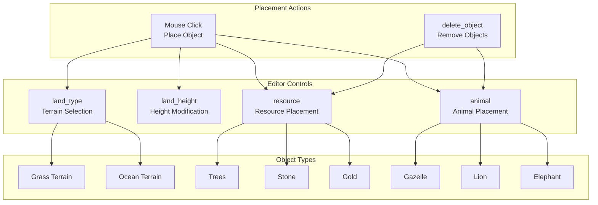
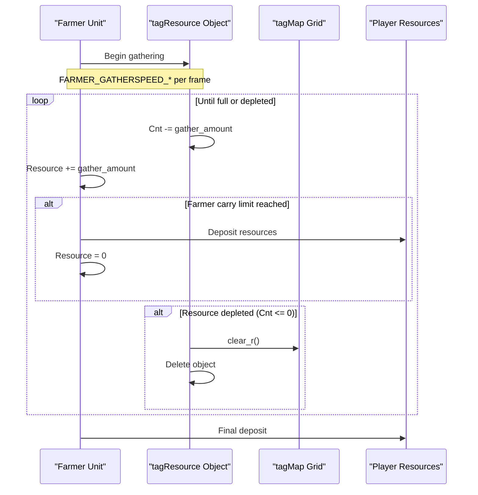

# Terrain and Objects

<details>
<summary>Relevant source files</summary>

The following files were used as context for generating this wiki page:

- [Editor.ui](Editor.ui)
- [GlobalVariate.h](GlobalVariate.h)
- [config.json](config.json)

</details>


This page documents the terrain system, static resource objects (trees, stone, gold), and animals that populate the game world. For information about the overall Map structure and coordinate systems, see [Map Structure](#6.1). For collision detection and spatial queries, see [Collision and Pathfinding](#6.3).

## Overview

The game world consists of a terrain grid overlaid with placeable objects. The terrain defines the ground type and elevation at each grid position, while objects include gatherable resources (trees, stone deposits, gold ore, berry bushes, fish) and neutral animals (gazelle, lions, elephants). These objects are configured through `config.json` and can be placed either during map generation or through the map editor.

---

## Terrain System

### Terrain Types and Structure

The terrain grid uses the `tagTerrain` structure to represent each grid cell:

**Structure: tagTerrain**

| Field | Type | Description |
|-------|------|-------------|
| `height` | `int` | Elevation level of the terrain cell |
| `type` | `int` | Terrain type identifier (grass, ocean) |

Sources: [GlobalVariate.h:828-831]()

The game supports two primary terrain types:
- **Grass** (default land terrain)
- **Ocean** (water terrain, passable by boats)

Terrain type affects unit movement capabilities - land units can only traverse grass, while boats can only move on ocean tiles. The map editor provides controls to modify terrain types through the `land_type` combo box.

Sources: [Editor.ui:335-359]()

### Height Map

Each terrain cell has a `height` value that creates elevation differences across the map. Height affects:
- Visual rendering (isometric display elevation)
- Line-of-sight calculations
- Strategic positioning

The editor provides height modification tools through the `land_height` combo box with options to:
- Raise height (`提升高度`)
- Lower height (`降低高度`)

Sources: [Editor.ui:29-53]()

### Terrain Data Storage

Terrain data is stored in the `tagInfo` structure as a 2D vector for efficient access:

```cpp
using TerrainData = const vector<vector<tagTerrain>>;
TerrainData* theMap;
```

The map dimensions are configured through:
- `MAP_L`: Map length (default 100)
- `MAP_U`: Map width (default 100)

Sources: [GlobalVariate.h:848-849](), [config.json:27-28]()

---

## Static Resource Objects

### Resource Types

The game includes five categories of gatherable resources placed as objects on the terrain:



Sources: [config.json:56-77](), [Editor.ui:259-291]()

### Tree Objects

Trees are the primary source of wood and are configured with:

| Parameter | Config Key | Default Value |
|-----------|------------|---------------|
| Health/Amount | `BLOOD_TREE` | 25 |
| Initial Count | `CNT_TREE` | 75 |
| Gather Speed | `FARMER_GATHERSPEED_WOOD` | 0.02 per frame |

Trees use the `BLOOD_TREE` parameter to determine how much wood can be gathered before depletion. Farmers gather at `FARMER_GATHERSPEED_WOOD` rate and can carry up to `FARMER_CARRYLIMIT_WOOD` (10) units before needing to deposit.

Sources: [config.json:56-57, 68](), [GlobalVariate.h:277-278, 289]()

### Stone Deposits

Stone deposits provide stone resources for construction:

| Parameter | Config Key | Default Value |
|-----------|------------|---------------|
| Initial Count | `CNT_STONE` | 250 |
| Gather Speed | `FARMER_GATHERSPEED_STONE` | 0.02 per frame |
| Carry Limit | `FARMER_CARRYLIMIT_STONE` | 10 |

Sources: [config.json:71, 75]()

### Gold Ore

Gold ore is the most valuable resource, used for advanced units and technologies:

| Parameter | Config Key | Default Value |
|-----------|------------|---------------|
| Initial Count | `CNT_GOLDORE` | 200 |
| Gather Speed | `FARMER_GATHERSPEED_GOLD` | 0.02 per frame |
| Carry Limit | `FARMER_CARRYLIMIT_GOLD` | 10 |

Sources: [config.json:72, 76]()

### Berry Bushes and Fish

Additional food sources include:
- **Berry Bushes**: `CNT_BUSH` = 150 initial count
- **Fish**: `CNT_FISH` = 200 initial count (water-based)

Both provide food when gathered, using `FARMER_GATHERSPEED_FOOD` = 0.02 and carry limit of 10.

Sources: [config.json:74, 77, 69-70]()

---

## Animal Objects

### Animal Types

The game includes three neutral animal types that populate the map:



Sources: [config.json:44-55](), [Editor.ui:292-321]()

### Gazelle (瞪羚)

Passive herbivores that provide food when hunted:

| Parameter | Config Key | Value |
|-----------|------------|-------|
| Vision Range | `VISION_GAZELLE` | 2 |
| Health | `BLOOD_GAZELLE` | 8 |
| Food Yield | `CNT_GAZELLE` | 150 |
| Movement Speed | `ANIMAL_SPEED` | 3.162 |

Gazelles are non-aggressive and will flee from threats. They provide `CNT_GAZELLE` = 150 food units when fully harvested.

Sources: [config.json:44-46, 31]()

### Lion (狮子)

Aggressive predators that attack nearby units:

| Parameter | Config Key | Value |
|-----------|------------|-------|
| Vision Range | `VISION_LION` | 3 |
| Health | `BLOOD_LION` | 20 |
| Food Yield | `CNT_LION` | 100 |
| Attack Range | `ANIMAL_ATTACKRANGE_LION` | 10 |

Lions are hostile and will engage units within their attack range. They provide less food than gazelles but are more dangerous.

Sources: [config.json:47-50]()

### Elephant (大象)

Large herbivores with high health and attack capability:

| Parameter | Config Key | Value |
|-----------|------------|-------|
| Vision Range | `VISION_ELEPHANT` | 4 |
| Health | `BLOOD_ELEPHANT` | 45 |
| Food Yield | `CNT_ELEPHANT` | 300 |
| Attack Range | `ANIMAL_ATTACKRANGE_ELEPHANT` | 10 |
| Movement Speed | `SPEED_ELEPHANT` | 2.033 |

Elephants provide the most food but are challenging to hunt due to their high health and aggressive behavior when attacked.

Sources: [config.json:51-55]()

---

## Resource Representation

### tagResource Structure

All placeable resource objects (trees, stone, gold, animals) are represented using the `tagResource` structure:

**Structure: tagResource**

| Field | Type | Description |
|-------|------|-------------|
| `SN` | `int` | Unique serial number for the object |
| `BlockDR`, `BlockUR` | `int` | Block coordinate position |
| `DR`, `UR` | `double` | Precise detail coordinate position |
| `Type` | `int` | Resource type identifier |
| `ProductSort` | `int` | Type of product yielded when gathered |
| `Cnt` | `int` | Remaining resource amount |
| `Blood` | `int` | Current health/durability |

The `tagResource` structure extends `tagObj` to inherit the serial number and block coordinates. The `Cnt` field tracks remaining resources, decreasing as farmers gather from the object. When `Cnt` reaches zero, the resource is depleted and removed from the map.

Sources: [GlobalVariate.h:696-703]()

### tagMap Structure

The `tagMap` structure stores resource information at specific map grid locations:

**Structure: tagMap**

| Field | Type | Description |
|-------|------|-------------|
| `explore` | `bool` | Whether the position has been explored |
| `high` | `int` | Terrain height at this position |
| `type` | `int` | Resource type (berry, tree, etc.) |
| `ResType` | `int` | Product type yielded (wood, food, etc.) |
| `fundation` | `int` | Size of resource footprint |
| `SN` | `int` | Serial number of resource object |
| `remain` | `int` | Remaining resource quantity |

The `tagMap` structure acts as a spatial index, allowing queries for resources at specific grid positions. The `clear_r()` method resets resource information when a resource is depleted or removed.

Sources: [GlobalVariate.h:798-827]()

---

## Object Placement System

### Editor Placement Controls

The map editor provides combo boxes for placing different object types:



Sources: [Editor.ui:16-446]()

### Placement Workflow

1. **Selection Phase**: User selects object type from appropriate combo box:
   - `land_type` for terrain (grass/ocean)
   - `land_height` for elevation changes
   - `resource` for resources (trees, stone, gold)
   - `animal` for animals (gazelle, lion, elephant)

2. **Placement Phase**: User clicks on the map to place the selected object at the clicked location

3. **Deletion Phase**: User clicks `delete_object` button then clicks objects to remove them

Sources: [Editor.ui:29-359]()

### Resource Density Configuration

Initial resource distribution is controlled through `CNT_*` parameters in `config.json`:

| Resource Type | Config Parameter | Default Count |
|---------------|------------------|---------------|
| Trees | `CNT_TREE` | 75 |
| Berry Bushes | `CNT_BUSH` | 150 |
| Stone Deposits | `CNT_STONE` | 250 |
| Gold Ore | `CNT_GOLDORE` | 200 |
| Fish | `CNT_FISH` | 200 |
| Gazelles | `CNT_GAZELLE` | 150 |
| Lions | `CNT_LION` | 100 |
| Elephants | `CNT_ELEPHANT` | 300 |

These counts represent the initial resource amount yielded when the object is fully harvested, not the number of objects placed on the map.

Sources: [config.json:46-77]()

---

## Resource Lifecycle

### Gathering and Depletion



Sources: [GlobalVariate.h:798-827](), [config.json:68-72]()

### Resource Parameters

Each resource type has associated gathering parameters:

**Gather Speed Parameters**:
- `FARMER_GATHERSPEED_WOOD` = 0.02
- `FARMER_GATHERSPEED_FOOD` = 0.02
- `FARMER_GATHERSPEED_GOLD` = 0.02
- `FARMER_GATHERSPEED_STONE` = 0.02

**Carry Limit Parameters**:
- `FARMER_CARRYLIMIT_WOOD` = 10
- `FARMER_CARRYLIMIT_FOOD` = 10
- `FARMER_CARRYLIMIT_GOLD` = 10
- `FARMER_CARRYLIMIT_STONE` = 10

These limits can be upgraded through technology research, with upgraded versions having higher carry capacities:
- `FARMER_CARRYLIMIT_UPGRADEWOOD` = 12
- `FARMER_CARRYLIMIT_UPGRADEFOOD` = 13
- `FARMER_CARRYLIMIT_UPGRADEGOLD` = 15
- `FARMER_CARRYLIMIT_UPGRADESTONE` = 13

Sources: [config.json:60-67](), [GlobalVariate.h:281-293]()

---

## Object Grid Integration

### Coordinate System

Objects on the terrain use two coordinate representations:

1. **Block Coordinates**: Integer grid positions (`BlockDR`, `BlockUR`)
2. **Detail Coordinates**: Precise floating-point positions (`DR`, `UR`)

The conversion between block and detail coordinates is handled by:
- `BLOCKSIDELENGTH` = 35.777 (detail units per block)
- `trans_BlockPointToDetailCenter()` function converts block to detail center

Sources: [config.json:25](), [GlobalVariate.h:1318]()

### Collision and Footprint

Resources occupy space on the grid determined by their `fundation` (footprint) value in the `tagMap` structure. This prevents overlapping placement and defines the collision area for unit pathfinding.

The `pixMemoryMap` structure stores collision information for each object, generated from the object's visual representation. This enables pixel-accurate collision detection for resource gathering and unit movement.

Sources: [GlobalVariate.h:806, 1002-1084]()

---

## Farm Buildings

### Special Case: Farms

Unlike natural resources, farms are player-constructed buildings that generate renewable food:

| Parameter | Config Key | Value |
|-----------|------------|-------|
| Build Cost | `BUILD_FARM_WOOD` | 75 |
| Build Time | `TIME_BUILD_FARM` | 30 frames |
| Food Capacity | `CNT_BUILD_FARM` | 250 |
| Health | `BLOOD_BUILD_FARM` | 50 |
| Vision Range | `VISION_FARM` | 4 |

Farms can be upgraded through market research to increase food yield:
- `BUILDING_MARKET_FARM_UPGRADE_ADDITION_FOOD` = +75 food
- `BUILDING_MARKET_PLOW_UPGRADE_ADDITION_FOOD` = +75 food (cumulative)

The `CNT_UPGRADEFARM` parameter (325) represents the farm capacity after the first upgrade (250 + 75).

Sources: [config.json:73, 211-245](), [GlobalVariate.h:211-215]()