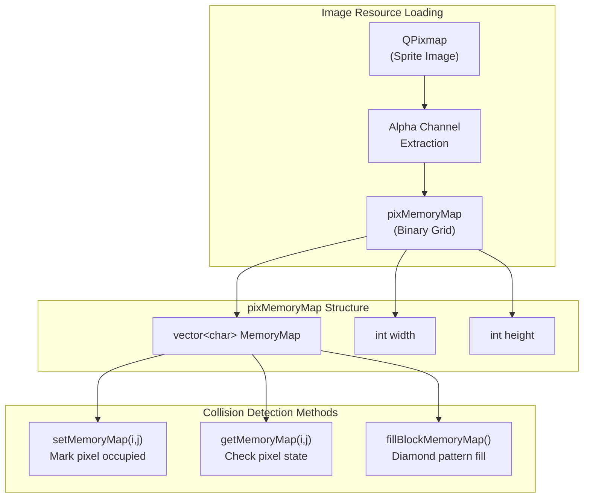
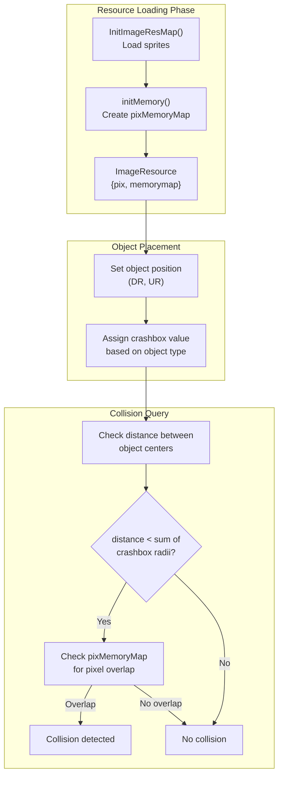
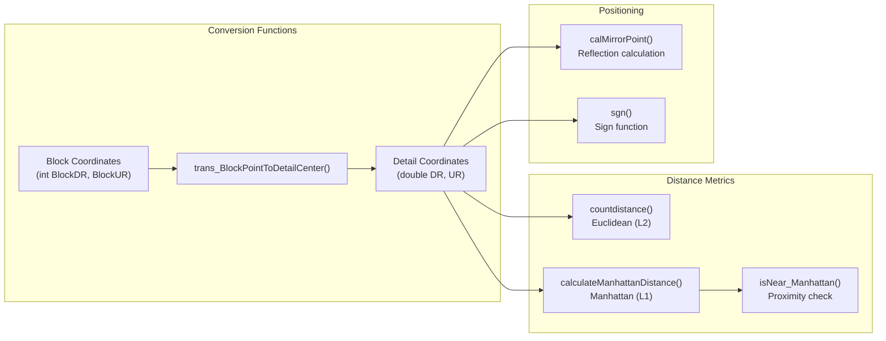

# Collision and Pathfinding

<details>
<summary>Relevant source files</summary>

The following files were used as context for generating this wiki page:

- [GlobalVariate.cpp](GlobalVariate.cpp)
- [GlobalVariate.h](GlobalVariate.h)
- [config.json](config.json)

</details>


This document explains the collision detection and spatial calculation systems used in the game engine. It covers the coordinate systems, collision detection using pixel-based memory maps and crashbox values, distance calculations using Manhattan and Euclidean metrics, and spatial query utilities that support unit movement and interaction.

For information about unit movement behavior and pathfinding logic, see the Unit AI and Movement section (not yet written). For information about the map structure and terrain representation, see [Map Structure](#6.1).

---

## Coordinate Systems

The game uses two coordinate systems that work together for spatial calculations:

**Block Coordinates** (`BlockDR`, `BlockUR`): Integer grid coordinates where each block represents a map tile. The map dimensions are defined by `MAP_L` and `MAP_U` (typically 100x100 blocks).

**Detail Coordinates** (`DR`, `UR`): Floating-point coordinates that represent precise positions within the game world. These are measured in detail units, where each block has side length `BLOCKSIDELENGTH` (approximately 35.78 detail units).

The `trans_BlockPointToDetailCenter()` function converts block coordinates to the detail coordinate at the center of that block:

```
detail_coordinate = (block_coordinate + 0.5) * BLOCKSIDELENGTH
```

This dual coordinate system allows for efficient spatial queries at the block level while maintaining smooth unit movement at the detail level.

**Sources:** [GlobalVariate.cpp:1089-1092](), [config.json:25,27-28](), [GlobalVariate.h:228-231]()

---

## Collision Detection System

### pixMemoryMap Structure

The `pixMemoryMap` struct provides pixel-accurate collision detection by creating binary memory maps from sprite alpha channels. Each pixel in a sprite is marked as occupied (1) or free (0) based on its alpha value.



The `initMemory()` function processes each sprite to create its collision map:

1. Converts `QPixmap` to `QImage` for pixel access
2. Iterates through each pixel
3. Checks if alpha channel is non-zero: `(piximage.pixel(i,j)) & (0xff000000) != 0`
4. Marks occupied pixels and their neighbors (3x3 dilation for smoother collision)

The `fillBlockMemoryMap()` method creates a diamond-shaped collision area for isometric block sprites, filling pixels based on geometric constraints.

**Sources:** [GlobalVariate.h:1002-1084](), [GlobalVariate.cpp:970-1013]()

---

### Crashbox Values

Crashbox values define the collision radius for different object types. These are circular collision areas measured in detail coordinate units:

| Crashbox Type | Value | Typical Use |
|---------------|-------|-------------|
| `CRASHBOX_MICRO` | 1.0 | Point objects |
| `CRASHBOX_SINGLEOB` | 5.96 | Small resources (berries) |
| `CRASHBOX_SMALLOB` | 8.925 | Medium resources |
| `CRASHBOX_BIGOB` | 17.7 | Large resources (trees) |
| `CRASHBOX_SINGLEBLOCK` | 16.36 | 1x1 buildings |
| `CRASHBOX_SMALLBLOCK` | 34.21 | Small buildings |
| `CRASHBOX_SMALL` | 32.72 | Small units/buildings |
| `CRASHBOX_MIDDLE` | 50.57 | Medium buildings |
| `CRASHBOX_BIG` | 68.42 | Large buildings |

These values are loaded from `config.json` and used throughout the codebase for distance checks and collision avoidance. Objects are considered colliding when the distance between their centers is less than the sum of their crashbox radii.

**Sources:** [config.json:84-92](), [GlobalVariate.h:21-29](), [GlobalVariate.cpp:99-107]()

---

## Distance Calculations

### Manhattan Distance

The game primarily uses Manhattan distance (L1 metric) for pathfinding and spatial queries. Manhattan distance is calculated as:

```
distance = |x1 - x2| + |y1 - y2|
```

**Key Functions:**

**`calculateManhattanDistance()`** - Two overloaded versions for integer and double coordinates:
- `int calculateManhattanDistance(int x1, int y1, int x2, int y2)`
- `double calculateManhattanDistance(double x1, double y1, double x2, double y2)`

**`isNear_Manhattan()`** - Checks if two points are within a Manhattan distance threshold:
```cpp
bool isNear_Manhattan(double dr, double ur, double dr1, double ur1, double distance)
{
    return fabs(dr - dr1) <= distance && fabs(ur - ur1) <= distance;
}
```

This function uses a simplified check: both coordinate differences must be ≤ distance.

**Manhattan Distance Constants:**

| Constant | Value | Purpose |
|----------|-------|---------|
| `DISTANCE_Manhattan_MoveEndNEAR` | 0.0001 | Movement completion tolerance |
| `DISTANCE_Manhattan_PathMove` | 0.01 | Pathfinding step threshold |
| `DISTANCE_Manhattan_Unload` | 42.93 | Ship unload range |
| `DISTANCE_Manhattan_Transport` | 51.52 | Ship transport range |

**Sources:** [GlobalVariate.cpp:1068-1077,1019-1022](), [config.json:258-261](), [GlobalVariate.h:300-303,1311-1314]()

---

### Euclidean Distance

For precise distance measurements (attack ranges, vision), the game uses Euclidean distance (L2 metric):

```cpp
double countdistance(double L, double U, double L0, double U0)
{
    return sqrt((L-L0)*(L-L0) + (U-U0)*(U-U0));
}
```

**Euclidean Distance Constants:**

| Constant | Value | Purpose |
|----------|-------|---------|
| `DISTANCE_ATTACK_CLOSE` | 17.89 | Close combat range |
| `DISTANCE_HIT_TARGET` | 4.0 | Hit detection threshold |
| `DISTANCE_ELEPHANT_ATTACK` | 42.57 | Elephant attack range |
| `SHIP_ACT_MAX_DISTANCE` | 1843.2 | Ship interaction range (squared) |

Note that `SHIP_ACT_MAX_DISTANCE` appears to be a squared distance value used for optimization (avoiding square root calculation).

**Sources:** [GlobalVariate.cpp:1015-1018](), [config.json:262-265](), [GlobalVariate.h:304-307,1310]()

---

## Collision Detection Workflow



The collision system uses a two-tier approach:

1. **Broad Phase**: Quick distance check using crashbox radii (circle-circle collision)
2. **Narrow Phase**: Pixel-perfect collision using `pixMemoryMap` for precise sprite overlap detection

This hybrid approach balances performance and accuracy.

**Sources:** [GlobalVariate.cpp:590-697,970-1013](), [GlobalVariate.h:1086-1103]()

---

## Spatial Queries and Positioning

### Proximity Checks

The `isNear_Manhattan()` function is the primary tool for proximity queries throughout the codebase. It's used for:

- Checking if a unit has reached its destination
- Determining if units are close enough to interact
- Resource gathering range checks
- Building placement validation

Example usage pattern:
```cpp
// Check if unit reached target position
if (isNear_Manhattan(current_dr, current_ur, target_dr, target_ur, DISTANCE_Manhattan_MoveEndNEAR)) {
    // Arrival logic
}
```

**Sources:** [GlobalVariate.cpp:1019-1022](), [GlobalVariate.h:1311]()

---

### Mirror Point Calculation

The `calMirrorPoint()` function calculates a reflected position around a mirror point, used for unit positioning and formation:

```cpp
void calMirrorPoint(double& dr, double &ur, double dr_mirror, double ur_mirror, double dis)
{
    double dr_deta = dr_mirror - dr;
    double ur_deta = ur_mirror - ur;
    double total = fabs(dr_deta) + fabs(ur_deta);
    
    dr = dr_mirror + dr_deta/total * dis;
    ur = ur_mirror + ur_deta/total * dis;
}
```

This function:
1. Calculates the direction vector from point to mirror point
2. Normalizes using Manhattan distance
3. Projects the point `dis` units beyond the mirror point in the same direction

This is useful for positioning units on the opposite side of a building or resource, such as when farmers need to position themselves for gathering.

**Sources:** [GlobalVariate.cpp:1079-1087](), [GlobalVariate.h:1316]()

---

## Distance Constants Reference

The following table summarizes all distance-related constants used for spatial queries:

| Category | Constant | Value | Units | Usage |
|----------|----------|-------|-------|-------|
| **Movement** | `DISTANCE_Manhattan_MoveEndNEAR` | 0.0001 | Detail | Movement completion |
| | `DISTANCE_Manhattan_PathMove` | 0.01 | Detail | Pathfinding step |
| **Ships** | `DISTANCE_Manhattan_Unload` | 42.93 | Detail | Unload range |
| | `DISTANCE_Manhattan_Transport` | 51.52 | Detail | Transport boarding |
| | `SHIP_ACT_MAX_DISTANCE` | 1843.2 | Detail² | Max interaction |
| **Combat** | `DISTANCE_ATTACK_CLOSE` | 17.89 | Detail | Melee range |
| | `DISTANCE_HIT_TARGET` | 4.0 | Detail | Hit detection |
| | `DISTANCE_ELEPHANT_ATTACK` | 42.57 | Detail | Elephant attack |
| | `DIS_ARROWTOWER` | 7.0 | Blocks | Tower attack range |

Additional per-unit attack ranges are stored in configuration as `DIS_*` values (e.g., `DIS_BOWMAN`, `DIS_SHIP`) measured in block units.

**Sources:** [config.json:247-265](), [GlobalVariate.h:300-307](), [GlobalVariate.cpp:349-356]()

---

## Coordinate System Utilities



**`sgn(double x)`** - Returns the sign of a number (-1, 0, or 1), used for direction calculations:

```cpp
int sgn(double __x)
{
    if(__x > 0) return 1;
    else if(__x < 0) return -1;
    else return 0;
}
```

These utility functions form the foundation for all spatial calculations in the game, from simple distance checks to complex positioning algorithms.

**Sources:** [GlobalVariate.cpp:1089-1092,1136-1141](), [GlobalVariate.h:1318,1321]()

---

## Integration Notes

The collision and pathfinding system integrates with other game systems as follows:

- **Map System** ([Map Structure](#6.1)): Block coordinates map directly to terrain grid
- **Movement System**: Uses Manhattan distance for pathfinding decisions
- **Combat System** ([Combat System](#3.4)): Uses Euclidean distance for attack range checks
- **Resource System**: Uses crashbox values for placement validation and gathering range

The pixMemoryMap collision data is stored in `ImageResource` structs within the global `resMap`, making it accessible throughout the rendering and game logic systems.

**Sources:** [GlobalVariate.h:1086-1103,524-526]()