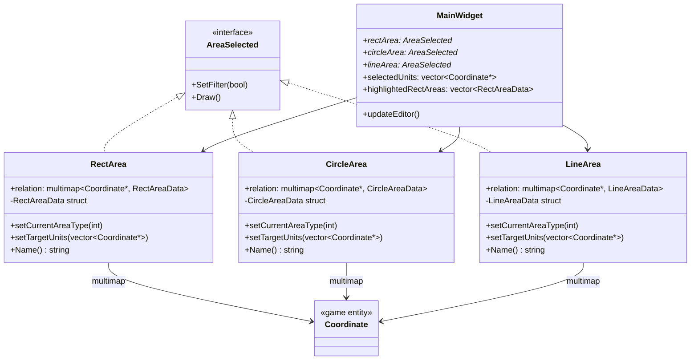
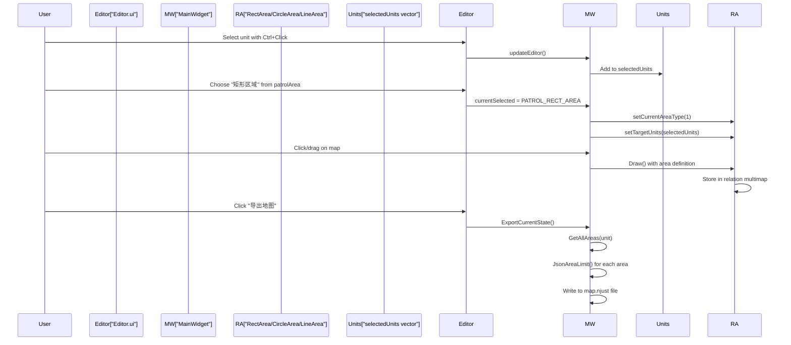
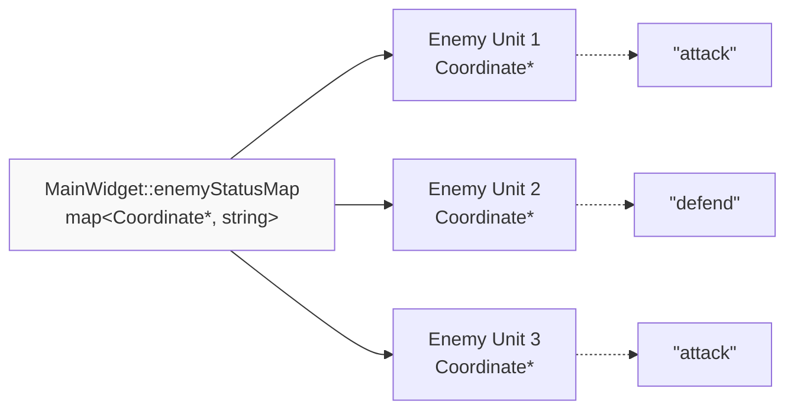
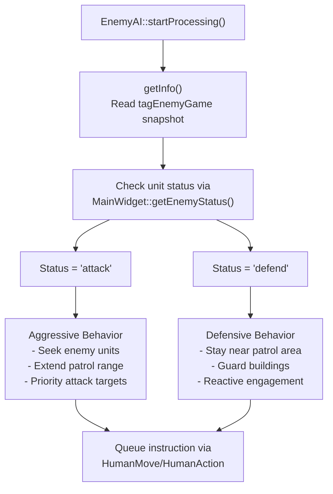
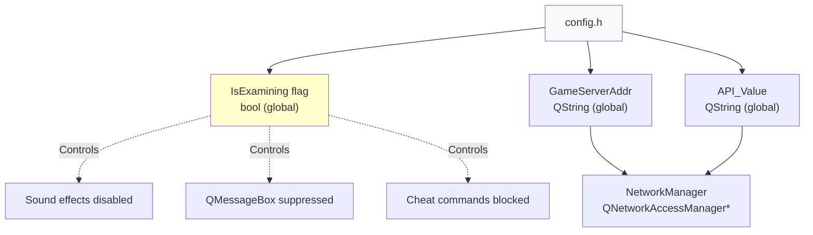
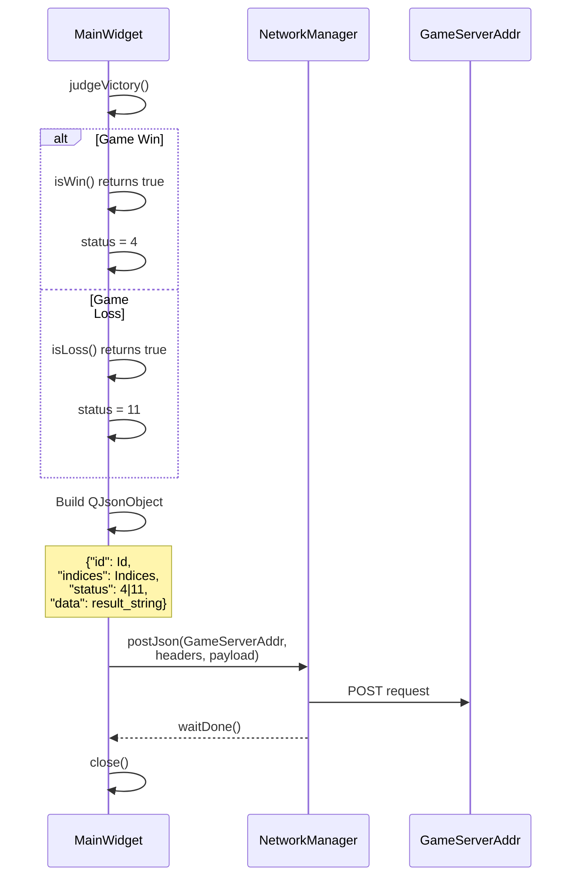
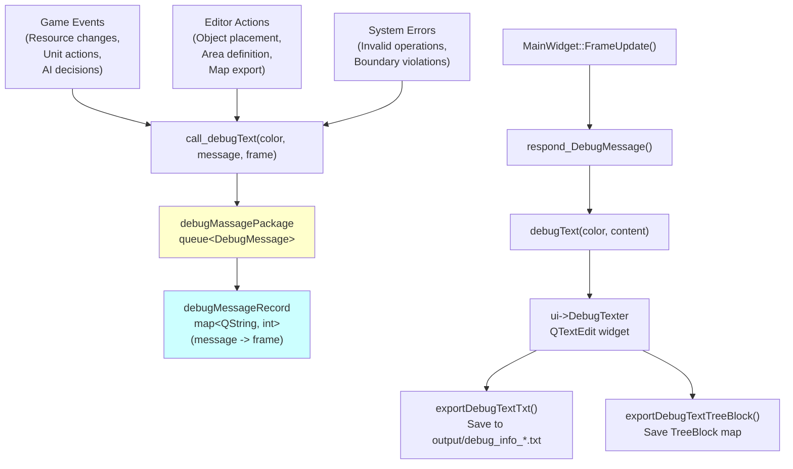
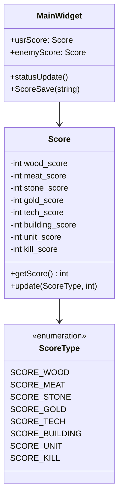
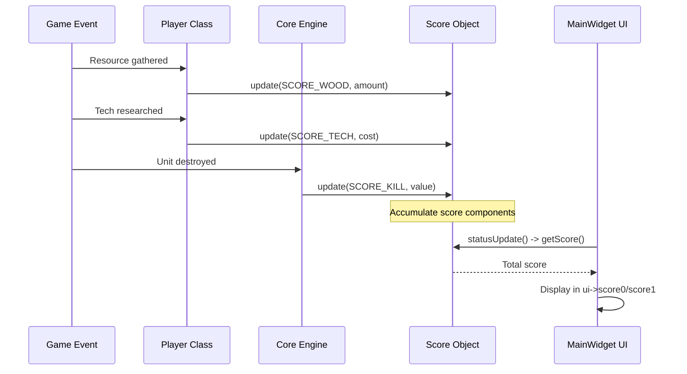

# Advanced Topics

<details>
<summary>Relevant source files</summary>

The following files were used as context for generating this wiki page:

- [MainWidget.cpp](MainWidget.cpp)
- [MainWidget.h](MainWidget.h)

</details>


This section documents specialized features and development utilities in the new-aoe codebase that extend beyond the core gameplay mechanics. These systems support map editing, AI behavior configuration, debugging, network integration, and game evaluation. While the core gameplay systems are covered in [Game Mechanics](#3) and [AI System](#5), this section focuses on the tooling and advanced configuration capabilities that enable sophisticated scenario design and system monitoring.

For information about the basic editor functionality (terrain modification, object placement), see [Map Editor](#4.2). For AI command processing, see [AI Architecture](#5.1).

---

## 7.1 Area Management System

The area management system allows map designers to define spatial constraints and patrol zones for units. Three geometric primitives are supported: rectangles, circles, and polylines. These areas can function as either **patrol zones** (beatarea) where units actively move, or **limit zones** (arealimit) that constrain movement ranges.

### Area Class Hierarchy



### Area Data Structures

Each area type stores its geometry and classification:

| Area Type | Geometry Fields | Area Classification |
|-----------|----------------|---------------------|
| **RectAreaData** | `dr`, `ur`, `w`, `h` | `areaType`: 1=Beatarea, 0=AreaLimit |
| **CircleAreaData** | `dr`, `ur`, `rad` | `areaType`: 1=Beatarea, 0=AreaLimit |
| **LineAreaData** | `data`: vector of `[x,y]` points | `areaType`: 1=Beatarea, 0=AreaLimit |

The `areaType` field distinguishes patrol zones (1) from movement restriction zones (0). This classification is set during editor interaction and persists to the exported map file.

### Editor Integration Workflow



### Global Area Object Management

The system maintains global area object pointers for editor access:

[MainWidget.cpp:14-16]()
```cpp
RectArea* g_rectArea = nullptr;
CircleArea* g_circleArea = nullptr;
LineArea* g_lineArea = nullptr;
```

These are initialized during editor mode and referenced by AI systems:

[MainWidget.cpp:2336-2343]()

### Area Export Format

Areas are serialized to JSON with geometry and classification data. The `ExportCurrentState` function supports multiple areas per unit:

[MainWidget.cpp:289-315]()

Area JSON structure example:
```json
{
  "Type": "RectArea",
  "DR": 50,
  "UR": 100,
  "W": 20,
  "H": 15,
  "AreaName": "Beatarea"
}
```

For units with multiple patrol areas, an array structure is used:

[MainWidget.cpp:475-481]()

### Area-Unit Relationships

The `relation` multimap associates units with their areas, allowing one-to-many relationships:

[MainWidget.cpp:291-307]()

The multimap structure enables:
- One unit to have multiple patrol routes (e.g., circular patrol + fallback line patrol)
- Efficient lookup of all areas for a given unit pointer
- Independent area definitions that don't interfere with unit lifecycle

**Sources:** [MainWidget.cpp:1-2700](), [MainWidget.h:64-78]()

---

## 7.2 Enemy Status and AI Behavior

The enemy status system allows map designers to configure AI unit behavior patterns. Each enemy unit can be assigned a status that determines its tactical stance: aggressive attack mode or defensive guard mode.

### Enemy Status Map Structure



The `enemyStatusMap` in `MainWidget` [MainWidget.h:73]() stores status strings keyed by unit pointers. The map persists across game sessions through JSON export.

### Status Assignment in Editor

The editor provides dropdown controls for status assignment:

[MainWidget.cpp:257-267]()

The editor combo box emits signals that set `currentSelected` to either `ENEMY_STATUS_ATTACK` or `ENEMY_STATUS_DEFEND`. When the user clicks a unit on the map, `handleEnemyStatusSelection` associates the status:

[MainWidget.cpp:711-715]()

### Status Persistence

Enemy status is exported alongside unit data during map save:

[MainWidget.cpp:493-497]()

The JSON format for a unit with status:
```json
{
  "DR": 1500,
  "UR": 2000,
  "Num": 42,
  "Sort": "Army",
  "Own": "LZ",
  "statu": "attack"
}
```

Note: The field name is "statu" (not "status") in the JSON format for historical consistency.

### Behavior Impact on AI

The status value influences AI decision-making through the following flow:



The AI queries unit status through `MainWidget::getEnemyStatus()` [MainWidget.h:50]() and adjusts its instruction generation accordingly. Attack-status units prioritize offensive actions, while defend-status units maintain tighter patrol zones.

### Debug Visualization

During map export, status assignment is logged to the debug console:

[MainWidget.cpp:496]()

This provides immediate feedback to map designers confirming status configuration.

**Sources:** [MainWidget.cpp:257-267,493-497,711-715](), [MainWidget.h:49-50,72-73]()

---

## 7.3 Network and Exam Mode

The network and exam mode system enables remote evaluation and automated testing of gameplay scenarios. When `IsExamining` is true, the game operates in a restricted mode that disables cheats, suppresses UI dialogs, and reports game state to an external evaluation server.

### Exam Mode Configuration



The `IsExamining` global flag (defined in config.h/GlobalVariate) controls multiple behavior branches:

| Affected System | Normal Mode | Exam Mode |
|----------------|-------------|-----------|
| **Sound** | Enabled | Disabled [MainWidget.cpp:2152,2157]() |
| **Victory Dialog** | Shows QMessageBox | Auto-closes [MainWidget.cpp:2125,2141]() |
| **Resource Cheat** | Enabled | Blocked [MainWidget.cpp:2437]() |
| **Debug Console** | Visible | Hidden |
| **BGM** | Plays | Silent [MainWidget.cpp:2451]() |

### Network Reporting Protocol

When game-over conditions are met, the system reports results to the evaluation server:

[MainWidget.cpp:2364-2377]()

The `HandleGameOver` function constructs a JSON payload with game outcome:



### JSON Payload Structure

The posted JSON includes:

```json
{
  "id": "student_id_string",
  "indices": "scenario_indices",
  "status": 4,  // 4=win, 11=loss
  "data": "游戏胜利" or "CurrentStatus details"
}
```

The `api` parameter is sent in HTTP headers: `{{"api", API_Value}}`

The `Core::GetCurrentStatus()` method provides detailed failure reasons when status=11 (loss condition).

### Exam Mode Restrictions

The exam mode enforces restrictions through conditional checks:

**Sound Suppression:**
[MainWidget.cpp:2152]()

**Cheat Prevention:**
[MainWidget.cpp:2437]()

**Dialog Auto-handling:**
[MainWidget.cpp:2125,2141]()

These restrictions ensure fair evaluation without manual intervention or exploits.

**Sources:** [MainWidget.cpp:2125,2141,2152,2157,2364-2377,2437,2451]()

---

## 7.4 Debug and Logging System

The debug and logging system provides real-time feedback during development and testing. It features color-coded messages, message filtering, and export capabilities for post-game analysis.

### Debug Message Pipeline



### Message Recording and Deduplication

The `debugMessageRecord` map [MainWidget.cpp:2460]() tracks when each unique message was last displayed, preventing spam:

[MainWidget.cpp:2468-2472]()

Messages older than 200 frames are automatically pruned, maintaining a sliding window of recent debug output.

### Color-Coded Message System

The `debugText` function formats messages with HTML color codes:

[MainWidget.cpp:2475-2489]()

| Color | Macro | Use Case | Example |
|-------|-------|----------|---------|
| **Blue** | `COLOR_BLUE` | System events | "游戏开始", "游戏胜利" |
| **Red** | `COLOR_RED` | Errors | "错误：位置超出地图范围" |
| **Green** | `COLOR_GREEN` | Success | "导出地图", "已添加巡逻区域" |
| **Black** | `COLOR_BLACK` | Generic info | Neutral status updates |
| **Yellow** | (extended) | Warnings | "找到 N 个区域" |
| **Cyan** | (extended) | Detailed info | Unit processing details |
| **Magenta** | (extended) | Debug traces | Area name logging |

Extended colors (yellow, cyan, magenta) are used in detailed logging during map export [MainWidget.cpp:441,447,455,462]().

### Message Queue Processing

The `call_debugText` function (defined in GlobalVariate) enqueues messages:

```cpp
struct DebugMessage {
    QString color;
    QString content;
    int frame;
};
queue<DebugMessage> debugMassagePackage;
```

Messages are dequeued during `respond_DebugMessage()`:

[MainWidget.cpp:2462-2466]()

### Export Functionality

**Text Export:**
[MainWidget.cpp:2525-2558]()

Creates timestamped files: `output/debug_info_YYYY-MM-DD_hh-mm-ss.txt`

**TreeBlock Export:**
[MainWidget.cpp:2496-2523]()

Exports the `Map::TreeBlock` visibility grid as a text matrix, useful for debugging fog-of-war and tree occlusion. Player positions are marked with `3`, trees with `1`, open areas with `0`.

**Clear Operations:**
- `clearDebugText()` [MainWidget.cpp:2491-2494]() - Clears the UI widget
- `clearDebugTextFile()` [MainWidget.cpp:2560-2581]() - Deletes all files in `output/` directory

### Usage Examples from Codebase

**Editor Feedback:**
[MainWidget.cpp:157]()
```cpp
call_debugText("green", " 导出地图", 0);
```

**Terrain Validation:**
[MainWidget.cpp:1191-1193]()
```cpp
call_debugText("red", " 错误：位置超出地图范围", 0);
```

**Area Export Progress:**
[MainWidget.cpp:441,466,481]()

The third parameter (frame number) is typically `0` for immediate display, or can be set to filter messages by game frame.

**Sources:** [MainWidget.cpp:157,441,447,455,462,466,481,1191-1193,2460-2489,2491-2581]()

---

## 7.5 Score System

The score system tracks player performance across multiple dimensions: resource collection, technology research, military production, and combat effectiveness. Scores are calculated continuously during gameplay and exported for post-game analysis.

### Score Structure



Global score instances are declared:

[MainWidget.cpp:30-31]()
```cpp
extern Score usrScore;
extern Score enemyScore;
```

### Score Components

| Component | Description | Weight Factor |
|-----------|-------------|---------------|
| **wood_score** | Total wood gathered | 1x resource value |
| **meat_score** | Total food gathered | 1x resource value |
| **stone_score** | Total stone gathered | 1x resource value |
| **gold_score** | Total gold gathered | 2x resource value |
| **tech_score** | Technologies researched | Based on tech cost |
| **building_score** | Buildings constructed | Based on building cost |
| **unit_score** | Military units trained | Based on unit cost |
| **kill_score** | Enemy units destroyed | Based on enemy unit value |

The `getScore()` method aggregates all components with appropriate weighting.

### Score Update Flow



### Score Display

Scores are rendered in the UI with color coding:

[MainWidget.cpp:2059-2066]()

Player score appears in blue (`#00007f`), enemy score in red (`#aa0000`).

### Score Persistence

When the game ends, scores are saved to `GameScore.txt`:

[MainWidget.cpp:2347-2362]()

File format:
```
<gameResult> <score> <time_seconds>
```

Example output:
```
Victory 8523 1847
```

Where:
- `gameResult`: String indicating win/loss condition
- `score`: Total score from `usrScore.getScore()`
- `time_seconds`: Game duration from `SelectWidget::getSecend()`

### Score Integration with Victory Conditions

Score is displayed in victory/defeat messages:

[MainWidget.cpp:2122,2138]()

The final score provides players with quantitative feedback on their performance regardless of win/loss outcome.

### Network Reporting

In exam mode, the final score is included in the network payload:

[MainWidget.cpp:2364-2377]()

While the current implementation sends win/loss status, the score value could be included in the `data` field for detailed performance analysis.

**Sources:** [MainWidget.cpp:30-31,2059-2066,2122,2138,2347-2362,2364-2377]()