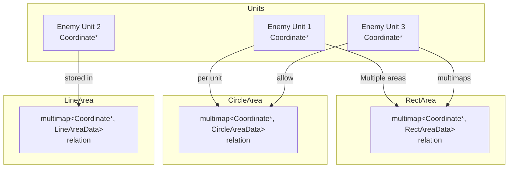
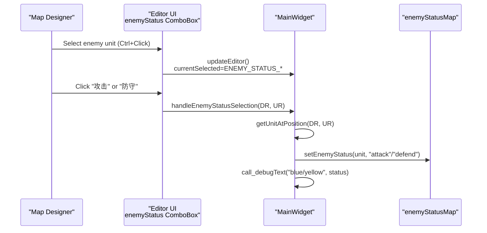
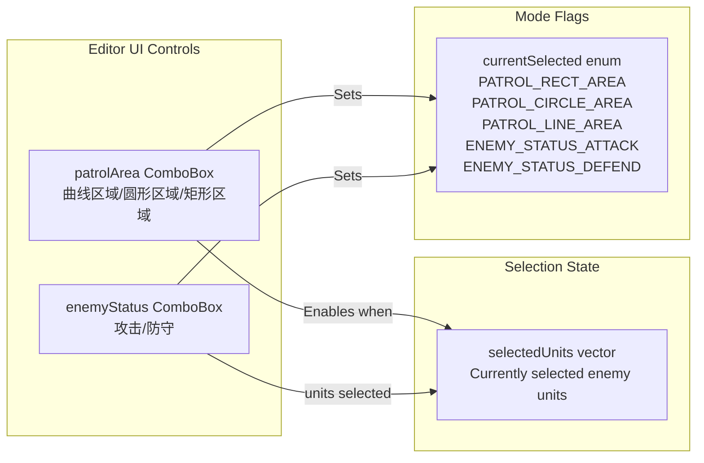
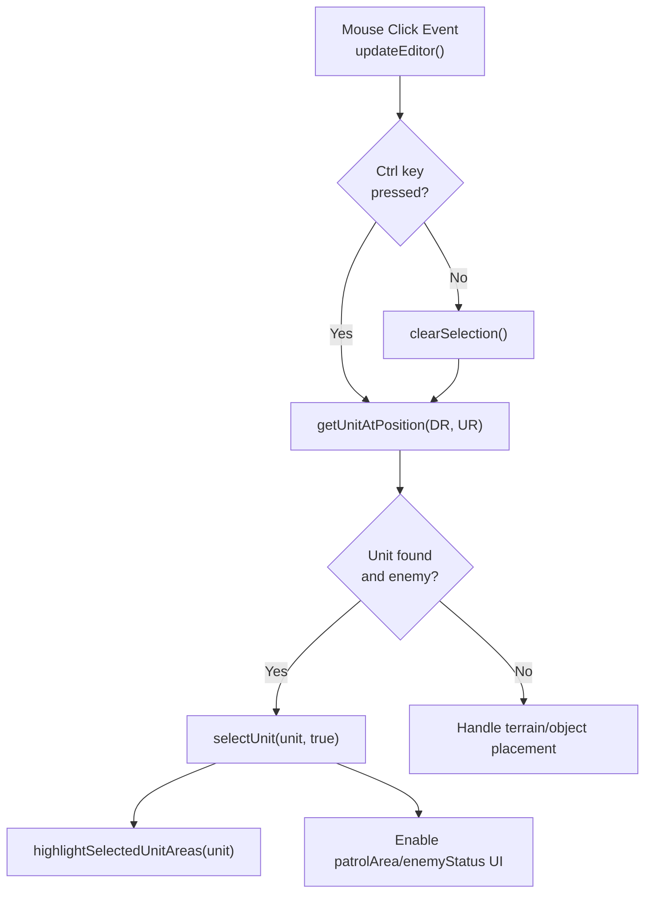
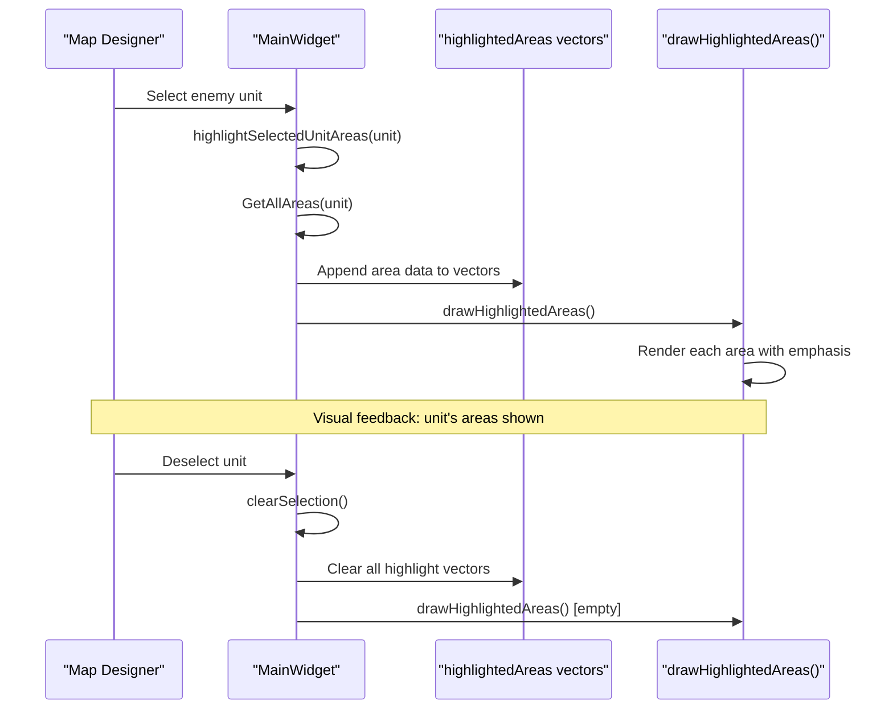
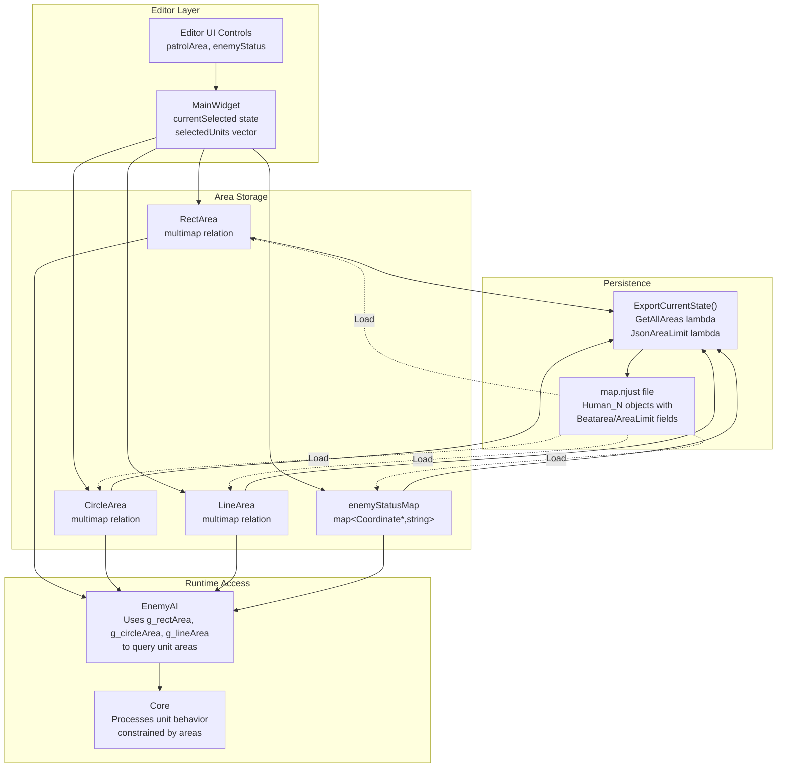

# Area Management System

<details>
<summary>Relevant source files</summary>

The following files were used as context for generating this wiki page:

- [Editor.ui](Editor.ui)
- [MainWidget.cpp](MainWidget.cpp)
- [MainWidget.h](MainWidget.h)

</details>


The Area Management System provides spatial control mechanisms for defining unit behavior zones in the map editor. This system allows map designers to constrain enemy unit movement patterns and define patrol routes through geometric shapes (rectangles, circles, and curved paths). For information about the map editor's other features such as terrain modification and object placement, see [Map Editor](#4.2). For AI behavior implementation that responds to these areas, see [AI Architecture](#5.1).

---

## Overview

The Area Management System consists of three geometric area types that can be associated with units (typically enemy units) to control their spatial behavior. Each unit can have multiple areas of different types assigned to it, and these relationships are stored in multimap data structures for efficient querying during gameplay and serialization during map export.

**Sources:** [MainWidget.cpp:8-16](), [MainWidget.h:64-78]()

---

## Area Type Classes

The system provides three geometric primitives for defining spatial zones:

| Class | Shape | Primary Use Case | Data Structure |
|-------|-------|------------------|----------------|
| `RectArea` | Rectangle | Simple patrol zones, building defense perimeters | `RectAreaData`: DR, UR, width, height |
| `CircleArea` | Circle | Radial patrol zones, point defense | `CircleAreaData`: DR, UR, radius |
| `LineArea` | Curved Path | Complex patrol routes, waypoint paths | `LineAreaData`: vector of [x,y] coordinate pairs |

### Global Area Objects

Three singleton area objects are instantiated globally to manage the editor's area creation workflow:

```cpp
RectArea* g_rectArea = nullptr;
CircleArea* g_circleArea = nullptr;
LineArea* g_lineArea = nullptr;
```

These objects are initialized during `MainWidget` construction and persist throughout the editor session.

**Sources:** [MainWidget.cpp:14-16](), [MainWidget.h:271-273]()

---

## Area-Unit Relationship Architecture

### Relationship Storage

Each area type maintains a multimap that associates `Coordinate*` unit pointers with area data:



**Diagram: Area-Unit multimap relationships allowing multiple areas per unit**

The multimap structure allows a single unit to be associated with multiple areas of the same or different types. For example, an enemy soldier might have a rectangular limit area (cannot leave a fortress) and a circular patrol area (walk around a courtyard).

**Sources:** [MainWidget.cpp:289-308]()

### Querying All Areas for a Unit

The `GetAllAreas` lambda in `ExportCurrentState` demonstrates how to retrieve all areas associated with a unit:

```cpp
auto GetAllAreas=[&](Coordinate*obj)->vector<pair<string,void*>>{
    vector<pair<string,void*>> areas;
    auto&lineR=((LineArea*)(lineArea))->relation;
    auto&circleR=((CircleArea*)(circleArea))->relation;
    auto&rectR=((RectArea*)(rectArea))->relation;
    
    // Query each multimap using equal_range
    for(auto it = lineR.equal_range(obj); it.first != it.second; ++it.first) {
        areas.push_back({LineArea::Name(), &(it.first->second)});
    }
    for(auto it = circleR.equal_range(obj); it.first != it.second; ++it.first) {
        areas.push_back({CircleArea::Name(), &(it.first->second)});
    }
    for(auto it = rectR.equal_range(obj); it.first != it.second; ++it.first) {
        areas.push_back({RectArea::Name(), &(it.first->second)});
    }
    return areas;
};
```

**Sources:** [MainWidget.cpp:289-308]()

---

## Area Categories: Beatarea vs AreaLimit

Each area instance has an `areaType` field that distinguishes its semantic purpose:

| Type Value | Category Name | Purpose | Visual Color |
|------------|---------------|---------|--------------|
| `1` | **Beatarea** (巡逻区域) | Defines patrol routes where units actively move | Blue |
| Other | **AreaLimit** (限制区域) | Defines movement constraints units cannot exit | Default |

### Setting Area Type

When the editor user selects a patrol area mode, the area type is configured:

```cpp
if (text == "矩形区域") {
    this->currentSelected = PATROL_RECT_AREA;
    ((RectArea*)rectArea)->setCurrentAreaType(1);  // 1 = patrol area (blue)
    ((RectArea*)rectArea)->setTargetUnits(selectedUnits);
}
```

### JSON Export Format

During map export, the `areaType` determines the JSON field name:

```cpp
QString areaName = (d.areaType == 1) ? "Beatarea" : "AreaLimit";
json.insert("AreaName", areaName);
```

For units with multiple areas, the export system creates separate JSON arrays:

- **Single area:** Stored as `"Beatarea"` or `"AreaLimit"` object
- **Multiple areas:** Stored as `"BeatAreas"` or `"AreaLimits"` array

**Sources:** [MainWidget.cpp:236-255](), [MainWidget.cpp:334-361](), [MainWidget.cpp:474-490]()

---

## Enemy Status System

The Enemy Status system works in conjunction with areas to define AI behavior modes. Each enemy unit can be assigned a status that influences its tactical decisions.

### Status Map Structure

```cpp
std::map<Coordinate*, string> enemyStatusMap;  // In MainWidget
```

### Status Values

| Status String | Behavior Mode | Description |
|---------------|---------------|-------------|
| `"attack"` | Offensive | Unit actively seeks and engages targets |
| `"defend"` | Defensive | Unit holds position, only engages nearby threats |

### Editor Workflow



**Diagram: Enemy status assignment workflow in the editor**

### Status Assignment and Retrieval

```cpp
// Setting status
void MainWidget::setEnemyStatus(Coordinate* unit, const string& status) {
    if (unit) {
        enemyStatusMap[unit] = status;
    }
}

// Retrieving status
string MainWidget::getEnemyStatus(Coordinate* unit) {
    auto it = enemyStatusMap.find(unit);
    if (it != enemyStatusMap.end()) {
        return it->second;
    }
    return "";  // No status assigned
}
```

### JSON Persistence

Enemy status is exported alongside unit data:

```cpp
string enemyStatus = getEnemyStatus(human);
if (!enemyStatus.empty()) {
    obj.insert("statu", QString::fromStdString(enemyStatus));
}
```

**Sources:** [MainWidget.cpp:258-267](), [MainWidget.cpp:711-715](), [MainWidget.cpp:493-497](), [MainWidget.h:48-50](), [MainWidget.h:73]()

---

## Editor UI Integration

### UI Components

The editor provides dedicated controls for area and status management:



**Diagram: Editor UI control relationships for area management**

### Control Enablement Logic

The `patrolArea` and `enemyStatus` combo boxes are initially disabled and activate when units are selected:

```cpp
connect(editor->ui->patrolArea, ..., this, [=](const QString& text) {
    if (selectedUnits.empty()) return;  // Disabled if no selection
    // ... handle area creation
});
```

**Sources:** [Editor.ui:360-445](), [MainWidget.cpp:236-267]()

---

## Unit Selection Workflow

### Selection Functions

| Function | Purpose | Multi-Select Support |
|----------|---------|---------------------|
| `selectUnit(Coordinate*, bool)` | Add unit to selection | `addToSelection=true` for Ctrl+Click |
| `clearSelection()` | Empty `selectedUnits` vector | N/A |
| `getUnitAtPosition(double, double)` | Find unit at DR/UR coordinates | Returns first match |

### Selection State Management

```cpp
void MainWidget::selectUnit(Coordinate* unit, bool addToSelection) {
    if (!addToSelection) {
        clearSelection();  // Single selection: clear previous
    }
    selectedUnits.push_back(unit);
    highlightSelectedUnitAreas(unit);  // Visual feedback
}

void MainWidget::clearSelection() {
    selectedUnits.clear();
    clearHighlightedAreas();
}
```

### Editor Mouse Event Handling



**Diagram: Unit selection logic flow in the editor**

**Sources:** [MainWidget.cpp:584-603](), [MainWidget.h:191-200]()

---

## Area Highlighting System

### Highlight Data Storage

```cpp
// In MainWidget
vector<RectAreaData> highlightedRectAreas;
vector<CircleAreaData> highlightedCircleAreas;
vector<LineAreaData> highlightedLineAreas;
```

These vectors store copies of area data that should be rendered with visual emphasis when units are selected.

### Highlight Workflow



**Diagram: Area highlighting sequence for selected units**

### Rendering Areas

The `updateEditor` function controls area visibility:

```cpp
bool isRectAreaActive = (currentSelected == RECT_AREA || currentSelected == PATROL_RECT_AREA);
bool isCircleAreaActive = (currentSelected == CIRCLE_AREA || currentSelected == PATROL_CIRCLE_AREA);
bool isLineAreaActive = (currentSelected == LINE_AREA || currentSelected == PATROL_LINE_AREA);

rectArea->SetFilter(!isRectAreaActive);  // false = visible
rectArea->Draw();
circleArea->SetFilter(!isCircleAreaActive);
circleArea->Draw();
lineArea->SetFilter(!isLineAreaActive);
lineArea->Draw();

drawHighlightedAreas();  // Overlay highlighted areas
```

**Sources:** [MainWidget.cpp:726-740](), [MainWidget.h:76-78]()

---

## Area Data Persistence

### JSON Export Structure

When exporting a map, each unit's associated areas are serialized to JSON. The export format supports both single areas (for backward compatibility) and multiple areas per unit.

### Area Serialization Format

#### Rectangle Area

```json
{
  "Type": "RectArea",
  "DR": 100,
  "UR": 200,
  "W": 50,
  "H": 30,
  "AreaName": "Beatarea"
}
```

#### Circle Area

```json
{
  "Type": "CircleArea",
  "DR": 150,
  "UR": 250,
  "R": 75,
  "AreaName": "AreaLimit"
}
```

#### Line/Curve Area

```json
{
  "Type": "LineArea",
  "Point": [
    [100, 200],
    [120, 220],
    [140, 210],
    [160, 230]
  ],
  "AreaName": "Beatarea"
}
```

### Unit Export with Multiple Areas

```cpp
for (Human* human : player[1]->human) {
    QJsonObject obj;
    // ... basic unit data ...
    
    auto allAreas = GetAllAreas(human);
    QJsonArray beatAreas;
    QJsonArray limitAreas;
    
    for(auto& areaData : allAreas){
        QJsonObject areaJson = JsonAreaLimit(areaData.first, areaData.second);
        QString areaName = areaJson.value("AreaName").toString();
        
        if(areaName == "Beatarea"){
            beatAreas.append(areaJson);
        } else {
            limitAreas.append(areaJson);
        }
    }
    
    // Single area: use singular field name for compatibility
    // Multiple areas: use plural field name with array
    if(!beatAreas.isEmpty()){
        if(beatAreas.size() == 1){
            obj.insert("Beatarea", beatAreas[0].toObject());
        } else {
            obj.insert("BeatAreas", beatAreas);
        }
    }
    if(!limitAreas.isEmpty()){
        if(limitAreas.size() == 1){
            obj.insert("AreaLimit", limitAreas[0].toObject());
        } else {
            obj.insert("AreaLimits", limitAreas);
        }
    }
    
    root.insert("Human_" + QString::number(Human_idx++), obj);
}
```

**Sources:** [MainWidget.cpp:317-363](), [MainWidget.cpp:443-490]()

---

## Area Management Data Flow

### Complete System Integration



**Diagram: Complete area management system data flow from editor to runtime**

**Sources:** [MainWidget.cpp:8-16](), [MainWidget.cpp:236-267](), [MainWidget.cpp:289-525](), [MainWidget.h:64-78]()

---

## Unit Reference Cleanup

When units are deleted (e.g., through the `clearArea` function), their references in the area multimaps must be cleaned up to prevent dangling pointers.

### Cleanup Function

```cpp
void MainWidget::cleanupUnitReferences(Coordinate* unit) {
    // Remove from selection
    auto it = std::find(selectedUnits.begin(), selectedUnits.end(), unit);
    if (it != selectedUnits.end()) {
        selectedUnits.erase(it);
    }
    
    // Remove from area relations
    ((RectArea*)rectArea)->relation.erase(unit);
    ((CircleArea*)circleArea)->relation.erase(unit);
    ((LineArea*)lineArea)->relation.erase(unit);
    
    // Remove from enemy status map
    enemyStatusMap.erase(unit);
}
```

This function is called during unit deletion to ensure all area and status associations are properly removed.

**Sources:** [MainWidget.cpp:831-833](), [MainWidget.h:43]()

---

## Summary Table

| Component | Type | Purpose | Key Methods/Fields |
|-----------|------|---------|-------------------|
| `RectArea` | Class | Rectangular area management | `relation` multimap, `setCurrentAreaType()`, `Draw()` |
| `CircleArea` | Class | Circular area management | `relation` multimap, `setTargetUnits()`, `Draw()` |
| `LineArea` | Class | Curved path management | `relation` multimap, `Draw()` |
| `selectedUnits` | `vector<Coordinate*>` | Tracks currently selected units | Modified by `selectUnit()`, `clearSelection()` |
| `enemyStatusMap` | `map<Coordinate*, string>` | Stores attack/defend status | `setEnemyStatus()`, `getEnemyStatus()` |
| `highlighted*Areas` | `vector<*AreaData>` | Visual feedback for selection | `highlightSelectedUnitAreas()`, `clearHighlightedAreas()` |
| `GetAllAreas` | Lambda function | Queries all areas for a unit | Returns `vector<pair<string,void*>>` |
| `JsonAreaLimit` | Lambda function | Serializes area to JSON | Returns `QJsonObject` |

**Sources:** [MainWidget.h:64-78](), [MainWidget.cpp:289-363]()