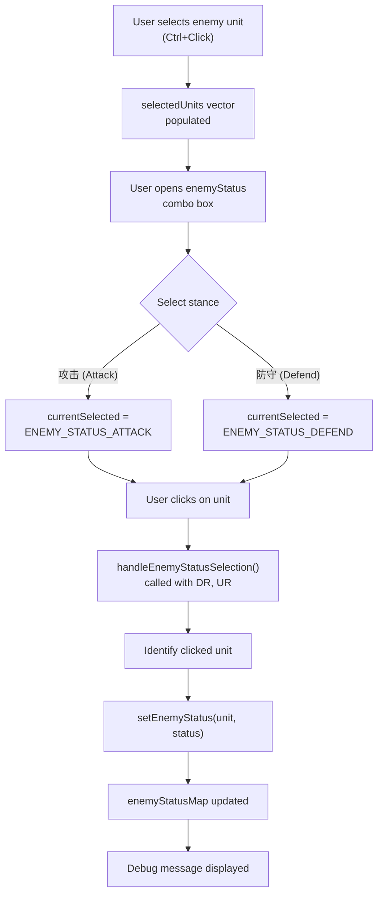
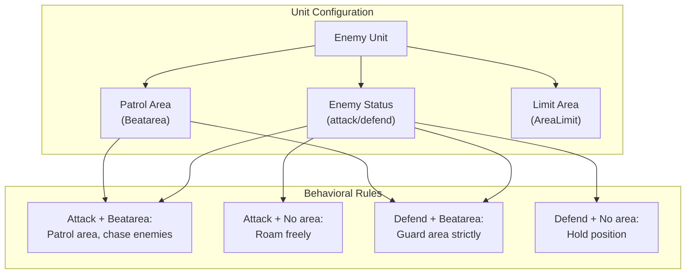
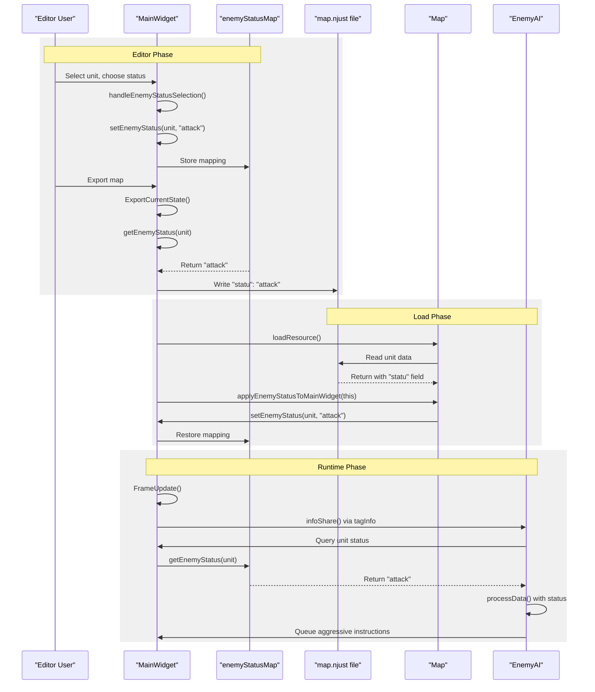

# Enemy Status and AI Behavior

<details>
<summary>Relevant source files</summary>

The following files were used as context for generating this wiki page:

- [Editor.ui](Editor.ui)
- [MainWidget.cpp](MainWidget.cpp)
- [MainWidget.h](MainWidget.h)

</details>


This document describes the enemy status system used to control AI unit behavior in the map editor. The enemy status system allows map creators to assign behavioral stances ("attack" or "defend") to individual enemy units, which influences how the AI controls those units during gameplay.

For information about patrol area definition and unit movement restrictions, see [Area Management System](#7.1). For details about the AI architecture and command processing, see [AI Architecture](#5.1) and [Instruction and Command System](#5.2).

---

## Overview

The enemy status system provides a simple but effective way to customize AI behavior on a per-unit basis. Each enemy unit can be assigned one of two status values:

- **Attack**: Units actively seek out and engage player units
- **Defend**: Units remain in their assigned patrol areas and only engage nearby threats

This system is integrated with the map editor ([Map Editor](#4.2)) and works in conjunction with the patrol area system ([Area Management System](#7.1)) to create varied and strategic AI behavior patterns.

**Key Components**:

| Component | Type | Purpose |
|-----------|------|---------|
| `enemyStatusMap` | `std::map<Coordinate*, string>` | Stores status for each enemy unit |
| `enemyStatus` combo box | Editor UI Control | User interface for assigning status |
| `ENEMY_STATUS_ATTACK` / `ENEMY_STATUS_DEFEND` | Editor mode enum | Editor selection states |
| `setEnemyStatus()` / `getEnemyStatus()` | Member functions | Status accessors |
| `handleEnemyStatusSelection()` | Editor handler | Processes status assignment clicks |

Sources: [MainWidget.h:73](), [MainWidget.h:126-127](), [MainWidget.h:49-50](), [Editor.ui:412-445]()

---

## Enemy Status Types

The system supports two behavioral stances:

### Attack Stance

Units with "attack" status exhibit aggressive behavior:
- Actively patrol their assigned areas searching for targets
- Chase detected enemies beyond patrol boundaries
- Prioritize offensive actions
- Use full combat capabilities

### Defend Stance

Units with "defend" status exhibit defensive behavior:
- Remain within patrol area boundaries
- Only engage enemies that enter patrol area
- Return to patrol area after threat is eliminated
- Prioritize area control over enemy elimination

The specific AI logic that interprets these status values is implemented in the `EnemyAI` class ([AI Architecture](#5.1)).

Sources: [Editor.ui:437-443](), [MainWidget.cpp:258-267]()

---

## Editor Integration

### Status Assignment Workflow



Sources: [MainWidget.cpp:258-267](), [MainWidget.cpp:711-715](), [MainWidget.cpp:584-603]()

### Editor UI Control

The editor provides a combo box control for status assignment:

**Location**: Editor window, right side  
**Control Name**: `enemyStatus`  
**UI File**: [Editor.ui:412-445]()  
**Options**:
- "敌人状态" (default/placeholder)
- "攻击" (Attack)
- "防守" (Defend)

The combo box is initially disabled and becomes enabled when enemy units are selected.

**Signal Connection** [MainWidget.cpp:258-267]():
```cpp
connect(editor->ui->enemyStatus, QOverload<const QString&>::of(&QComboBox::currentIndexChanged), 
    this, [=](const QString& text) {
        if (text == "攻击") {
            this->currentSelected = ENEMY_STATUS_ATTACK;
            call_debugText("blue", " 敌人状态: 攻击模式", 0);
        }
        else if (text == "防守") {
            this->currentSelected = ENEMY_STATUS_DEFEND;
            call_debugText("yellow", " 敌人状态: 防守模式", 0);
        }
    });
```

Sources: [Editor.ui:412-445](), [MainWidget.cpp:258-267]()

---

## Data Storage and Persistence

### Runtime Storage

Enemy status is stored in the `MainWidget` instance:

**Data Structure**: `std::map<Coordinate*, string> enemyStatusMap` [MainWidget.h:73]()

**Key**: Pointer to enemy unit (`Coordinate*`)  
**Value**: Status string ("attack" or "defend")

### Status Accessor Functions

**Setting Status** [MainWidget.h:49]():
```cpp
void setEnemyStatus(Coordinate* unit, const string& status);
```

**Retrieving Status** [MainWidget.h:50]():
```cpp
string getEnemyStatus(Coordinate* unit);
```

These functions provide encapsulated access to `enemyStatusMap`, ensuring consistent status management across the codebase.

Sources: [MainWidget.h:73](), [MainWidget.h:49-50]()

### JSON Export Format

When exporting maps, enemy status is saved in the JSON structure for each enemy unit:

**Export Code** [MainWidget.cpp:492-497]():
```cpp
// 添加敌人状态属性
string enemyStatus = getEnemyStatus(human);
if (!enemyStatus.empty()) {
    obj.insert("statu", QString::fromStdString(enemyStatus));
    call_debugText("blue", QString("已保存敌人状态: %1")
        .arg(QString::fromStdString(enemyStatus)).toStdString().c_str(), 0);
}
```

**JSON Structure**:
```json
{
  "Human_0": {
    "DR": 1200,
    "UR": 1500,
    "Num": 50,
    "Sort": "Army",
    "Own": "LZ",
    "statu": "attack",
    "Beatarea": { ... }
  }
}
```

**Field**: `"statu"` (note: not "status")  
**Values**: `"attack"` or `"defend"`  
**Applies to**: Enemy units only (Own = "LZ")

Sources: [MainWidget.cpp:492-497]()

### Map Loading

When loading a map in editor mode, the status is applied from JSON:

**Initialization** [MainWidget.cpp:1414-1416]():
```cpp
// 应用从地图文件中读取的敌人状态
if (EditorMode) {
    map->applyEnemyStatusToMainWidget(this);
}
```

The `Map::applyEnemyStatusToMainWidget()` function reads the "statu" field from loaded JSON data and populates `enemyStatusMap` by calling `setEnemyStatus()` for each enemy unit.

Sources: [MainWidget.cpp:1414-1416]()

---

## AI Behavior Integration

### Data Flow from Editor to AI

```mermaid
graph LR
    subgraph "Editor Phase"
        A["Map Creator<br/>assigns status"] --> B["enemyStatusMap<br/>populated"]
        B --> C["ExportCurrentState()<br/>saves to JSON"]
    end
    
    subgraph "Game Load Phase"
        D["loadResource()<br/>reads JSON"] --> E["applyEnemyStatusToMainWidget()<br/>restores enemyStatusMap"]
    end
    
    subgraph "Runtime Phase"
        F["FrameUpdate()<br/>every frame"] --> G["infoShare()<br/>creates tagInfo"]
        G --> H["EnemyAI thread<br/>getInfo()"]
        H --> I["AI reads unit data<br/>and status"]
        I --> J["processData()<br/>makes decisions"]
        J --> K["Queue instructions<br/>based on status"]
    end
    
    C --> D
    E --> F
```



Sources: [MainWidget.cpp:492-497](), [MainWidget.cpp:1414-1416]()

### Status Effect on AI Decision Making

The enemy status value influences AI behavior through the game state snapshot system ([AI Architecture](#5.1)):

**State Sharing Process**:
1. Each frame, `MainWidget::FrameUpdate()` calls `infoShare()`
2. `infoShare()` creates `tagEnemyGame` and `tagInfo` snapshots
3. `EnemyAI::getInfo()` reads these snapshots
4. AI accesses unit status from `enemyStatusMap` via `getEnemyStatus()`
5. `EnemyAI::processData()` makes decisions based on status

**Attack Status Behavior**:
- AI generates aggressive patrol patterns
- Units pursue detected enemies
- Prioritizes offensive instructions (HumanMove, HumanAction)
- May venture outside patrol areas during combat

**Defend Status Behavior**:
- AI generates conservative patrol patterns
- Units stay within patrol area boundaries
- Reacts to threats but doesn't initiate pursuit
- Returns to patrol area after engagement

Sources: [MainWidget.cpp:492-497](), [MainWidget.h:73]()

---

## Interaction with Patrol Areas

Enemy status works in conjunction with patrol areas ([Area Management System](#7.1)) to define complete unit behavior:

### Combined System Overview



Sources: [MainWidget.cpp:444-490](), [MainWidget.cpp:492-497]()

### Behavior Matrix

| Status | Patrol Area | Limit Area | Resulting Behavior |
|--------|-------------|------------|-------------------|
| Attack | Yes | No | Actively patrols area, pursues enemies outside area |
| Attack | Yes | Yes | Patrols within limit, pursues enemies to limit boundary |
| Attack | No | No | Free-roaming aggressive behavior |
| Defend | Yes | No | Guards patrol area, does not pursue beyond |
| Defend | Yes | Yes | Guards patrol area, respects limit boundaries |
| Defend | No | No | Holds initial position, minimal movement |

The patrol area system stores area definitions in multimaps ([Area Management System](#7.1)):
- `RectArea::relation` - rectangular patrol areas
- `CircleArea::relation` - circular patrol areas  
- `LineArea::relation` - linear patrol paths

Each area is marked as either `areaType = 1` (patrol/Beatarea) or `areaType = 0` (limit/AreaLimit). The enemy status modifies how aggressively units utilize these areas.

Sources: [MainWidget.cpp:335-360](), [MainWidget.cpp:444-490]()

---

## Implementation Details

### Status Assignment Handler

The `handleEnemyStatusSelection()` function processes editor clicks when in status assignment mode:

**Function Signature** [MainWidget.h:203]():
```cpp
void handleEnemyStatusSelection(double DR, double UR);
```

**Call Site** [MainWidget.cpp:711-715]():
```cpp
case ENEMY_STATUS_ATTACK:
case ENEMY_STATUS_DEFEND:
    // 处理敌人状态选择
    handleEnemyStatusSelection(DR, UR);
    break;
```

**Expected Implementation Flow**:
1. Convert detail coordinates (DR, UR) to identify clicked unit
2. Call `getUnitAtPosition(DR, UR)` to find unit under cursor
3. Verify unit belongs to enemy player (playerRepresent == 1)
4. Determine status string based on `currentSelected`:
   - `ENEMY_STATUS_ATTACK` → "attack"
   - `ENEMY_STATUS_DEFEND` → "defend"
5. Call `setEnemyStatus(unit, statusString)`
6. Display confirmation via `call_debugText()`

Sources: [MainWidget.cpp:711-715](), [MainWidget.h:203]()

### Unit Selection for Status Assignment

Enemy units must be selected before status can be assigned:

**Selection Code** [MainWidget.cpp:584-603]():
```cpp
// 使用Qt的键盘状态检测Ctrl键
bool isCtrlPressed = QApplication::keyboardModifiers() & Qt::ControlModifier;
Coordinate* clickedUnit = getUnitAtPosition(DR, UR);

// 如果点击了敌方单位，且当前没有选择特定的编辑工具，则进行单位选择
if (clickedUnit && clickedUnit->getPlayerRepresent() == 1 && 
    (currentSelected == DELETEOBJECT || currentSelected == FLAT || 
     currentSelected == OCEAN || currentSelected == HIGHTERLAND || 
     currentSelected == LOWERLAND || currentSelected == PATROL_RECT_AREA || 
     currentSelected == PATROL_CIRCLE_AREA || currentSelected == PATROL_LINE_AREA ||
     currentSelected == NORMAL_MOUSE)) {
    
    selectUnit(clickedUnit, isCtrlPressed);
    return;  // 不执行后面的创建对象逻辑
}
```

**Selection Storage** [MainWidget.h:70]():
```cpp
vector<Coordinate*> selectedUnits;  // 当前选中的单位
```

Selected units can be managed with Ctrl+Click for multi-selection, similar to standard RTS controls.

Sources: [MainWidget.cpp:584-603](), [MainWidget.h:70]()

### Status Persistence Flow Diagram



Sources: [MainWidget.cpp:492-497](), [MainWidget.cpp:1414-1416](), [MainWidget.h:49-50](), [MainWidget.h:73]()

---

## Debug and Visualization

### Status Assignment Feedback

When status is assigned, debug messages provide visual confirmation:

**Attack Status** [MainWidget.cpp:260-262]():
```cpp
call_debugText("blue", " 敌人状态: 攻击模式", 0);
```

**Defend Status** [MainWidget.cpp:264-266]():
```cpp
call_debugText("yellow", " 敌人状态: 防守模式", 0);
```

**Export Confirmation** [MainWidget.cpp:496]():
```cpp
call_debugText("blue", QString("已保存敌人状态: %1")
    .arg(QString::fromStdString(enemyStatus)).toStdString().c_str(), 0);
```

These messages appear in the in-game debug console ([Debug and Logging System](#7.4)) with color-coding for easy identification.

Sources: [MainWidget.cpp:260-266](), [MainWidget.cpp:496]()

---

## Summary

The enemy status system provides a straightforward mechanism for customizing AI behavior:

1. **Two status types**: "attack" (aggressive) and "defend" (conservative)
2. **Editor integration**: Combo box UI for per-unit assignment
3. **Data persistence**: Stored in `enemyStatusMap` and JSON "statu" field
4. **AI integration**: Status influences decision-making in `EnemyAI::processData()`
5. **Area synergy**: Works with patrol areas to create complex behavior patterns

This system enables map creators to design varied enemy encounters without modifying AI code, supporting scenarios from aggressive rushes to defensive holdouts.

Sources: [MainWidget.h:73](), [MainWidget.cpp:258-267](), [MainWidget.cpp:492-497](), [Editor.ui:412-445]()