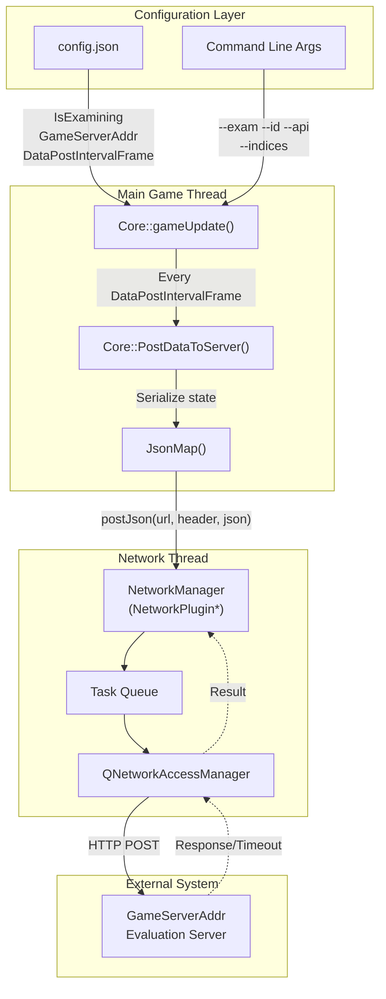
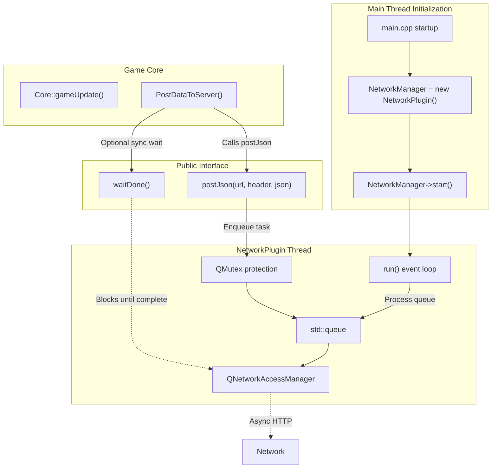
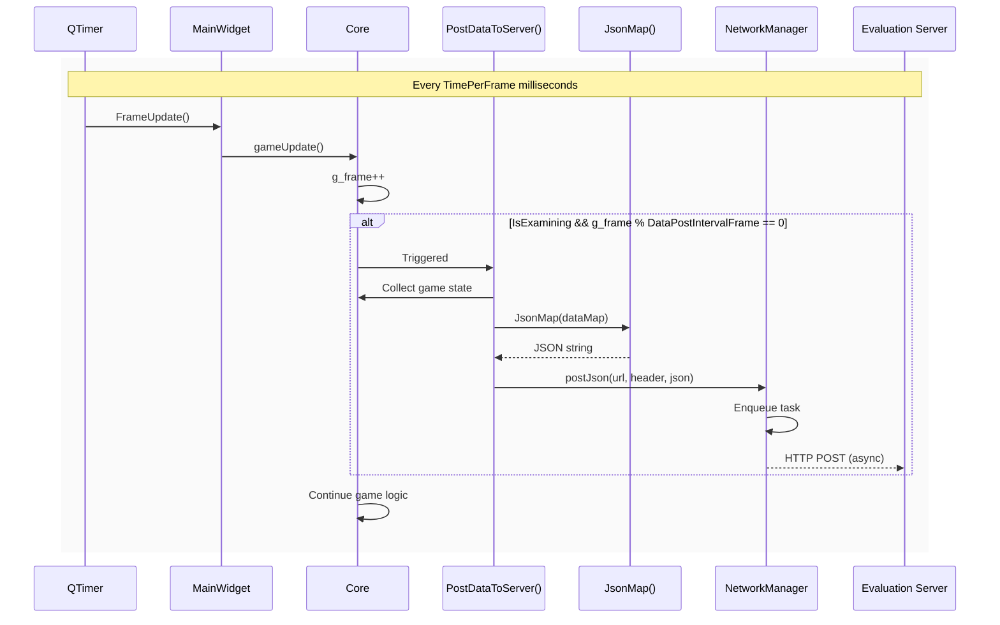
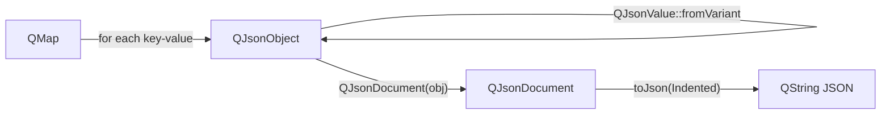
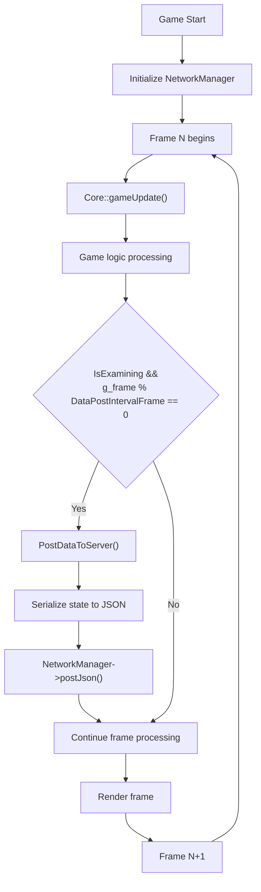
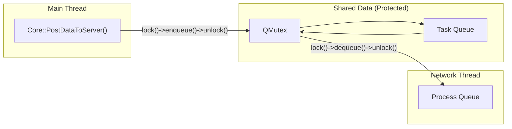

# Network and Exam Mode

<details>
<summary>Relevant source files</summary>

The following files were used as context for generating this wiki page:

- [GlobalVariate.cpp](GlobalVariate.cpp)
- [GlobalVariate.h](GlobalVariate.h)
- [README.md](README.md)
- [config.json](config.json)

</details>


## Purpose and Scope

This document describes the network integration and exam mode subsystem, which enables automated evaluation and external monitoring of gameplay sessions. This feature allows the game to periodically post state snapshots to an HTTP evaluation server, supporting use cases such as student AI grading, tournament monitoring, and remote assessment.

For information about the AI system that generates the gameplay being evaluated, see [5.1](#5.1) AI Architecture. For details on how game state is captured and shared with external systems, see [5.2](#5.2) Instruction and Command System.

---

## System Overview

The network and exam mode system consists of three main components:

1. **Configuration flags** that control when and how data is posted
2. **NetworkPlugin** - a separate thread that manages HTTP requests
3. **Core integration** that periodically serializes game state and posts it to the server



**Sources:** [config.json:1-6](), [GlobalVariate.h:501-508](), [GlobalVariate.cpp:14-17](), [README.md:134-137]()

---

## Configuration Parameters

The exam mode is controlled by several configuration parameters loaded from `config.json` and command line arguments.

### config.json Parameters

| Parameter | Type | Default | Description |
|-----------|------|---------|-------------|
| `IsExamining` | bool | `false` | Master switch for exam mode. When `true`, enables periodic data posting. |
| `GameServerAddr` | string | `"http://localhost:8080/api/admin/CodeRunStatusPost"` | HTTP endpoint URL where game state will be posted. |
| `DataPostIntervalFrame` | int | `100` | Number of game frames between successive data posts. At 25 FPS, 100 frames = 4 seconds. |
| `TimePerFrame` | int | `40` | Milliseconds per frame (used for timing calculations). |

These values are read during application startup via the `ReadConfig()` function marked with `Q_COREAPP_STARTUP_FUNCTION`.

**Sources:** [config.json:3-6](), [GlobalVariate.cpp:1224-1256]()

### Command Line Parameters

When launching the game, additional parameters override or supplement configuration:

| Parameter | Format | Purpose |
|-----------|--------|---------|
| `--exam` | `--exam true` or `--exam false` | Override `IsExamining` flag from config.json |
| `--id` | `--id <student_id>` | Set student/player identification string (stored in global `Id`) |
| `--api` | `--api <api_key>` | Set API authentication token (stored in global `API_Value`) |
| `--indices` | `--indices <number>` | Set database record index (stored in global `Indices`) |

These parameters are parsed in `main.cpp` and stored in global variables for later use when constructing HTTP requests.

**Sources:** [README.md:290-297](), [GlobalVariate.h:504-508]()

### Global Variables

The configuration values are stored in global variables declared in `GlobalVariate.h` and defined in `GlobalVariate.cpp`:

```cpp
extern bool IsExamining;
extern int TimePerFrame;
extern QString GameServerAddr;
extern int DataPostIntervalFrame;
extern NetworkPlugin* NetworkManager;
extern QString API_Value;
extern QString Id;
extern int Indices;
```

**Sources:** [GlobalVariate.h:501-508](), [GlobalVariate.cpp:14-17]()

---

## NetworkPlugin Architecture

The `NetworkPlugin` class manages HTTP communication in a separate QThread to avoid blocking the game loop.



**Sources:** [README.md:136-137](), [GlobalVariate.h:503]()

### Key Characteristics

1. **Thread Isolation**: The `NetworkPlugin` runs in its own QThread, preventing network I/O from blocking game frame updates
2. **Task Queue**: HTTP requests are queued and processed asynchronously with mutex protection
3. **Timeout Support**: Requests can be configured with timeout values to prevent indefinite blocking
4. **Synchronous Wait**: The `waitDone()` method allows the game to wait for all queued requests to complete (useful at shutdown)

**Sources:** [README.md:136-137]()

---

## Data Posting Mechanism

The `Core` class contains the logic for periodic state posting in exam mode.

### Posting Trigger Logic



**Sources:** [config.json:3-6](), [GlobalVariate.cpp:1254-1256]()

### Implementation Pattern

The posting logic follows this pattern (pseudocode based on typical implementation):

1. **Frame Counter Check**:
   ```cpp
   if (IsExamining && g_frame % DataPostIntervalFrame == 0) {
       PostDataToServer();
   }
   ```

2. **State Serialization**:
   The `JsonMap()` utility function converts a `QMap<QString, QVariant>` into JSON format:
   ```cpp
   QMap<QString, QVariant> data;
   data["frame"] = g_frame;
   data["wood"] = player->Wood;
   data["id"] = Id;
   data["indices"] = Indices;
   // ... additional state fields
   QString jsonStr = JsonMap(data);
   ```

3. **HTTP Request Construction**:
   ```cpp
   QMap<QString, QString> headers;
   headers["Content-Type"] = "application/json";
   headers["Authorization"] = API_Value;  // If provided
   
   NetworkManager->postJson(GameServerAddr, headers, jsonStr);
   ```

**Sources:** [GlobalVariate.cpp:1212-1221](), [README.md:321-323]()

---

## JsonMap Utility Function

The `JsonMap()` function provides JSON serialization for posting data.

### Function Signature

```cpp
QString JsonMap(const QMap<QString, QVariant>& data)
```

Located at [GlobalVariate.cpp:1212-1221]()

### Implementation Details



The function:
1. Creates a `QJsonObject`
2. Iterates through the input map, inserting each key-value pair after converting `QVariant` to `QJsonValue`
3. Constructs a `QJsonDocument` from the object
4. Returns the formatted JSON string with indentation

**Sources:** [GlobalVariate.cpp:1212-1221](), [GlobalVariate.h:1319]()

---

## Exam Mode Behavior Changes

When `IsExamining` is `true`, certain game behaviors are modified:

### Debug Output Suppression

The `call_debugText()` function checks the exam mode flag:

```cpp
void call_debugText(QString color, QString content, int playerID) {
    if (!IsExamining && 
        (!only_debug_Player0 || playerID == NOWPLAYERREPRESENT || 
         playerID == REPRESENT_BOARDCAST_MESSAGE)) {
        // Output debug message
    }
}
```

This prevents debug messages from appearing during evaluation, ensuring clean server-side logs.

**Sources:** [GlobalVariate.cpp:1094-1104]()

### Typical Data Posted

While the exact payload format depends on implementation, typical posted data includes:

| Field Category | Example Fields | Purpose |
|----------------|----------------|---------|
| **Metadata** | `id`, `indices`, `frame`, `timestamp` | Identify the game session and point in time |
| **Resources** | `Wood`, `Meat`, `Stone`, `Gold` | Track player economy |
| **Units** | `farmer_count`, `army_count`, `building_count` | Track production progress |
| **State** | `civilizationStage`, `isGameOver`, `winner` | Track game progression |
| **Score** | `player_score`, `enemy_score` | Track performance metrics (see [7.5](#7.5)) |

**Sources:** [GlobalVariate.h:847-868](), [config.json:3-6]()

---

## Integration with Main Game Loop

The exam mode integrates seamlessly with the core game loop without affecting frame timing.



The key design principle is that HTTP posting happens asynchronously in the `NetworkPlugin` thread, so the game loop never blocks waiting for network I/O.

**Sources:** [README.md:136-137](), [config.json:3-6]()

---

## Thread Safety and Synchronization

### Mutex Protection in NetworkPlugin

The `NetworkPlugin` uses `QMutex` to protect its internal task queue, ensuring thread-safe access when the main thread calls `postJson()` while the network thread processes requests.



### No Game State Corruption

Because state serialization (reading values like `player->Wood`, `g_frame`) happens entirely in the main thread before the JSON string is passed to `NetworkPlugin`, there are no race conditions on game state. The network thread only handles pre-serialized strings.

**Sources:** [README.md:136-137]()

---

## Typical Usage Scenarios

### Scenario 1: Student AI Evaluation

```
1. Course instructor sets up evaluation server at GameServerAddr
2. Student compiles game with their AI code
3. Instructor launches game with:
   ./newAOE --exam true --id student123 --api course_key --indices 42
4. Game posts snapshots every 100 frames to server
5. Server records progression, detects win/loss, assigns grade
```

### Scenario 2: Tournament Monitoring

```
1. Tournament organizer configures GameServerAddr to live dashboard
2. Multiple game instances run with different --indices values
3. Dashboard aggregates data from all instances in real-time
4. Observers watch resource/score progression without direct game access
```

### Scenario 3: Debugging/Replay

```
1. Developer enables exam mode with local server
2. Plays test match
3. Server logs complete game state history
4. Developer analyzes JSON logs to diagnose AI behavior issues
```

**Sources:** [README.md:8](), [config.json:5]()

---

## Error Handling and Timeout

The `NetworkPlugin` supports timeout configuration to prevent indefinite blocking:

- If a POST request exceeds the configured timeout, the plugin abandons the request
- The game continues running regardless of network failures
- Failed requests do not retry automatically (to prevent queue buildup)

At game shutdown, the main thread can call `NetworkManager->waitDone()` to ensure all pending requests complete before the application exits, preventing data loss.

**Sources:** [README.md:136-137]()

---

## Configuration Best Practices

### For Development
```json
{
  "IsExamining": false,
  "GameServerAddr": "http://localhost:8080/api/admin/CodeRunStatusPost",
  "DataPostIntervalFrame": 100
}
```
Disable exam mode to avoid network overhead during local testing.

### For Evaluation
```json
{
  "IsExamining": true,
  "GameServerAddr": "https://evaluation.example.com/api/submit",
  "DataPostIntervalFrame": 25
}
```
Enable exam mode with more frequent updates (every 1 second at 25 FPS) for fine-grained monitoring.

### For Tournament
```json
{
  "IsExamining": true,
  "GameServerAddr": "https://tournament.example.com/live",
  "DataPostIntervalFrame": 250
}
```
Lower frequency updates (every 10 seconds) reduce server load in multi-game tournaments.

**Sources:** [config.json:1-6]()

---

## Related Systems

- **[5.1](#5.1) AI Architecture**: The AI system whose behavior is being evaluated
- **[5.2](#5.2) Instruction and Command System**: How AI commands are captured in the posted state
- **[7.4](#7.4) Debug and Logging System**: Complementary logging for local debugging (suppressed in exam mode)
- **[7.5](#7.5) Score System**: Score data that may be included in posted JSON

**Sources:** [README.md:24-33]()