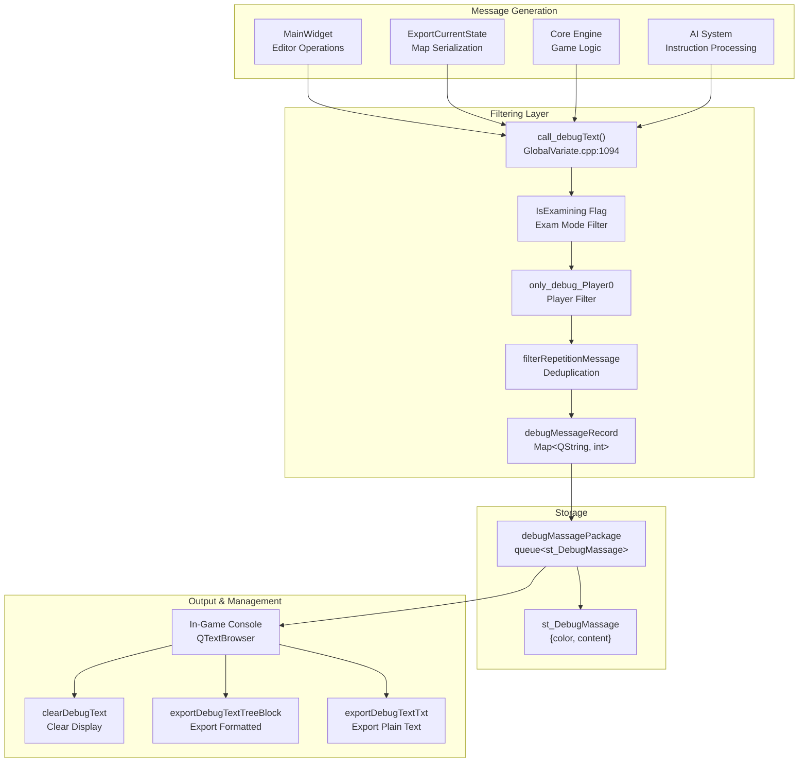
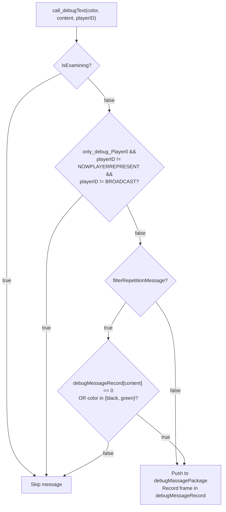
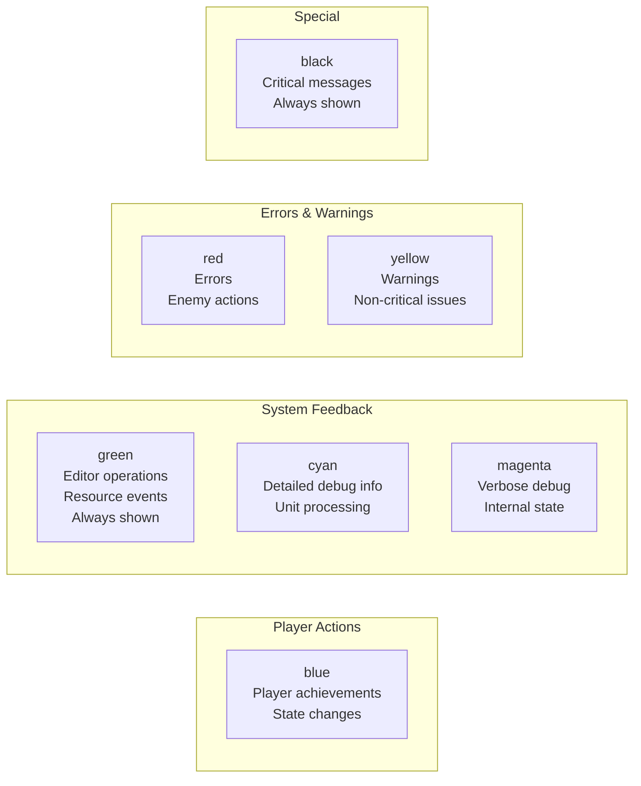
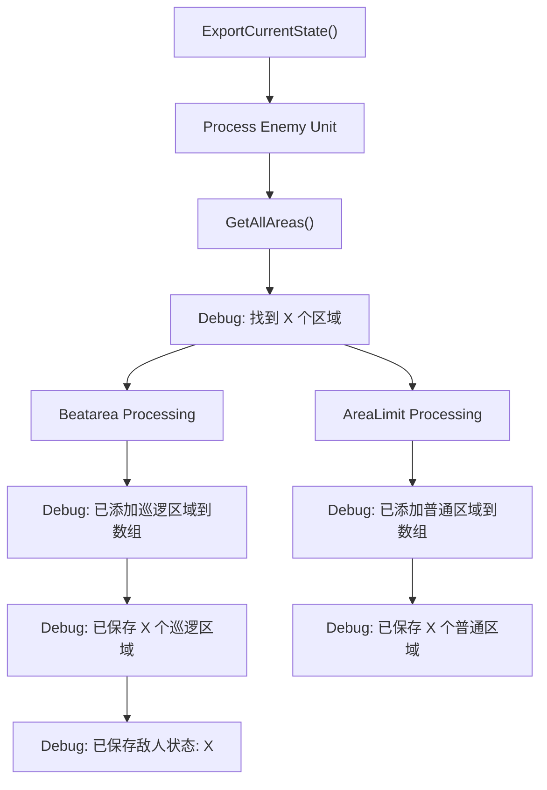
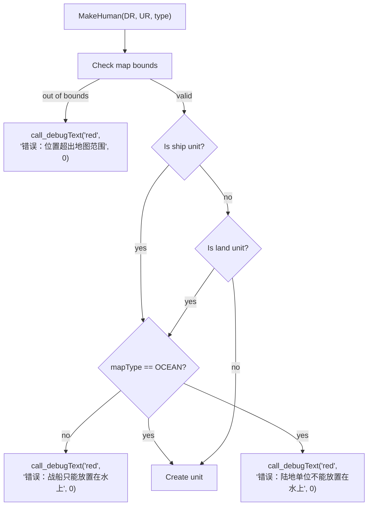
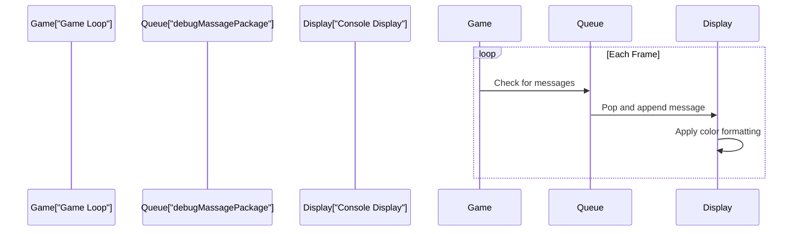

# Debug and Logging System

<details>
<summary>Relevant source files</summary>

The following files were used as context for generating this wiki page:

- [GlobalVariate.cpp](GlobalVariate.cpp)
- [GlobalVariate.h](GlobalVariate.h)
- [MainWidget.cpp](MainWidget.cpp)

</details>


The Debug and Logging System provides runtime message output for development, debugging, and monitoring game state changes. It implements a color-coded message queue with filtering capabilities to reduce noise and support selective display based on player context and message repetition.

For information about the AI instruction system error codes (which feed into this debug system), see [Instruction and Command System](#5.2).

---

## System Overview

The debug system consists of a centralized message queuing mechanism that collects color-coded text messages from throughout the codebase and delivers them to an in-game console display. Messages are filtered based on examination mode, player affiliation, and repetition detection.



**Sources:** [GlobalVariate.cpp:1094-1104](), [GlobalVariate.h:538-553](), [MainWidget.cpp:138-275]()

---

## Core Components

### call_debugText Function

The `call_debugText()` function serves as the primary interface for logging messages throughout the codebase. It applies all filtering logic before queuing messages.

**Function Signature:**
```cpp
void call_debugText(QString color, QString content, int playerID)
```

**Parameters:**
- `color` - String identifier for message color ("blue", "red", "green", "yellow", "cyan", "magenta", "black")
- `content` - Message text to display
- `playerID` - Player context (0 = player, 1 = enemy, `REPRESENT_BOARDCAST_MESSAGE` for global)

**Filtering Logic Flow:**



**Sources:** [GlobalVariate.cpp:1094-1104](), [GlobalVariate.h:548]()

### st_DebugMassage Structure

Encapsulates a single debug message with its associated color code.

| Field | Type | Description |
|-------|------|-------------|
| `color` | `QString` | Color identifier for message styling |
| `content` | `QString` | Message text content |

**Sources:** [GlobalVariate.h:538-547]()

### Message Storage

The system uses a queue-based approach to store messages before they are consumed by the UI:

| Component | Type | Purpose |
|-----------|------|---------|
| `debugMassagePackage` | `std::queue<st_DebugMassage>` | FIFO queue of pending messages |
| `debugMessageRecord` | `std::map<QString, int>` | Tracks last frame each message appeared for deduplication |

**Sources:** [GlobalVariate.cpp:585-586](), [GlobalVariate.h:550-553]()

---

## Message Filtering System

### Configuration Flags

Three global flags control message filtering behavior:

```cpp
extern bool IsExamining;              // Disables all debug output in exam mode
extern bool only_debug_Player0;        // Only shows player 0 messages
extern bool filterRepetitionMessage;   // Prevents duplicate consecutive messages
```

**Filter Combinations:**

| IsExamining | only_debug_Player0 | filterRepetitionMessage | Behavior |
|-------------|-------------------|------------------------|----------|
| `true` | * | * | All messages blocked |
| `false` | `true` | * | Only player 0 and broadcast messages shown |
| `false` | `false` | `true` | All messages shown, duplicates suppressed |
| `false` | `false` | `false` | All messages shown, duplicates allowed |

**Sources:** [GlobalVariate.cpp:1094-1104](), [GlobalVariate.h:551-552]()

### Repetition Detection

The `debugMessageRecord` map stores the frame number when each unique message last appeared. Messages are only filtered if:
1. `filterRepetitionMessage` is enabled
2. The message content already exists in the record
3. The message color is NOT "black" or "green" (these always display)

**Sources:** [GlobalVariate.cpp:1098-1102]()

---

## Color Coding Scheme

Messages use color coding to indicate their semantic category and importance:



**Usage Examples by Color:**

| Color | Example Messages | Code Reference |
|-------|-----------------|----------------|
| **blue** | "游戏开始", "敌人状态: 攻击模式" | [MainWidget.cpp:138](), [MainWidget.cpp:261]() |
| **green** | "导出地图", "普通鼠标模式", "巡逻区域: 矩形区域" | [MainWidget.cpp:157](), [MainWidget.cpp:273](), [MainWidget.cpp:254]() |
| **red** | "错误：位置超出地图范围", "错误：战船只能放置在水上" | [MainWidget.cpp:1191](), [MainWidget.cpp:1202]() |
| **yellow** | "找到 X 个区域" | [MainWidget.cpp:447]() |
| **cyan** | "处理敌方单位: Num=X" | [MainWidget.cpp:441]() |
| **magenta** | "区域名称: Beatarea" | [MainWidget.cpp:462]() |

**Sources:** [MainWidget.cpp:138-275](), [MainWidget.cpp:436-497](), [MainWidget.cpp:1191-1214]()

---

## Integration Points

### Editor Operations

The editor extensively uses debug messages to provide feedback on terrain modification, object placement, and area definition:

```mermaid
sequenceDiagram
    participant User
    participant Editor["Editor UI"]
    participant Update["MainWidget::updateEditor()"]
    participant Debug["call_debugText()"]
    participant Queue["debugMassagePackage"]
    
    User->>Editor: Select "草地" from land_type
    Editor->>Update: currentIndexChanged signal
    Update->>Debug: call_debugText("green", " 草地", 0)
    Debug->>Queue: Push st_DebugMassage
    
    User->>Editor: Click map to place unit
    Editor->>Update: MakeHuman() called
    Update->>Debug: call_debugText("red", " 错误: ...", 0)
    Debug->>Queue: Push st_DebugMassage
    
    User->>Editor: Export map
    Editor->>Update: ExportCurrentState()
    Update->>Debug: Multiple cyan/yellow/green messages
    Debug->>Queue: Push multiple messages
```

**Key Editor Message Points:**

| Operation | Color | Example Message | Location |
|-----------|-------|----------------|----------|
| Terrain type selection | green | "草地", "海洋" | [MainWidget.cpp:169]() |
| Height modification | green | "提升高度", "降低高度" | [MainWidget.cpp:175]() |
| Building placement | green | "玩家市中心", "玩家箭塔" | [MainWidget.cpp:189]() |
| Unit placement | green | "玩家农民", "敌方棍棒兵" | [MainWidget.cpp:198](), [MainWidget.cpp:219]() |
| Area definition | green | "巡逻区域: 矩形区域" | [MainWidget.cpp:254]() |
| Enemy status | blue/yellow | "敌人状态: 攻击模式" | [MainWidget.cpp:261](), [MainWidget.cpp:265]() |
| Map export | green | "导出地图" | [MainWidget.cpp:157]() |

**Sources:** [MainWidget.cpp:155-275]()

### Map Export Debugging

The `ExportCurrentState()` function generates verbose debug output tracking the serialization process:



**Message Sequence (Lines 436-497):**
1. `cyan` - "处理敌方单位: Num=X, Sort=X, DR=X, UR=X"
2. `yellow` - "找到 X 个区域"
3. `green` - "发现区域类型: RectArea/CircleArea/LineArea"
4. `magenta` - "区域名称: Beatarea/AreaLimit"
5. `green` - "已添加巡逻区域到数组" / `blue` - "已添加普通区域到数组"
6. `green` - "已保存 X 个巡逻区域" / `blue` - "已保存 X 个普通区域"
7. `blue` - "已保存敌人状态: attack/defend"

**Sources:** [MainWidget.cpp:436-497]()

### Unit Placement Validation

Terrain validation during unit placement generates error messages:



**Sources:** [MainWidget.cpp:1183-1274]()

---

## Debug Text Management

### Option Dialog Integration

The Option dialog provides controls for managing debug output:

| Function | Purpose | Signal Connection |
|----------|---------|-------------------|
| `clearDebugText()` | Clear console display | `Option::request_ClearDebugText` |
| `exportDebugTextTreeBlock()` | Export with tree structure | `Option::request_exportTreeBlock` |
| `exportDebugTextTxt()` | Export as plain text | `Option::request_exportTxt` |
| `clearDebugTextFile()` | Clear export files | `Option::request_exportClear` |

**Signal Connections:**

```cpp
// MainWidget.cpp lines 1324-1327
connect(option, &Option::request_ClearDebugText, this, &MainWidget::clearDebugText);
connect(option, &Option::request_exportTreeBlock, this, &MainWidget::exportDebugTextTreeBlock);
connect(option, &Option::request_exportTxt, this, &MainWidget::exportDebugTextTxt);
connect(option, &Option::request_exportClear, this, &MainWidget::clearDebugTextFile);
```

**Sources:** [MainWidget.cpp:1324-1328]()

### Message Queue Consumption

The debug message queue is consumed by the UI rendering thread each frame. Messages are removed from `debugMassagePackage` and displayed in the console widget.



**Sources:** [GlobalVariate.h:550]()

---

## Usage Patterns

### Basic Logging

```cpp
// Simple informational message
call_debugText("blue", " 游戏开始", REPRESENT_BOARDCAST_MESSAGE);

// Editor operation feedback
call_debugText("green", " 导出地图", 0);

// Error reporting
call_debugText("red", " 错误：位置超出地图范围", 0);
```

**Sources:** [MainWidget.cpp:138](), [MainWidget.cpp:157](), [MainWidget.cpp:1191]()

### Conditional Debug Output

```cpp
// Only log for specific player context
if (unit->getPlayerRepresent() == 1) {
    call_debugText("cyan", QString("处理敌方单位: Num=%1").arg(num), 0);
}

// Always-show messages (black/green bypass filters)
call_debugText("green", " 已保存区域", 0);  // Always displays even if repetition filter on
```

**Sources:** [MainWidget.cpp:441](), [GlobalVariate.cpp:1098-1102]()

### Verbose Debugging

```cpp
// Multi-level detail for complex operations
call_debugText("cyan", QString("处理单位: %1").arg(info), 0);
call_debugText("yellow", QString("找到 %1 个区域").arg(count), 0);
call_debugText("green", QString("发现区域类型: %1").arg(type), 0);
call_debugText("magenta", QString("区域名称: %1").arg(name), 0);
```

**Sources:** [MainWidget.cpp:436-462]()

---

## Configuration Reference

### Global Variables

| Variable | Type | Default | Purpose |
|----------|------|---------|---------|
| `IsExamining` | `bool` | `false` | Disable all debug output in exam mode |
| `only_debug_Player0` | `bool` | `false` | Filter to show only player 0 messages |
| `filterRepetitionMessage` | `bool` | `false` | Suppress duplicate messages |
| `debugMassagePackage` | `std::queue<st_DebugMassage>` | empty | Message queue |
| `debugMessageRecord` | `std::map<QString, int>` | empty | Last seen frame for each message |
| `g_frame` | `int` | 0 | Current game frame counter |

**Configuration Loading:**

All boolean flags are loaded from `config.json` via `ReadConfig()` at startup:

```cpp
// GlobalVariate.cpp lines 1254-1261
jsonBool(IsExamining);
jsonBool(only_debug_Player0);
jsonBool(filterRepetitionMessage);
```

**Sources:** [GlobalVariate.h:501-553](), [GlobalVariate.cpp:1254-1261](), [GlobalVariate.cpp:585-586]()

---

## Special Message Constants

### Player ID Constants

```cpp
#define REPRESENT_BOARDCAST_MESSAGE  // Used for global messages visible to all players
```

Messages with this playerID bypass the `only_debug_Player0` filter.

**Sources:** [GlobalVariate.cpp:1096-1097]()

### Frame-Based Deduplication

The `debugMessageRecord` map stores frame numbers rather than boolean flags, enabling time-based message suppression. Messages can reappear after sufficient frames have passed, providing a balance between reducing spam and maintaining awareness of recurring issues.

**Sources:** [GlobalVariate.cpp:1101]()