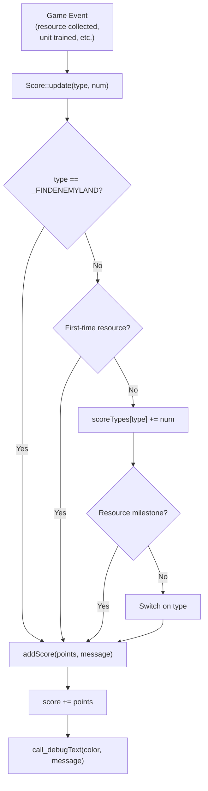
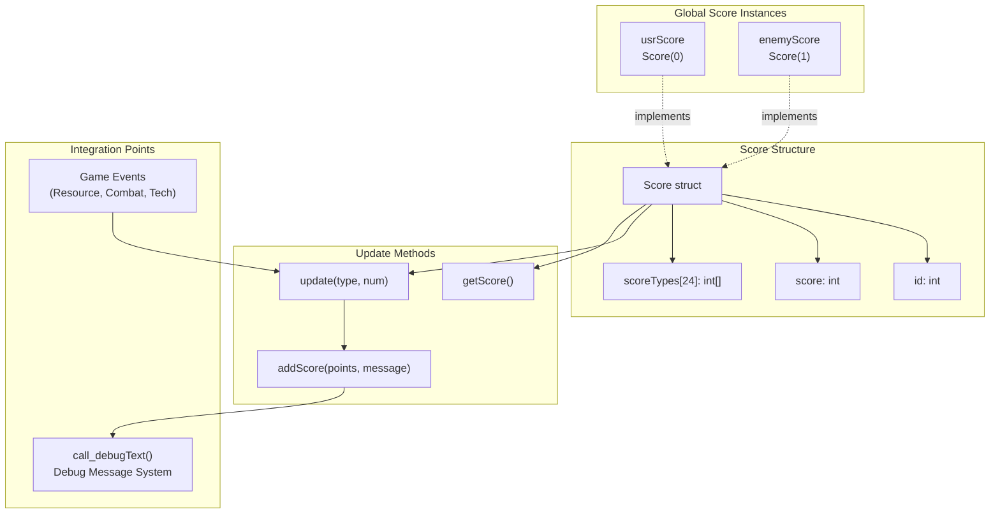

# Score System

<details>
<summary>Relevant source files</summary>

The following files were used as context for generating this wiki page:

- [GlobalVariate.cpp](GlobalVariate.cpp)
- [GlobalVariate.h](GlobalVariate.h)

</details>


The Score System tracks player and enemy performance throughout the game by awarding points for various achievements including resource collection, technology research, unit production, building construction, and combat victories. The system maintains cumulative scores and provides real-time feedback through the debug message interface.

For information about debug messages and logging, see [Debug and Logging System](#7.4). For resource collection mechanics, see [Resource and Economy System](#3.1).

---

## Overview

The scoring system is implemented through the `Score` struct and `ScoreType` enumeration, which categorize and track 24 different types of achievements. Two global score instances track player and enemy performance independently, updating in response to gameplay events and broadcasting changes to the debug console.

**Sources:** [GlobalVariate.h:555-670](), [GlobalVariate.cpp:579-580]()

---

## Core Data Structures

### Score Struct

The `Score` struct encapsulates all scoring logic and state for a single player:

| Field | Type | Purpose |
|-------|------|---------|
| `id` | `int` | Player identifier (0 for user, 1 for enemy) |
| `score` | `int` | Cumulative total score |
| `scoreTypes[SCORE_TYPE_COUNT]` | `int[]` | Individual counters for each achievement type |

**Key Methods:**

- `Score(int id)` - Constructor initializing player ID and zero score
- `int getScore()` - Returns current cumulative score
- `void update(int type, int num = 1)` - Main scoring method that processes achievements
- `void addScore(int points, const QString& message)` - Private helper that increments score and broadcasts message

**Sources:** [GlobalVariate.h:587-670]()

### ScoreType Enumeration

The `ScoreType` enum defines 24 distinct achievement categories:

```cpp
enum ScoreType {
    _WOOD = 0, _STONE, _GOLD, _MEAT,              // Resource counters (0-3)
    _BERRY, _GAZELLE, _ELEPHANT, _FARM, _FISH,    // Resource source types (4-8)
    _ISWOOD, _ISGOLD, _ISSTONE,                   // First-time resource flags (9-11)
    _TECH,                                         // Technology research (12)
    _BUILDING1, _BUILDING2,                        // Building construction (13-14)
    _HUMAN1, _HUMAN2,                              // Unit production (15-16)
    _KILL2, _KILL10,                               // Combat kills (17-18)
    _DESTORY2, _DESTORY4, _DESTORY5, _DESTORY10,  // Building destruction (19-22)
    _FINDENEMYLAND,                                // Exploration (23)
    SCORE_TYPE_COUNT                               // Array size marker (24)
};
```

**Sources:** [GlobalVariate.h:555-585]()

---

## Score Categories and Point Values

### Resource Collection

#### Milestone Awards
For basic resources (`_WOOD`, `_STONE`, `_GOLD`, `_MEAT`), the system awards **1 point per 100 resources** collected:

```
scoreTypes[type] tracks total collected
Points awarded: floor(total / 100) - floor(previous / 100)
```

#### First-Time Collection Bonuses
When a player first collects certain resource types, they receive bonus points:

| Achievement | Points | Trigger |
|------------|--------|---------|
| First new resource type | +5 | Any of `_BERRY`, `_GAZELLE`, `_ELEPHANT`, `_FARM`, `_FISH` |
| First gold collection | +10 | `_ISGOLD` flag (cumulative with +5) |

**Sources:** [GlobalVariate.h:607-621]()

### Production and Research

| Category | Points | ScoreType |
|----------|--------|-----------|
| Research technology | +2 | `_TECH` |
| Build house/farm | +1 | `_BUILDING1` |
| Build general building | +2 | `_BUILDING2` |
| Train basic unit | +1 | `_HUMAN1` |
| Train special unit | +2 | `_HUMAN2` |

**Sources:** [GlobalVariate.h:636-650]()

### Combat Achievements

| Category | Points | ScoreType |
|----------|--------|-----------|
| Kill enemy unit | +2 | `_KILL2` |
| Destroy house/farm | +2 | `_DESTORY2` |
| Destroy general building | +4 | `_DESTORY4` |
| Destroy arrow tower | +5 | `_DESTORY5` |
| Destroy town center | +10 | `_DESTORY10` |

**Sources:** [GlobalVariate.h:651-665]()

### Exploration

| Achievement | Points | ScoreType |
|------------|--------|-----------|
| Reach enemy continent | +10 | `_FINDENEMYLAND` |

**Sources:** [GlobalVariate.h:607-610]()

---

## Score Update Mechanism

### Update Flow



**Diagram: Score Update Process Flow**

**Sources:** [GlobalVariate.h:606-669]()

### Special Update Logic

#### First-Time Resource Collection

The system uses the `scoreTypes` array as both a counter and a flag system for resources:

```cpp
if (type <= _ISSTONE && scoreTypes[type] == 0 && type > _MEAT) {
    addScore(5, " 采集到新资源，分数+5");
    if (type == _ISGOLD) {
        addScore(10, " 采集到黄金，分数+10");
    }
}
if (type > _MEAT && type <= _ISSTONE) {
    scoreTypes[type] = scoreTypes[type] | 1;  // Set flag
    return;
}
```

For types `_ISWOOD`, `_ISGOLD`, `_ISSTONE`, the counter acts as a binary flag (0 or 1).

**Sources:** [GlobalVariate.h:611-621]()

#### Resource Milestone Detection

For basic resources, the system calculates milestone crossings:

```cpp
int before = scoreTypes[type] / 100;
scoreTypes[type] += num;
if (type <= _MEAT) {
    int after = scoreTypes[type] / 100;
    int change = after - before;
    while (change > 0) {
        addScore(1, " 单种资源收集满100个，分数+1");
        change--;
    }
}
```

This awards 1 point for each 100-resource threshold crossed in a single update.

**Sources:** [GlobalVariate.h:623-633]()

---

## Integration Architecture



**Diagram: Score System Architecture**

**Sources:** [GlobalVariate.h:555-670](), [GlobalVariate.cpp:579-580]()

---

## Global Score Instances

Two global `Score` objects track player and enemy performance:

| Variable | Type | Player ID | Purpose |
|----------|------|-----------|---------|
| `usrScore` | `Score` | 0 | Tracks user player achievements |
| `enemyScore` | `Score` | 1 | Tracks enemy AI achievements |

These instances are initialized at program startup:

```cpp
Score usrScore=Score(0);
Score enemyScore=Score(1);
```

The player ID determines the debug message color: blue for player (ID 0), red for enemy (ID 1).

**Sources:** [GlobalVariate.cpp:579-580]()

---

## Debug Message Broadcasting

### Message Generation

When scores change, the `addScore` method broadcasts messages through the debug system:

```cpp
void addScore(int points, const QString& message) {
    score += points;
    if (id == 0)
        call_debugText("blue", " 玩家" + message, REPRESENT_BOARDCAST_MESSAGE);
    else
        call_debugText("red", " 敌方" + message, REPRESENT_BOARDCAST_MESSAGE);
}
```

### Color Coding

- **Blue messages**: User player achievements (ID 0)
- **Red messages**: Enemy AI achievements (ID 1)

### Message Examples

The Chinese text messages include:
- "采集到新资源，分数+5" (Collected new resource, +5 points)
- "采集到黄金，分数+10" (Collected gold, +10 points)
- "单种资源收集满100个，分数+1" (Collected 100 of a resource, +1 point)
- "解锁新科技，分数+2" (Unlocked new technology, +2 points)
- "生产普通单位，分数+1" (Trained basic unit, +1 point)
- "击杀一般敌人，分数+2" (Killed enemy unit, +2 points)
- "摧毁主营，分数+10" (Destroyed town center, +10 points)

**Sources:** [GlobalVariate.h:593-599](), [GlobalVariate.h:607-665]()

---

## Score Retrieval

### Public Interface

The `Score` struct exposes one public query method:

```cpp
int getScore() {
    return score;
}
```

This returns the cumulative total score. Individual achievement counters in `scoreTypes[]` are private and not directly accessible from outside the struct.

**Sources:** [GlobalVariate.h:603-605]()

---

## Summary Table: All Score Values

| Achievement Type | Points | ScoreType Constant | Notes |
|-----------------|--------|-------------------|-------|
| 100 wood collected | 1 | `_WOOD` | Repeatable milestone |
| 100 stone collected | 1 | `_STONE` | Repeatable milestone |
| 100 gold collected | 1 | `_GOLD` | Repeatable milestone |
| 100 meat collected | 1 | `_MEAT` | Repeatable milestone |
| First berry collection | 5 | `_BERRY` | One-time bonus |
| First gazelle hunted | 5 | `_GAZELLE` | One-time bonus |
| First elephant hunted | 5 | `_ELEPHANT` | One-time bonus |
| First farm harvested | 5 | `_FARM` | One-time bonus |
| First fish caught | 5 | `_FISH` | One-time bonus |
| First wood collected | 5 | `_ISWOOD` | One-time bonus |
| First gold collected | 15 | `_ISGOLD` | One-time (5+10) |
| First stone collected | 5 | `_ISSTONE` | One-time bonus |
| Technology researched | 2 | `_TECH` | Per research |
| House/farm built | 1 | `_BUILDING1` | Per building |
| General building built | 2 | `_BUILDING2` | Per building |
| Basic unit trained | 1 | `_HUMAN1` | Per unit |
| Special unit trained | 2 | `_HUMAN2` | Per unit |
| Enemy unit killed | 2 | `_KILL2` | Per kill |
| House/farm destroyed | 2 | `_DESTORY2` | Per destruction |
| General building destroyed | 4 | `_DESTORY4` | Per destruction |
| Arrow tower destroyed | 5 | `_DESTORY5` | Per destruction |
| Town center destroyed | 10 | `_DESTORY10` | Per destruction |
| Enemy land discovered | 10 | `_FINDENEMYLAND` | One-time |

**Sources:** [GlobalVariate.h:555-669]()