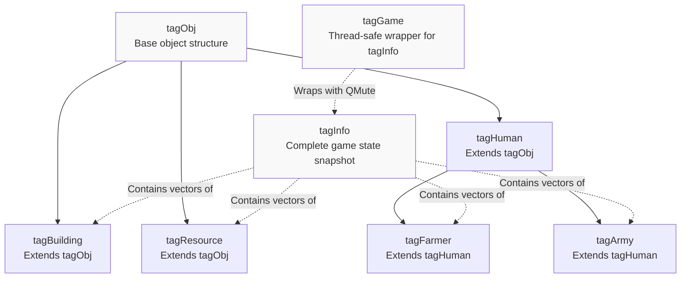
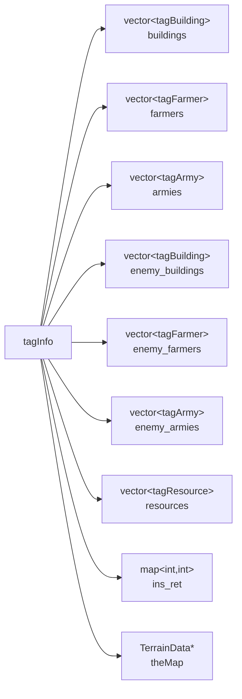
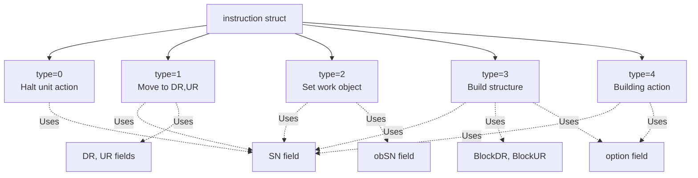
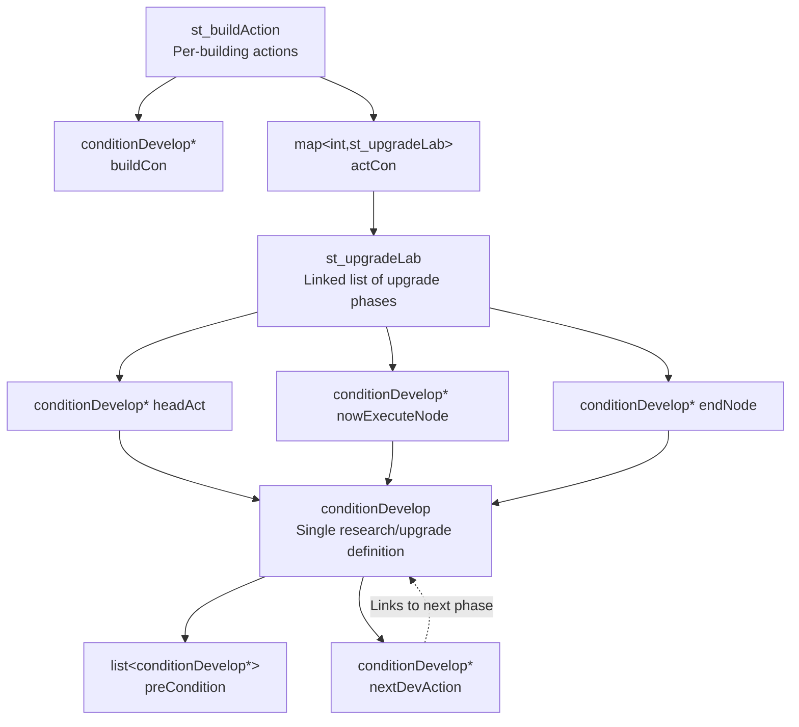
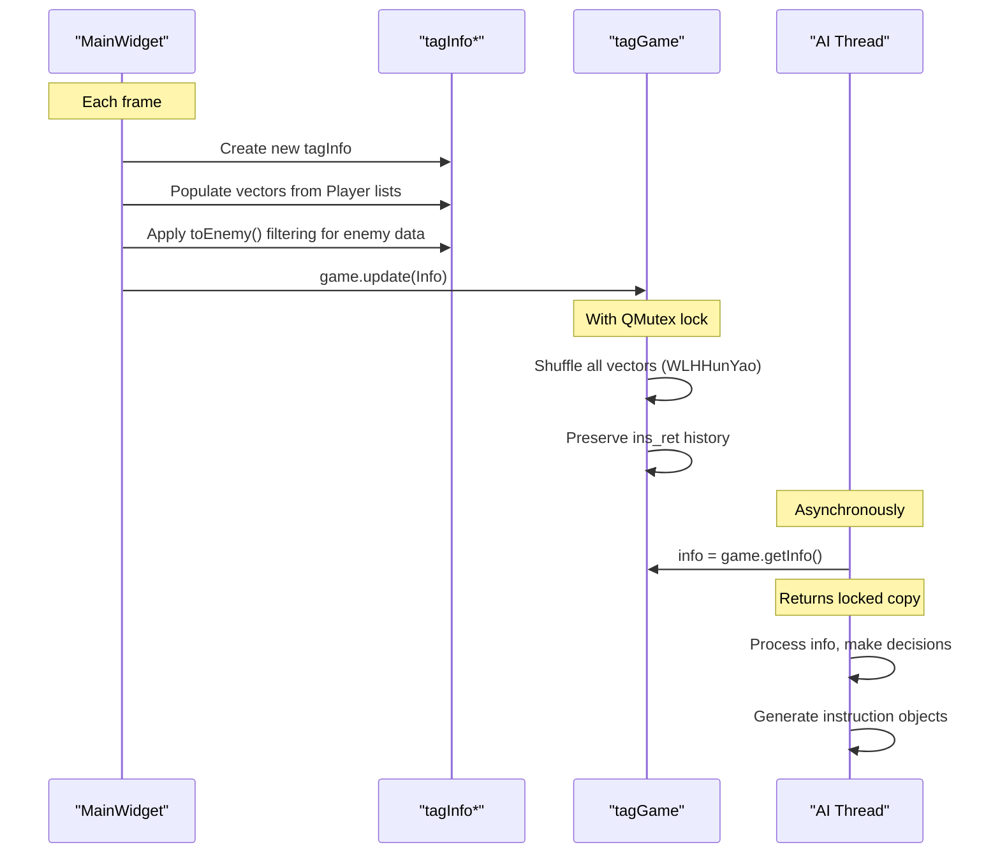
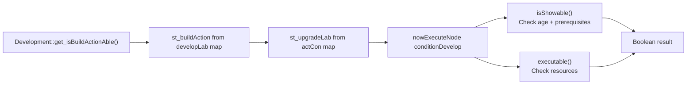

# Data Structures Reference

Relevant source files

The following files were used as context for generating this wiki page:

- [Development.h](Development.h)
- [GlobalVariate.h](GlobalVariate.h)
- [Player.cpp](Player.cpp)

This page provides a comprehensive reference for all key data structures used throughout the new-aoe codebase. These structures define the game state representation, command interfaces, technology tree configuration, and spatial data organization.

For information about how these structures are used in specific systems, see:
- Game state management and AI communication: [AI System](#5)
- Technology tree logic and progression: [Technology Tree](#3.2)
- Map and spatial queries: [Map and World](#6)

---

## Structure Categories

The codebase organizes data structures into several functional categories:

| Category | Purpose | Key Structures |
|----------|---------|----------------|
| **Game State** | Represent entities and game world state | `tagObj`, `tagBuilding`, `tagHuman`, `tagFarmer`, `tagArmy`, `tagResource` |
| **State Snapshots** | Thread-safe game state sharing with AI | `tagInfo`, `tagGame` |
| **Instructions** | AI command interface | `instruction`, `ins` |
| **Technology Tree** | Define research/upgrade prerequisites and effects | `conditionDevelop`, `st_upgradeLab`, `st_buildAction` |
| **Spatial** | Map coordinates and terrain data | `Point`, `tagMap`, `tagTerrain`, `pixMemoryMap` |
| **Utility** | Supporting functionality | `Score`, `MouseEvent`, `ImageResource` |

---

## Game State Structure Hierarchy

The following diagram shows the inheritance and composition relationships between game state structures:

**Sources:** [GlobalVariate.h:672-759](), [GlobalVariate.h:847-972]()

---

## tagObj - Base Object Structure

The `tagObj` structure serves as the base for all game entities, providing minimal identification information.

| Field | Type | Description |
|-------|------|-------------|
| `SN` | `int` | Unique serial number for the object |
| `BlockDR` | `int` | Block coordinate (down-right axis) |
| `BlockUR` | `int` | Block coordinate (up-right axis) |

The structure implements the `<` operator for sorting by serial number, used in container operations.

**Sources:** [GlobalVariate.h:672-678]()

---

## tagBuilding - Building State

Extends `tagObj` with building-specific data including health, construction progress, and current production.

| Field | Type | Description |
|-------|------|-------------|
| `Type` | `int` | Building type constant (e.g., `BUILDING_CENTER`, `BUILDING_HOME`) |
| `Blood` | `int` | Current hit points |
| `MaxBlood` | `int` | Maximum hit points |
| `Percent` | `int` | Construction completion percentage (0-100) |
| `Project` | `int` | Currently active project/action number (-1 if none) |
| `ProjectPercent` | `int` | Project completion percentage |
| `Cnt` | `int` | Remaining resource count (only for `BUILDING_FARM`) |

### toEnemy() Method

The `toEnemy()` method creates a fog-of-war filtered copy by setting sensitive fields to -1:
- Sets `Cnt = -1`
- Sets `Project = -1`
- Sets `ProjectPercent = -1`

This prevents enemy AI from seeing player's production queue and resource status.

**Sources:** [GlobalVariate.h:679-694]()

---

## tagResource - Static Resource Objects

Represents harvestable resources like trees, gold mines, stone deposits, and animals.

| Field | Type | Description |
|-------|------|-------------|
| `DR` | `double` | Detail coordinate (down-right) |
| `UR` | `double` | Detail coordinate (up-right) |
| `Type` | `int` | Resource type (tree, stone, gold, berry bush, animal) |
| `ProductSort` | `int` | Resource category yielded when harvested (wood, food, stone, gold) |
| `Cnt` | `int` | Remaining harvestable quantity |
| `Blood` | `int` | Current hit points (for animals/trees that can be destroyed) |

**Sources:** [GlobalVariate.h:696-703]()

---

## tagHuman - Base Human Unit

Base structure for all mobile human units, providing position, state, and combat stats.

| Field | Type | Description |
|-------|------|-------------|
| `DR`, `UR` | `double` | Current position in detail coordinates |
| `DR0`, `UR0` | `double` | Destination coordinates |
| `NowState` | `int` | Current unit state (idle, moving, gathering, attacking, etc.) |
| `WorkObjectSN` | `int` | Serial number of object this unit is interacting with |
| `Blood` | `int` | Current hit points |
| `attack` | `int` | Attack damage value |
| `rangedDefense` | `int` | Defense against ranged attacks |
| `meleeDefense` | `int` | Defense against melee attacks |

### cast_from() Method

The `cast_from()` method copies all fields from another `tagHuman` instance, used when converting between unit types.

**Sources:** [GlobalVariate.h:705-727]()

---

## tagFarmer - Villager Units

Extends `tagHuman` with resource gathering and carrying capabilities.

| Field | Type | Description |
|-------|------|-------------|
| `ResourceSort` | `int` | Type of resource currently carried |
| `Resource` | `int` | Quantity of resource currently carried |
| `FarmerSort` | `int` | Farmer subtype (farmer, fishing boat, transport ship, sailing ship) |

### toEnemy() Method

Fog-of-war filtering sets:
- `Resource = -1`
- `DR0 = -1.0`, `UR0 = -1.0` (hides destination)

**Sources:** [GlobalVariate.h:729-740]()

---

## tagArmy - Military Units

Extends `tagHuman` with military-specific behavior parameters.

| Field | Type | Description |
|-------|------|-------------|
| `Sort` | `int` | Army unit type (clubman, bowman, scout, cavalry, etc.) |
| `status` | `int` | AI behavior mode (patrol, attack, defend) |
| `starttime` | `int` | Patrol cycle start frame |
| `finishtime` | `int` | Patrol cycle end frame |
| `startpointDR`, `startpointUR` | `double` | Patrol route start point |
| `destinaDR`, `destinaUR` | `double` | Patrol route end point |
| `ifAttack` | `bool` | Whether unit should attack enemies on sight |
| `timelock` | `int` | Frame counter for behavior timing |

### toEnemy() Method

Hides destination: `DR0 = -1.0`, `UR0 = -1.0`

**Sources:** [GlobalVariate.h:742-759]()

---

## tagInfo - Complete Game State Snapshot

The `tagInfo` structure contains a complete snapshot of the observable game state for one player. This is the primary data structure used for AI decision-making.

### Fields

| Field | Type | Description |
|-------|------|-------------|
| `buildings` | `vector<tagBuilding>` | All friendly buildings |
| `farmers` | `vector<tagFarmer>` | All friendly farmer units |
| `armies` | `vector<tagArmy>` | All friendly military units |
| `enemy_buildings` | `vector<tagBuilding>` | Visible enemy buildings (fog-of-war filtered) |
| `enemy_farmers` | `vector<tagFarmer>` | Visible enemy farmers (fog-of-war filtered) |
| `enemy_armies` | `vector<tagArmy>` | Visible enemy armies (fog-of-war filtered) |
| `resources` | `vector<tagResource>` | All resources on the map (trees, mines, animals) |
| `ins_ret` | `map<int, int>` | Return codes from executed instructions (id → result) |
| `theMap` | `TerrainData*` | Pointer to terrain height/type grid |
| `exploredUpdate` | `vector<Point>` | Newly explored map regions this frame |
| `GameFrame` | `int` | Current game frame number |
| `civilizationStage` | `int` | Current age/era |
| `Wood`, `Meat`, `Stone`, `Gold` | `int` | Current resource quantities |
| `Human_MaxNum` | `int` | Maximum population capacity |

### Methods

- **Assignment operator**: Deep copies all vectors and maps, shares terrain pointer
- **clear()**: Clears all vectors and maps, preparing for reuse

**Sources:** [GlobalVariate.h:847-910]()

---

## tagGame - Thread-Safe State Wrapper

Wraps `tagInfo` with a `QMutex` to provide thread-safe access for AI threads reading game state.

### Key Methods

| Method | Purpose |
|--------|---------|
| `update(tagInfo*)` | Atomically replaces stored info, preserves `ins_ret` history, shuffles vectors |
| `getInfo()` | Returns a copy of current `tagInfo` with mutex lock |
| `insertInsRet(int, instruction)` | Adds instruction result to `ins_ret` map |
| `clearInsRet()` | Clears all instruction return codes |

### WLHHunYao Vector Shuffling

The `update()` method shuffles all entity vectors using the `WLHHunYao()` helper (Fisher-Yates shuffle). This randomization prevents AI from exploiting consistent ordering and makes behavior less predictable.

**Sources:** [GlobalVariate.h:914-972]()

---

## Instruction System Structures

### instruction - AI Command Representation

The `instruction` structure encodes a single AI command with all necessary parameters.

### Fields

| Field | Type | Description |
|-------|------|-------------|
| `ret` | `int` | Return code after execution (0=success, negative=error) |
| `type` | `int` | Command type (0-4) |
| `id` | `int` | Unique instruction identifier |
| `self` | `Coordinate*` | Pointer to acting object (deprecated, use `SN` instead) |
| `obj` | `Coordinate*` | Pointer to target object (deprecated, use `obSN` instead) |
| `option` | `int` | Additional parameter (building type or action number) |
| `BlockDR`, `BlockUR` | `int` | Block coordinates for construction |
| `SN` | `int` | Serial number of acting object |
| `obSN` | `int` | Serial number of target object |
| `DR`, `UR` | `double` | Detail coordinates for movement |

### Constructors

The structure provides multiple constructors for different command types:
- `instruction(int type, int SN, int obSN, bool)` - For type 2 (set work object)
- `instruction(int type, int SN, int BlockDR, int BlockUR, int option)` - For type 3 (build)
- `instruction(int type, int SN, double DR, double UR)` - For type 1 (move)
- `instruction(int type, int SN, int option)` - For type 0 or 4 (halt/action)

### Return Codes

| Code | Meaning |
|------|---------|
| `0` | Success |
| `-1` | SN not found |
| `-2` | Action not found |
| `-3` | Position out of bounds |
| `-4` | Target object (obSN) not found |
| `-5` | Building type invalid |
| `-6` | Insufficient resources |

**Sources:** [GlobalVariate.h:765-791](), [GlobalVariate.h:1291-1299]()

---

## ins - Thread-Safe Instruction Queue

The `ins` structure provides a thread-safe queue for AI to submit commands to the game engine.

| Field | Type | Description |
|-------|------|-------------|
| `g_id` | `int` | Global counter for assigning unique instruction IDs |
| `instructions` | `queue<instruction>` | FIFO queue of pending instructions |
| `lock` | `QMutex` | Mutex for thread-safe queue operations |

AI threads push `instruction` objects onto this queue, and `MainWidget::manageOrder()` consumes them each frame.

**Sources:** [GlobalVariate.h:793-797]()

---

## Technology Tree Structures

The technology tree is implemented using a linked list structure with prerequisite chains.

**Sources:** [GlobalVariate.h:1106-1286]()

---

## conditionDevelop - Research/Upgrade Node

Defines a single research item, upgrade phase, or building action with its prerequisites and effects.

### Fields

| Field | Type | Description |
|-------|------|-------------|
| `civilization` | `int` | Minimum age required (Stone/Tool/Bronze/Iron) |
| `sort_building` | `int` | Building type that can perform this action |
| `times_second` | `double` | Duration in seconds |
| `acttimes` | `int` | Number of times this action has been completed |
| `isCreatObjectAction` | `bool` | Whether action creates a unit/object |
| `creatObjectSort` | `int` | Type of object to create (`SORT_FARMER`, `SORT_ARMY`) |
| `creatObjectNum` | `int` | Specific unit type number |
| `preCondition` | `list<conditionDevelop*>` | List of prerequisite actions that must be completed |
| `nextDevAction` | `conditionDevelop*` | Next upgrade phase in the chain |
| `need_Wood`, `need_Food`, `need_Stone`, `need_Gold` | `int` | Resource costs |

### Key Methods

| Method | Purpose |
|--------|---------|
| `executable(int wood, int food, int stone, int gold)` | Check if resources are sufficient |
| `isShowable(int nowcivilization)` | Check if prerequisites and age allow this action |
| `finishAct()` | Increment `acttimes` counter |
| `isNeedCreatObject(int&, int&)` | Query object creation settings |
| `addPreCondition(conditionDevelop*)` | Add prerequisite requirement |
| `setCreatObjectAfterAction(int, int)` | Configure unit creation |

**Sources:** [GlobalVariate.h:1106-1189]()

---

## st_upgradeLab - Upgrade Chain Manager

Manages a linked list of `conditionDevelop` nodes representing sequential upgrade phases for a specific building action.

### Fields

| Field | Type | Description |
|-------|------|-------------|
| `headAct` | `conditionDevelop*` | First node in the chain |
| `nowExecuteNode` | `conditionDevelop*` | Current upgrade level |
| `endNode` | `conditionDevelop*` | Last node in the chain |
| `haveFinishedPhaseNum` | `int` | Number of completed upgrades |
| `nowExecuting` | `bool` | Whether an action is currently in progress |

### Key Methods

| Method | Purpose |
|--------|---------|
| `setHead(conditionDevelop*)` | Initialize chain with first node |
| `push_back(conditionDevelop*)` | Append upgrade phase to chain |
| `endNodeAsOver()` | Mark last node as repeatable (loops to itself) |
| `shift()` | Advance to next upgrade phase |
| `isShowAble(int)` | Check if current node can be displayed |
| `executable(int, int, int, int, int)` | Check if current node can be executed |
| `beginExecute()`, `overExecute()` | Mark action as in-progress/complete |
| `getPhaseTimes()` | Get number of completed upgrades |

The destructor walks the linked list and deletes all `conditionDevelop` nodes.

**Sources:** [GlobalVariate.h:1191-1260]()

---

## st_buildAction - Building Action Container

Groups all actions available for a specific building type.

### Fields

| Field | Type | Description |
|-------|------|-------------|
| `buildCon` | `conditionDevelop*` | Construction requirements for the building itself |
| `actCon` | `map<int, st_upgradeLab>` | Map of action number to upgrade chain |

### Key Methods

| Method | Purpose |
|--------|---------|
| `finishBuild()` | Mark building construction complete |
| `finishAction(int actNum)` | Complete an action and shift to next phase |

The destructor deletes the `buildCon` node.

**Sources:** [GlobalVariate.h:1262-1286]()

---

## Spatial and Map Structures

### Point - 2D Block Coordinates

Simple integer coordinate structure with operator overloads.

| Field | Type | Description |
|-------|------|-------------|
| `x` | `int` | Down-right axis |
| `y` | `int` | Up-right axis |

Overloaded operators: `+`, `-`, `==`, `<`

**Sources:** [GlobalVariate.h:833-845]()

---

### tagTerrain - Terrain Grid Cell

Stores height and type for a single map cell.

| Field | Type | Description |
|-------|------|-------------|
| `height` | `int` | Elevation level |
| `type` | `int` | Terrain type (grass, ocean, etc.) |

**Sources:** [GlobalVariate.h:828-831]()

---

### tagMap - Fog of War Cell

Extended map cell data including exploration state and resource information.

| Field | Type | Description |
|-------|------|-------------|
| `explore` | `bool` | Whether this cell has been explored |
| `high` | `int` | Height value (-1 if unexplored) |
| `type` | `int` | Resource object type at this location |
| `ResType` | `int` | Resource category yielded (wood/food/stone/gold) |
| `fundation` | `int` | Size of resource object |
| `SN` | `int` | Serial number of resource object |
| `remain` | `int` | Remaining quantity |

### Methods

- `clear()`: Reset all fields including exploration state
- `clear_r()`: Reset only resource fields, preserve exploration/height

**Sources:** [GlobalVariate.h:798-827]()

---

### pixMemoryMap - Collision Detection Grid

Alpha-channel based collision map for sprites.

| Field | Type | Description |
|-------|------|-------------|
| `MemoryMap` | `vector<char>` | Flattened 2D grid of opacity values |
| `width` | `int` | Grid width in pixels |
| `height` | `int` | Grid height in pixels |

### Key Methods

| Method | Purpose |
|--------|---------|
| `setMemoryMap(int i, int j)` | Mark pixel as solid |
| `getMemoryMap(int i, int j)` | Query pixel solidity |
| `fillBlockMemoryMap()` | Fill with diamond-shaped pattern for isometric blocks |

The `fillBlockMemoryMap()` method creates a diamond collision shape by iterating over four quadrants and using line equations to determine which pixels fall within the isometric block footprint.

**Sources:** [GlobalVariate.h:1002-1084]()

---

## Utility Structures

### Score - Score Tracking System

Tracks player achievements and calculates score.

| Field | Type | Description |
|-------|------|-------------|
| `id` | `int` | Player identifier (0 or 1) |
| `score` | `int` | Total accumulated score |
| `scoreTypes` | `int[SCORE_TYPE_COUNT]` | Counter array for each achievement type |

### ScoreType Enumeration

| Value | Description |
|-------|-------------|
| `_WOOD`, `_STONE`, `_GOLD`, `_MEAT` | Resource collection counters |
| `_BERRY`, `_GAZELLE`, `_ELEPHANT`, `_FARM`, `_FISH` | Specific food source counters |
| `_ISWOOD`, `_ISGOLD`, `_ISSTONE` | First-time collection flags |
| `_TECH` | Technology research count |
| `_BUILDING1`, `_BUILDING2` | Building construction counts |
| `_HUMAN1`, `_HUMAN2` | Unit production counts |
| `_KILL2`, `_KILL10` | Enemy kill counts |
| `_DESTORY2`, `_DESTORY4`, `_DESTORY5`, `_DESTORY10` | Enemy building destruction counts |
| `_FINDENEMYLAND` | First exploration of enemy territory |

### Key Methods

- `update(int type, int num)`: Increment counter and award points
- `getScore()`: Return total score

**Sources:** [GlobalVariate.h:555-670]()

---

### ImageResource - Sprite with Collision Data

Packages a `QPixmap` sprite with its corresponding collision map.

| Field | Type | Description |
|-------|------|-------------|
| `pix` | `QPixmap` | The sprite image |
| `memorymap` | `pixMemoryMap` | Alpha-channel collision grid |

**Sources:** [GlobalVariate.h:1086-1103]()

---

### MouseEvent - Input Event Data

Encapsulates mouse click/drag information.

| Field | Type | Description |
|-------|------|-------------|
| `memoryMapX`, `memoryMapY` | `int` | Memory map grid coordinates |
| `DR`, `UR` | `double` | Detail world coordinates |
| `mouseEventType` | `int` | Event type code |

### Key Methods

| Method | Purpose |
|--------|---------|
| `GetMouseEventType()`, `SetMouseEventType(int)` | Query/set event type |
| `HaveEvent()` | Check if event exists |
| `GetMemoryMapX()`, `GetMemoryMapY()` | Get grid coordinates |
| `GetDR()`, `GetUR()` | Get world coordinates |
| `Reset()` | Clear event data |

**Sources:** [GlobalVariate.h:974-997]()

---

## Data Structure Usage Patterns

### State Snapshot Creation Flow

**Sources:** [GlobalVariate.h:914-972](), [Player.cpp:1-358]()

---

### Technology Tree Query Pattern

**Sources:** [Development.h:1-138](), [GlobalVariate.h:1106-1286]()

---

## Global Data Structure Instances

Key global instances defined in `GlobalVariate.h`:

| Variable | Type | Purpose |
|----------|------|---------|
| `g_Object` | `map<int, Coordinate*>` | Global object registry (SN → pointer) |
| `memorymap` | `int**` | Vision/fog-of-war grid |
| `resMap` | `map<string, list<QPixmap>>` | Sprite animation sequences |
| `SoundMap` | `map<string, QSoundEffect*>` | Sound effect registry |
| `soundQueue` | `queue<string>` | Pending sound playback queue |
| `debugMassagePackage` | `queue<st_DebugMassage>` | Debug message queue |
| `debugMessageRecord` | `map<QString, int>` | Message deduplication tracking |

**Sources:** [GlobalVariate.h:514-553]()

---

## Summary Table: Structure Sizes and Key Fields

| Structure | Primary Keys | Vectors/Lists | Maps | Typical Size |
|-----------|--------------|---------------|------|--------------|
| `tagInfo` | `GameFrame`, `civilizationStage` | 7 vectors (buildings, farmers, armies, etc.) | `ins_ret` | ~hundreds of entities |
| `tagBuilding` | `SN`, `Type` | None | None | 72 bytes |
| `tagHuman` | `SN`, `NowState` | None | None | 96 bytes |
| `tagFarmer` | `SN`, `ResourceSort` | None | None | 112 bytes |
| `tagArmy` | `SN`, `Sort`, `status` | None | None | 160 bytes |
| `conditionDevelop` | `civilization`, `sort_building` | `preCondition` list | None | Variable |
| `st_buildAction` | None | None | `actCon` map | Variable |
| `instruction` | `id`, `type`, `SN` | None | None | 80 bytes |
| `tagMap` | `explore`, `SN` | None | None | 44 bytes |

**Sources:** [GlobalVariate.h:672-1286]()