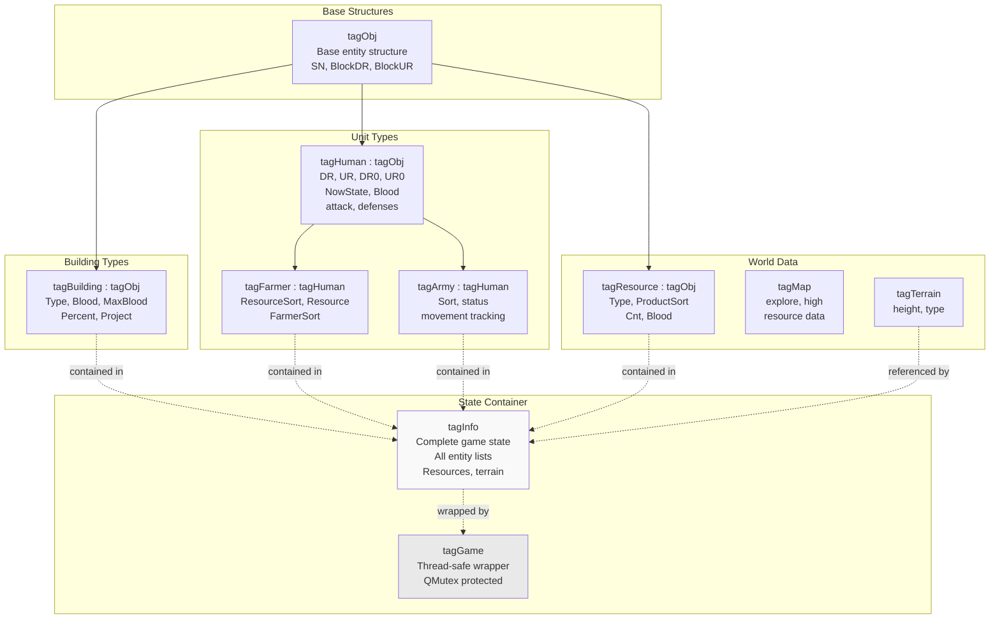
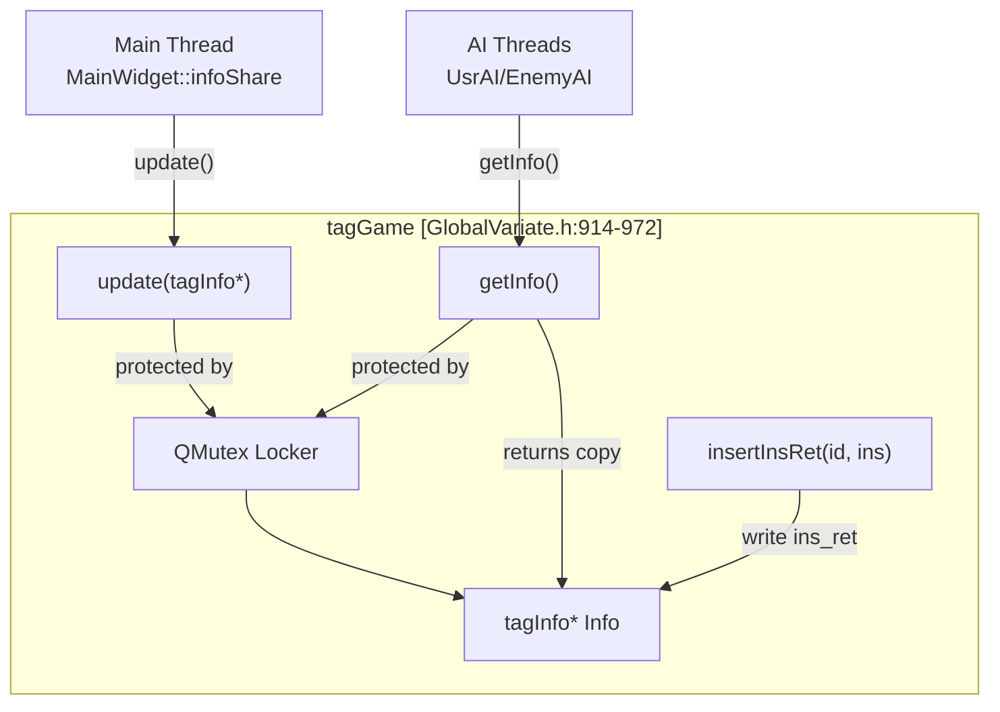
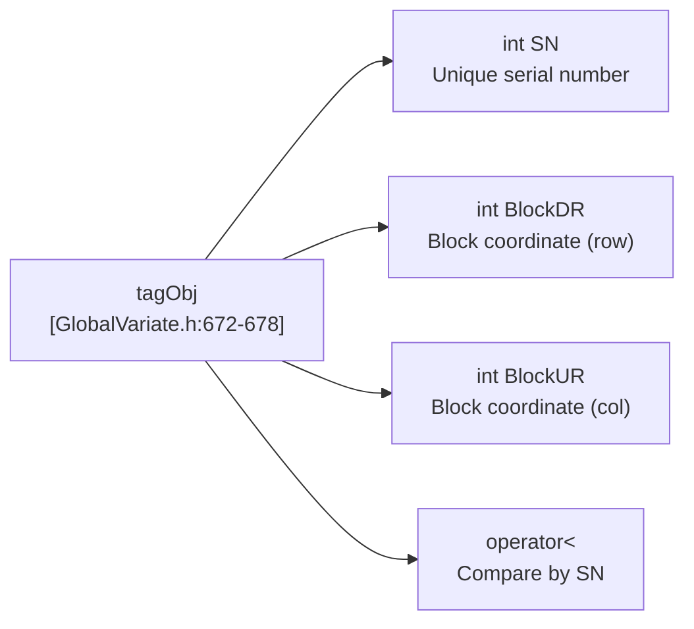
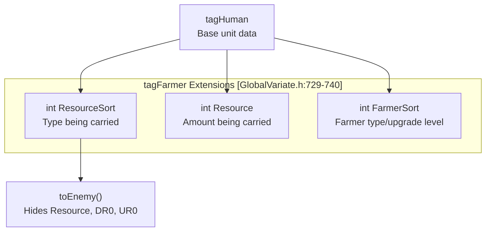
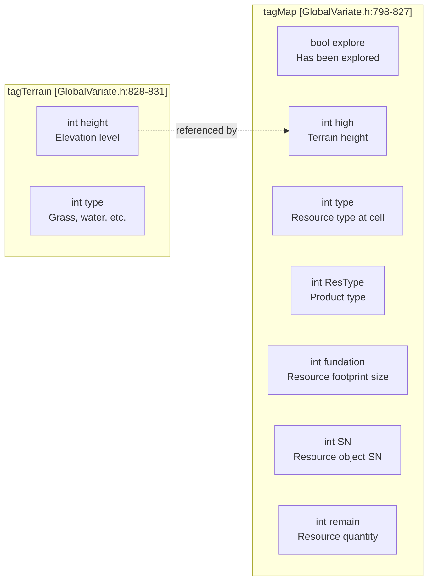
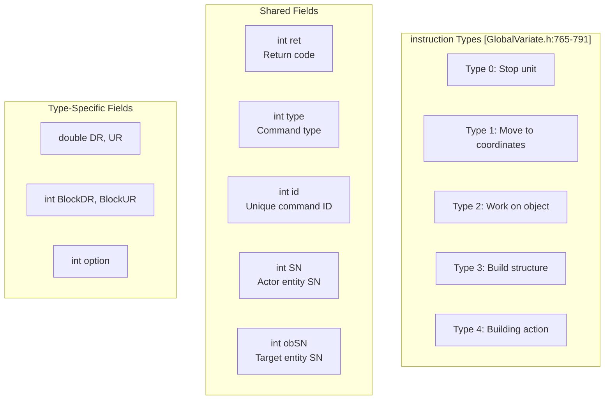
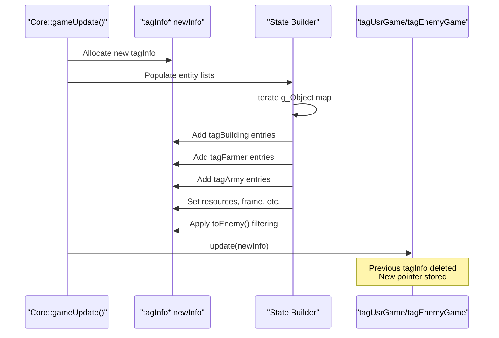
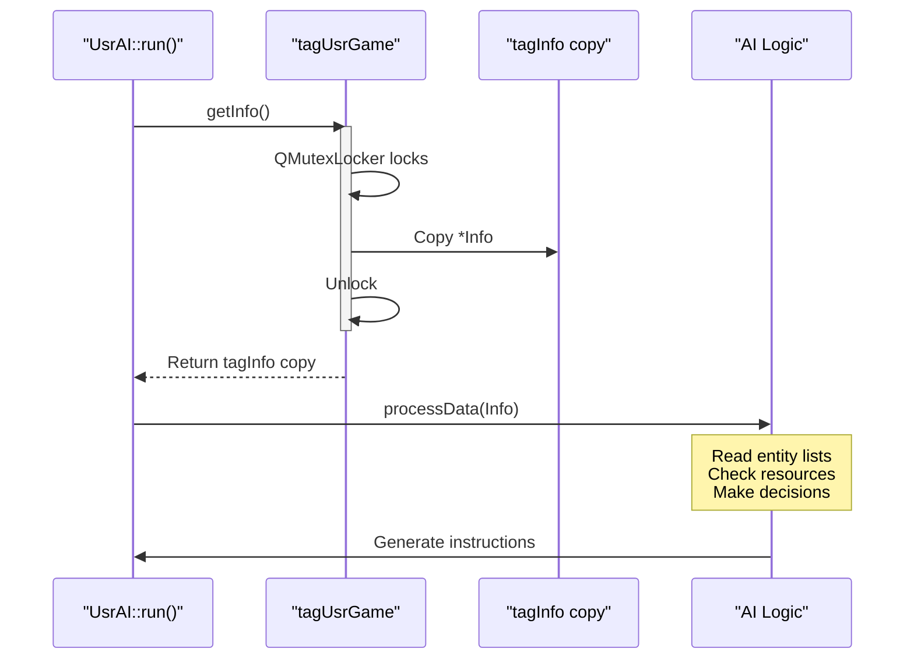
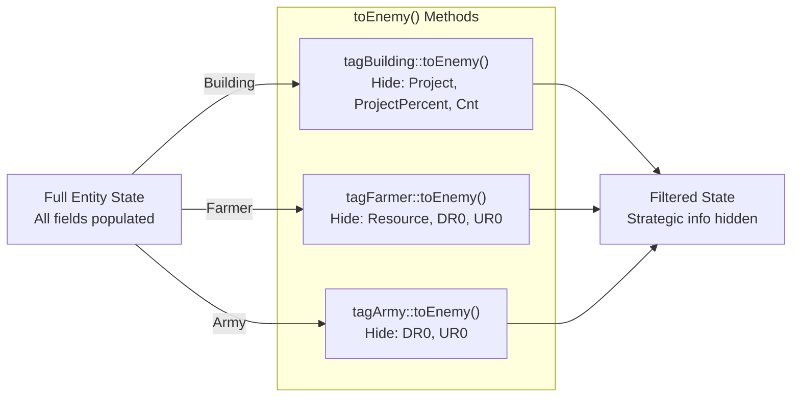

# Game State Structures

<details>
<summary>Relevant source files</summary>

The following files were used as context for generating this wiki page:

- [GlobalVariate.h](GlobalVariate.h)
- [config.json](config.json)

</details>


This page documents the fundamental data structures used to represent game state throughout the codebase. These structures serve as the primary communication mechanism between the game engine, AI threads, and UI components.

For technology tree and upgrade structures, see [Development Structures](#8.2). For enumeration constants and type definitions, see [Constants and Enumerations](#8.3). For details on how AI threads interact with these structures, see [AI Architecture](#5.1).

## Overview

The game state structures are defined in [GlobalVariate.h:672-973]() and serve multiple purposes:

- **Game State Snapshots**: `tagInfo` and `tagGame` provide complete game state for AI threads to read
- **Entity Representation**: `tagObj`, `tagBuilding`, `tagHuman`, `tagFarmer`, `tagArmy` represent game entities
- **World Data**: `tagResource`, `tagMap`, `tagTerrain` describe the game world
- **Command Interface**: `instruction` and `ins` enable AI-to-Core communication

These structures are designed for efficient serialization and thread-safe communication between the main game loop and AI threads.

Sources: [GlobalVariate.h:672-973]()

## Structure Hierarchy



**Inheritance Relationships**

The structure hierarchy uses C++ struct inheritance with two main branches:

- **Entity Branch**: `tagObj` → `tagBuilding` (buildings), `tagHuman` → `tagFarmer`/`tagArmy` (units)
- **Resource Branch**: `tagObj` → `tagResource` (harvestable objects)

Sources: [GlobalVariate.h:672-760]()

## Core State Container: tagInfo and tagGame

### tagInfo Structure

`tagInfo` is the primary game state snapshot structure that contains all information visible to a player or AI at a given frame.

```mermaid
graph LR
    subgraph "tagInfo Contents"
        VEC1["vector&lt;tagBuilding&gt; buildings"]
        VEC2["vector&lt;tagFarmer&gt; farmers"]
        VEC3["vector&lt;tagArmy&gt; armies"]
        VEC4["vector&lt;tagBuilding&gt; enemy_buildings"]
        VEC5["vector&lt;tagFarmer&gt; enemy_farmers"]
        VEC6["vector&lt;tagArmy&gt; enemy_armies"]
        VEC7["vector&lt;tagResource&gt; resources"]
        MAP1["map&lt;int, int&gt; ins_ret"]
        TERRAIN["TerrainData* theMap"]
        EXPLORED["vector&lt;Point&gt; exploredUpdate"]
        RES["Wood, Meat, Stone, Gold"]
        META["GameFrame, civilizationStage<br/>Human_MaxNum"]
    end
```



**Field Documentation**

| Field | Type | Description |
|-------|------|-------------|
| `buildings` | `vector<tagBuilding>` | Player's buildings |
| `farmers` | `vector<tagFarmer>` | Player's farmer units |
| `armies` | `vector<tagArmy>` | Player's military units |
| `enemy_buildings` | `vector<tagBuilding>` | Enemy buildings (fog-of-war filtered) |
| `enemy_farmers` | `vector<tagFarmer>` | Enemy farmers (fog-of-war filtered) |
| `enemy_armies` | `vector<tagArmy>` | Enemy armies (fog-of-war filtered) |
| `resources` | `vector<tagResource>` | Visible resources (trees, gold, etc.) |
| `ins_ret` | `map<int, int>` | Instruction return codes, `map<id, ret>` |
| `theMap` | `TerrainData*` | Pointer to terrain height/type grid |
| `exploredUpdate` | `vector<Point>` | Newly explored map areas this frame |
| `GameFrame` | `int` | Current game frame number |
| `civilizationStage` | `int` | Current civilization age (0-3) |
| `Wood`, `Meat`, `Stone`, `Gold` | `int` | Player's resource amounts |
| `Human_MaxNum` | `int` | Maximum population capacity |

Sources: [GlobalVariate.h:847-910]()

### tagGame Structure

`tagGame` wraps `tagInfo` with thread-safe access for AI threads.



**Key Methods**

| Method | Purpose |
|--------|---------|
| `update(tagInfo*)` | Replace internal state pointer (called by main thread) |
| `getInfo()` | Return thread-safe copy of state (called by AI threads) |
| `insertInsRet(int id, instruction ins)` | Store instruction result code |
| `clearInsRet()` | Clear instruction return map |
| `WLHHunYao(vector<T>&)` | Randomize entity order to prevent exploitation |

The `update()` method preserves the `ins_ret` map from the previous frame and limits it to 100 entries to prevent memory growth. The `WLHHunYao()` method shuffles entity vectors to prevent AI from exploiting consistent ordering.

Sources: [GlobalVariate.h:914-972]()

## Base Entity Structure: tagObj

`tagObj` is the minimal structure for any identifiable game entity.



**Fields**

- `SN`: Unique serial number assigned when entity is created, used as primary identifier throughout codebase
- `BlockDR`, `BlockUR`: Block-level coordinates (grid position), see [Map Structure](#6.1) for coordinate systems
- `operator<`: Enables use in sorted containers like `std::set`

Sources: [GlobalVariate.h:672-678]()

## Building Structure: tagBuilding

`tagBuilding` extends `tagObj` to represent all building types in the game.

**Field Documentation**

| Field | Type | Description | Notes |
|-------|------|-------------|-------|
| `Type` | `int` | Building type enum | See [Constants and Enumerations](#8.3) |
| `Blood` | `int` | Current hit points | |
| `MaxBlood` | `int` | Maximum hit points | |
| `Percent` | `int` | Construction progress % | 0-100 during construction, 100 when complete |
| `Project` | `int` | Current project ID | Unit training, tech research, or -1 if idle |
| `ProjectPercent` | `int` | Project completion % | 0-100 for active projects |
| `Cnt` | `int` | Remaining resources | Only used for farms, -1 otherwise |

**Fog-of-War Filtering**

```cpp
// GlobalVariate.h:688-693
tagBuilding toEnemy() {
    this->Cnt = -1;        // Hide farm resource count
    this->Project = -1;    // Hide current project
    this->ProjectPercent = -1;  // Hide project progress
    return *this;
}
```

The `toEnemy()` method sanitizes building data before sending to opponent AI, hiding strategic information while preserving position and type.

Sources: [GlobalVariate.h:679-694]()

## Unit Structures

### tagHuman Base Structure

`tagHuman` is the base structure for all mobile units (farmers, military).

| Field | Type | Description |
|-------|------|-------------|
| `DR`, `UR` | `double` | Detail-level coordinates (precise position) |
| `DR0`, `UR0` | `double` | Destination coordinates for movement |
| `NowState` | `int` | Current unit state (idle, moving, working, attacking) |
| `WorkObjectSN` | `int` | Serial number of target object |
| `Blood` | `int` | Current hit points |
| `attack` | `int` | Attack value |
| `rangedDefense` | `int` | Defense against ranged attacks |
| `meleeDefense` | `int` | Defense against melee attacks |

The `cast_from(tagHuman)` method [GlobalVariate.h:715-726]() copies state from another `tagHuman`, used for type conversions.

Sources: [GlobalVariate.h:705-728]()

### tagFarmer Structure



**Farmer-Specific Fields**

- `ResourceSort`: Type of resource being carried (wood/food/stone/gold)
- `Resource`: Quantity currently being carried (0 to carry limit)
- `FarmerSort`: Farmer upgrade tier affecting carry capacity and gather rate

The `toEnemy()` method hides resource cargo and destination to prevent opponent from inferring base location.

Sources: [GlobalVariate.h:729-740]()

### tagArmy Structure

Military unit structure with additional combat tracking fields.

| Field | Type | Description |
|-------|------|-------------|
| `Sort` | `int` | Unit type (clubman, bowman, cavalry, etc.) |
| `status` | `int` | Combat status flags |
| `starttime` | `int` | Movement/action start frame |
| `finishtime` | `int` | Movement/action end frame |
| `startpointDR`, `startpointUR` | `double` | Movement origin |
| `destinaDR`, `destinaUR` | `double` | Movement destination |
| `ifAttack` | `bool` | Currently in attack animation |
| `timelock` | `int` | Attack cooldown timer |

Similar to `tagFarmer`, the `toEnemy()` method [GlobalVariate.h:754-758]() hides movement destination.

Sources: [GlobalVariate.h:742-759]()

## Resource and Map Structures

### tagResource Structure

Represents harvestable resources (trees, gold mines, stone deposits, animals).

| Field | Type | Description |
|-------|------|-------------|
| `DR`, `UR` | `double` | Detail-level coordinates |
| `Type` | `int` | Resource object type (tree, goldmine, gazelle, etc.) |
| `ProductSort` | `int` | Type of resource produced (wood/food/stone/gold) |
| `Cnt` | `int` | Remaining resource quantity |
| `Blood` | `int` | Current hit points (for animals, trees) |

Resources inherit from `tagObj` [GlobalVariate.h:696-703](), so they have `SN` and block coordinates.

Sources: [GlobalVariate.h:696-703]()

### tagTerrain and tagMap



**tagTerrain vs tagMap**

- `tagTerrain` [GlobalVariate.h:828-831](): Pure terrain data (height, type), used in the constant terrain grid
- `tagMap` [GlobalVariate.h:798-827](): Combined terrain + resource + exploration state for each map cell

The `tagMap` structure includes both terrain information and dynamic resource data. The `clear_r()` method [GlobalVariate.h:819-826]() resets only the resource fields while preserving terrain data.

Sources: [GlobalVariate.h:798-831]()

## Command Structures

### instruction Structure

The `instruction` structure encodes commands from AI threads to the game core.



**Field Usage by Type**

| Type | SN | obSN | DR/UR | BlockDR/UR | option | Description |
|------|-----|------|-------|------------|--------|-------------|
| 0 | ✓ | - | - | - | - | Stop unit's current action |
| 1 | ✓ | - | ✓ | - | - | Move unit to coordinates |
| 2 | ✓ | ✓ | - | - | - | Assign unit to work on object |
| 3 | ✓ | - | - | ✓ | ✓ | Build structure at block coords |
| 4 | ✓ | - | - | - | ✓ | Execute building action |

**Return Codes**

| Code | Meaning | When Set |
|------|---------|----------|
| 0 | Success | Command executed successfully |
| -1 | SN not found | Actor entity doesn't exist |
| -2 | Action not found | Invalid action option |
| -3 | Out of bounds | Coordinates outside map |
| -4 | Target not found | obSN entity doesn't exist |
| -5 | Building invalid | Building type not available |
| -6 | Insufficient resources | Not enough resources to execute |

See detailed documentation in [Instruction and Command System](#5.2).

Sources: [GlobalVariate.h:765-791](), [GlobalVariate.h:1292-1299]()

### ins Structure

Thread-safe instruction queue for AI-to-Core communication.

```cpp
// GlobalVariate.h:793-797
struct ins {
    int g_id = 0;                     // Global instruction ID counter
    std::queue<instruction> instructions;  // Command queue
    QMutex lock;                       // Thread synchronization
};
```

The `ins` structure provides:
- **Thread Safety**: `QMutex` protects concurrent access from AI threads
- **FIFO Queue**: Instructions processed in submission order
- **ID Generation**: `g_id` counter for unique instruction tracking

Each AI thread has its own `ins` queue. The main game loop dequeues and processes instructions via `Core::manageOrder()`.

Sources: [GlobalVariate.h:793-797]()

## Data Flow Patterns

### Main Thread: State Creation



The main thread creates fresh `tagInfo` snapshots each frame by iterating over the global `g_Object` map and converting entities to their tag structures.

Sources: Referenced from architecture diagrams

### AI Thread: State Reading



AI threads call `getInfo()` to receive a snapshot copy, ensuring thread-safe read access without blocking the main thread for extended periods.

Sources: Referenced from architecture diagrams

### Fog-of-War Data Sanitization



Before adding enemy entities to `tagInfo`, the state builder calls `toEnemy()` methods to hide:
- Building production queues and farm resource counts
- Unit cargo and movement destinations

This implements fog-of-war at the data structure level, ensuring AI cannot access information it shouldn't have.

Sources: [GlobalVariate.h:688-693](), [GlobalVariate.h:734-740](), [GlobalVariate.h:754-758]()

## Memory Management Considerations

**tagInfo Lifecycle**

The main thread allocates a new `tagInfo` each frame and passes ownership to `tagGame::update()`. The previous frame's `tagInfo` is deleted automatically. This ensures AI threads never access stale data.

**Vector Ordering Randomization**

The `tagGame::WLHHunYao()` method [GlobalVariate.h:921-930]() shuffles entity vectors to prevent AI exploitation of consistent ordering. This is controlled by `openHunYao` flag (default: enabled).

**ins_ret Map Pruning**

To prevent unbounded growth, `tagGame::update()` limits the `ins_ret` map to 100 entries [GlobalVariate.h:933-937](), evicting oldest entries first.

Sources: [GlobalVariate.h:914-972]()

## Usage Examples in Codebase

**Creating Entity Tags**

When populating `tagInfo`, the game core converts internal objects to tag structures:

```
// Building → tagBuilding
tagBuilding tb;
tb.SN = building->SN;
tb.BlockDR = building->getBlockD();
tb.BlockUR = building->getBlockU();
tb.Type = building->getSort();
tb.Blood = building->getNowBlood();
tb.MaxBlood = building->getMaxBlood();
// ... populate remaining fields
```

**AI Reading State**

AI threads access game state through `tagGame`:

```
tagInfo info = tagUsrGame.getInfo();
for (const tagBuilding& b : info.buildings) {
    if (b.Type == BUILDING_CENTER && b.Percent == 100) {
        // Found completed town center
    }
}
```

**Instruction Result Codes**

After processing instructions, the core stores results:

```
instruction ins = /* dequeued from ins.instructions */;
// Process instruction...
ins.ret = 0;  // Success, or error code
tagUsrGame.insertInsRet(ins.id, ins);
```

AI threads retrieve results from `tagInfo::ins_ret` in subsequent frames.

Sources: Referenced from architecture diagrams, [GlobalVariate.h:765-973]()