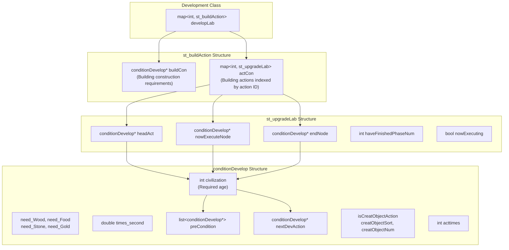
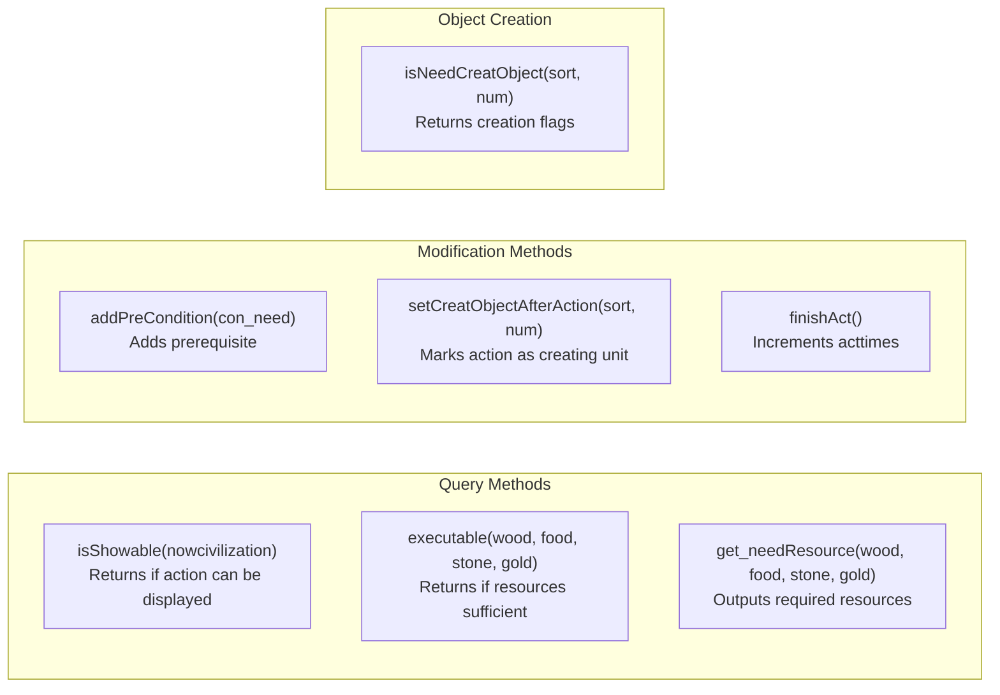
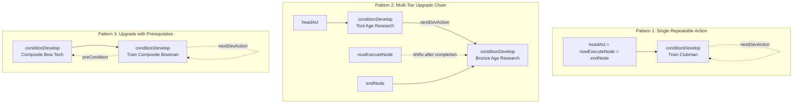
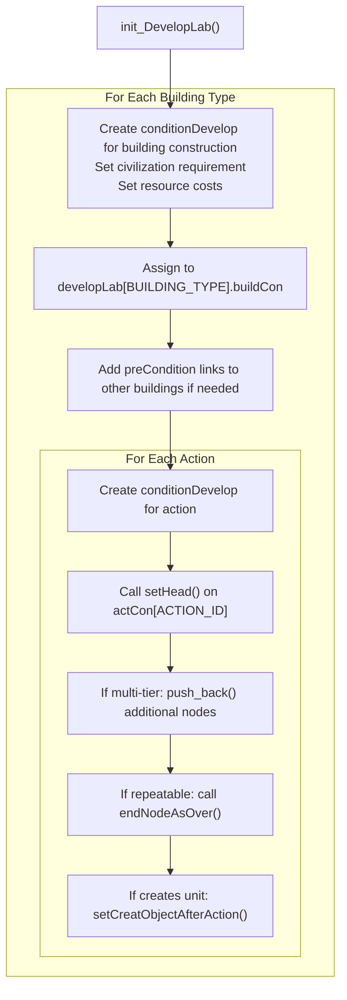
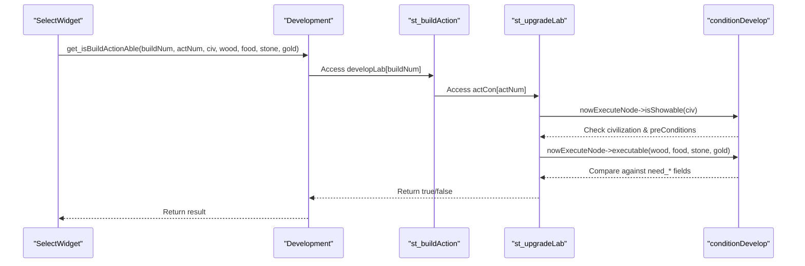
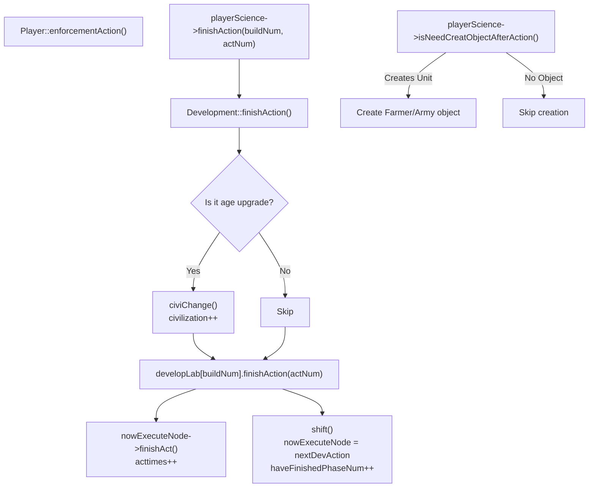

# Development Structures

<details>
<summary>Relevant source files</summary>

The following files were used as context for generating this wiki page:

- [Development.cpp](Development.cpp)
- [Development.h](Development.h)
- [GlobalVariate.h](GlobalVariate.h)
- [Player.cpp](Player.cpp)

</details>


This page documents the data structures that define the technology tree system in new-aoe. These structures encode prerequisites, resource costs, timing, and unlock chains for buildings, units, and upgrades. For information about the `Development` class that manages these structures, see [Technology Tree](#3.2). For runtime game state structures, see [Game State Structures](#8.1).

## Overview

The technology tree is implemented through three interconnected structures:

- **`conditionDevelop`** - A single node representing one technology, upgrade, or training action
- **`st_upgradeLab`** - A linked list manager for chains of upgrades (e.g., Tool Age → Bronze Age)
- **`st_buildAction`** - Container for a building's construction requirements and all its available actions

These structures are instantiated in [Development.cpp:391-693]() within `Development::init_DevelopLab()` and stored in the `developLab` map indexed by building type.

## Structure Hierarchy

The following diagram shows how these structures relate to each other:



**Sources:** [GlobalVariate.h:1106-1286](), [Development.h:131]()

## conditionDevelop Structure

The `conditionDevelop` structure represents a single action in the technology tree, such as "Build Town Center", "Research Bronze Age", or "Train Clubman".

### Field Reference

| Field | Type | Purpose |
|-------|------|---------|
| `civilization` | `int` | Minimum civilization age required (CIVILIZATION_STONEAGE, CIVILIZATION_TOOLAGE, etc.) |
| `sort_building` | `int` | Building type this action belongs to |
| `times_second` | `double` | Duration in seconds to complete this action |
| `acttimes` | `int` | Number of times this action has been completed |
| `isCreatObjectAction` | `bool` | Whether completing this action creates a unit/building |
| `creatObjectSort` | `int` | Type of object to create (SORT_FARMER, SORT_ARMY, etc.) |
| `creatObjectNum` | `int` | Specific subtype of created object (AT_CLUBMAN, FARMERTYPE_FARMER, etc.) |
| `preCondition` | `list<conditionDevelop*>` | Other actions that must be completed before this can be started |
| `nextDevAction` | `conditionDevelop*` | Next upgrade in the chain (for multi-tier upgrades) |
| `need_Wood` | `int` | Wood cost |
| `need_Food` | `int` | Food cost |
| `need_Stone` | `int` | Stone cost |
| `need_Gold` | `int` | Gold cost |

**Sources:** [GlobalVariate.h:1106-1189]()

### Key Methods



**Sources:** [GlobalVariate.h:1142-1188]()

### Constructor Pattern

The primary constructor is invoked throughout `init_DevelopLab()`:

```cpp
conditionDevelop(int civilization, int sort_building, double needTimes, 
                 int need_Wood = 0, int need_Food = 0, 
                 int need_Stone = 0, int need_Gold = 0)
```

**Example from code:**
[Development.cpp:400-401]() - Creating a farmer training action:
```cpp
newNode = new conditionDevelop(CIVILIZATION_STONEAGE, BUILDING_CENTER, TIME_BUILDING_CENTER_CREATEFARMER,
                               0, BUILDING_CENTER_CREATEFARMER_FOOD);
```

**Sources:** [GlobalVariate.h:1131-1140](), [Development.cpp:391-693]()

## st_upgradeLab Structure

The `st_upgradeLab` structure manages a linked list of `conditionDevelop` nodes, used for actions that have multiple tiers or can be repeated. It tracks which node in the chain is currently active.

### Field Reference

| Field | Type | Purpose |
|-------|------|---------|
| `headAct` | `conditionDevelop*` | First node in the upgrade chain |
| `nowExecuteNode` | `conditionDevelop*` | Currently active/available node |
| `endNode` | `conditionDevelop*` | Last node in the chain |
| `haveFinishedPhaseNum` | `int` | Number of completed phases (each node completion increments this) |
| `nowExecuting` | `bool` | Whether the current node is being executed (in progress) |

**Sources:** [GlobalVariate.h:1191-1244]()

### Linked List Patterns

The diagram below shows three common upgrade chain patterns:



**Sources:** [Development.cpp:403-404](), [Development.cpp:408-413](), [Development.cpp:628-639]()

### State Management Methods

| Method | Purpose |
|--------|---------|
| `setHead(conditionDevelop*)` | Initialize chain with first node |
| `push_back(conditionDevelop*)` | Append node to end of chain |
| `endNodeAsOver()` | Mark end node as repeatable (nextDevAction points to itself) |
| `shift()` | Complete current node and move to next (calls `finishAct()`, increments `haveFinishedPhaseNum`) |
| `isShowAble(nowcivilization)` | Check if current action can be displayed in UI |
| `executable(nowciv, wood, food, stone, gold)` | Check if current action can be started |
| `beginExecute()` / `overExecute()` | Set/clear `nowExecuting` flag |

**Sources:** [GlobalVariate.h:1208-1250]()

### Example Usage

[Development.cpp:482-486]() shows creating a repeatable training action:
```cpp
newNode = new conditionDevelop(CIVILIZATION_STONEAGE, BUILDING_ARMYCAMP, TIME_BUILDING_ARMYCAMP_CREATE_CLUBMAN, 
                               0, BUILDING_ARMYCAMP_CREATE_CLUBMAN_FOOD);
newNode->setCreatObjectAfterAction(SORT_ARMY, AT_CLUBMAN);
developLab[BUILDING_ARMYCAMP].actCon[BUILDING_ARMYCAMP_CREATE_CLUBMAN].setHead(newNode);
developLab[BUILDING_ARMYCAMP].actCon[BUILDING_ARMYCAMP_CREATE_CLUBMAN].endNodeAsOver();
```

**Sources:** [Development.cpp:482-486]()

## st_buildAction Structure

The `st_buildAction` structure aggregates all technology information for a single building type. It contains the building's construction requirements and a map of all actions that building can perform.

### Field Reference

| Field | Type | Purpose |
|-------|------|---------|
| `buildCon` | `conditionDevelop*` | Requirements to construct this building |
| `actCon` | `map<int, st_upgradeLab>` | Map from action ID to upgrade chain for that action |

**Sources:** [GlobalVariate.h:1262-1278]()

### Methods

| Method | Purpose |
|--------|---------|
| `finishBuild()` | Calls `buildCon->finishAct()` to mark building as constructed |
| `finishAction(int actNum)` | Completes action `actNum` and shifts to next phase |

**Sources:** [GlobalVariate.h:1280-1285]()

### Destructor Behavior

The destructor [GlobalVariate.h:1272-1278]() deletes the `buildCon` pointer but relies on the `st_upgradeLab` destructor [GlobalVariate.h:1197-1206]() to clean up action chains by walking the linked list.

**Sources:** [GlobalVariate.h:1197-1206](), [GlobalVariate.h:1272-1278]()

## Technology Tree Initialization

The `Development::init_DevelopLab()` method constructs the entire technology tree at game start. The pattern for each building follows this structure:



**Sources:** [Development.cpp:391-693]()

### Example: Town Center Initialization

[Development.cpp:396-415]() demonstrates the complete initialization of the Town Center:

```cpp
// Building construction requirement
developLab[BUILDING_CENTER].buildCon = new conditionDevelop(
    CIVILIZATION_IRONAGE, BUILDING_CENTER, TIME_BUILD_CENTER, BUILD_CENTER_WOOD);

// Action 1: Train Farmer (repeatable)
newNode = new conditionDevelop(CIVILIZATION_STONEAGE, BUILDING_CENTER, 
                               TIME_BUILDING_CENTER_CREATEFARMER,
                               0, BUILDING_CENTER_CREATEFARMER_FOOD);
newNode->setCreatObjectAfterAction(SORT_FARMER, FARMERTYPE_FARMER);
developLab[BUILDING_CENTER].actCon[BUILDING_CENTER_CREATEFARMER].setHead(newNode);
developLab[BUILDING_CENTER].actCon[BUILDING_CENTER_CREATEFARMER].endNodeAsOver();

// Action 2: Age Upgrades (multi-tier chain)
// Tier 1: Tool Age
newNode = new conditionDevelop(CIVILIZATION_STONEAGE, BUILDING_CENTER, 
                               TIME_BUILDING_CENTER_UPGRADE,
                               0, BUILDING_CENTER_UPGRADE_TOOLAGE_FOOD);
developLab[BUILDING_CENTER].actCon[BUILDING_CENTER_UPGRADE].setHead(newNode);

// Tier 2: Bronze Age
newNode = new conditionDevelop(CIVILIZATION_TOOLAGE, BUILDING_CENTER,
                               TIME_BUILDING_CENTER_UPGRADE,
                               0, BUILDING_CENTER_UPGRADE_BRONZEAGE_FOOD, 
                               0, BUILDING_CENTER_UPGRADE_BRONZEAGE_GOLD);
developLab[BUILDING_CENTER].actCon[BUILDING_CENTER_UPGRADE].push_back(newNode);
```

**Sources:** [Development.cpp:396-415]()

## Query and Validation

The `Development` class provides query methods that traverse these structures:

### Resource Validation Flow



**Sources:** [Development.cpp:338-347](), [GlobalVariate.h:1164-1172](), [GlobalVariate.h:1232-1238]()

### Key Query Methods

From [Development.h:86-108]():

| Method | Returns | Purpose |
|--------|---------|---------|
| `get_isBuildingShowAble(buildingNum, civ)` | `bool` | Can building be shown in UI? |
| `get_isBuildingAble(buildingNum, w, f, s, g)` | `bool` | Can building be constructed? |
| `get_isBuildActionShowAble(buildingNum, actNum, civ)` | `bool` | Can action be shown in UI? |
| `get_isBuildActionAble(buildingNum, actNum, civ, w, f, s, g, oper*)` | `bool` | Can action be executed? |
| `get_Resource_Consume(buildNum, &w, &f, &s, &g)` | `void` | Output resource costs for building |
| `get_Resource_Consume(buildNum, actNum, &w, &f, &s, &g)` | `void` | Output resource costs for action |
| `get_buildTime(buildingNum)` | `double` | Get construction duration |
| `get_actTime(buildingNum, actNum)` | `double` | Get action duration |
| `getActLevel(buildType, actType)` | `int` | Get number of completed phases |

**Sources:** [Development.h:86-108]()

## Action Completion Flow

When a building completes an action, the following sequence updates the technology tree state:



**Sources:** [Player.cpp:272-324](), [Development.cpp:325-336](), [GlobalVariate.h:1280-1285](), [GlobalVariate.h:1220-1228]()

## Prerequisite System

Prerequisites are enforced through the `preCondition` list in `conditionDevelop`. An action is only showable if all prerequisites have `acttimes > 0`.

### Example: Market Prerequisites

[Development.cpp:515-516]() shows the Market requiring the Granary:
```cpp
developLab[BUILDING_MARKET].buildCon = new conditionDevelop(
    CIVILIZATION_TOOLAGE, BUILDING_MARKET, TIME_BUILD_MARKET, BUILD_MARKET_WOOD);
developLab[BUILDING_MARKET].buildCon->addPreCondition(
    developLab[BUILDING_GRANARY].buildCon);
```

### Example: Chariot Prerequisites

[Development.cpp:587-593]() shows the Chariot requiring the Wheel upgrade:
```cpp
newNode = new conditionDevelop(CIVILIZATION_BRONZEAGE, BUILDING_STABLE, 
                               TIME_BUILDING_STABLE_CREATE_CHARIOT,
                               BUILDING_STABLE_CREATE_CHARIOT_WOOD, 
                               BUILDING_STABLE_CREATE_CHARIOT_FOOD);
// Add wheel upgrade as prerequisite
newNode->addPreCondition(developLab[BUILDING_MARKET].actCon[BUILDING_MARKET_WHEEL_UPGRADE].headAct);
newNode->setCreatObjectAfterAction(SORT_ARMY, AT_CHARIOT);
```

The `isShowable()` check [GlobalVariate.h:1164-1172]() verifies all prerequisites:
```cpp
for (list<conditionDevelop*>::iterator iter = preCondition.begin(); 
     iter != preCondition.end(); iter++)
    if (!(*iter)->acttimes) return false;
```

**Sources:** [Development.cpp:515-516](), [Development.cpp:587-593](), [GlobalVariate.h:1164-1172]()

## Memory Management

### Allocation

All `conditionDevelop` nodes are allocated with `new` in `init_DevelopLab()` [Development.cpp:391-693]().

### Deallocation

1. `st_buildAction` destructor [GlobalVariate.h:1272-1278]() deletes `buildCon`
2. `st_upgradeLab` destructor [GlobalVariate.h:1197-1206]() walks the linked list from `headAct` to `endNode`, deleting each node
3. The `~st_buildAction()` is called when `Development::~Development()` destroys the `developLab` map

**Note:** The comment at [Development.cpp:692]() warns "存在内存泄漏" (memory leak exists), suggesting incomplete cleanup.

**Sources:** [GlobalVariate.h:1197-1206](), [GlobalVariate.h:1272-1278](), [Development.cpp:692]()

## Integration with Development Class

The `Development` class [Development.h:1-139]() stores the `developLab` map [Development.h:131]():

```cpp
map<int, st_buildAction> developLab;
```

Indexed by building type constants (BUILDING_CENTER, BUILDING_ARMYCAMP, etc.), this map provides O(1) access to any building's technology information.

The class provides convenience accessors for common queries:
- Civilization/age management [Development.h:44-52]()
- Population/housing limits [Development.h:54-69]()
- Resource consumption queries [Development.h:94-100]()
- Stat modifiers (attack, defense, gather rates) [Development.cpp:13-311]()

**Sources:** [Development.h:1-139](), [Development.h:131](), [Development.cpp:1-693]()