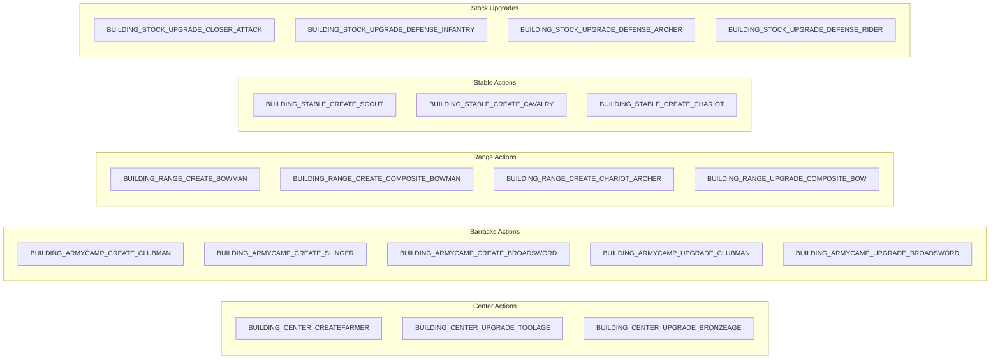
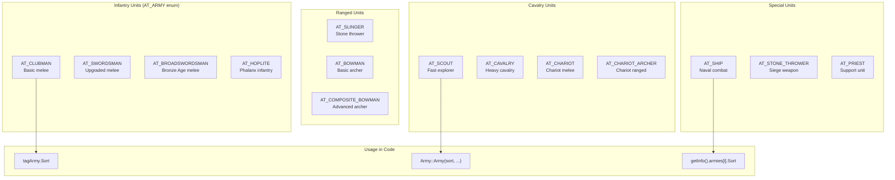
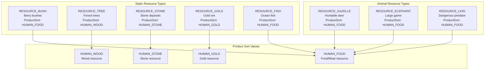
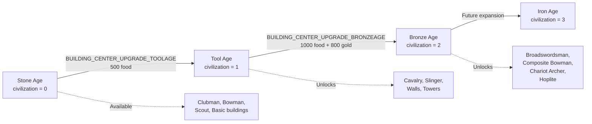
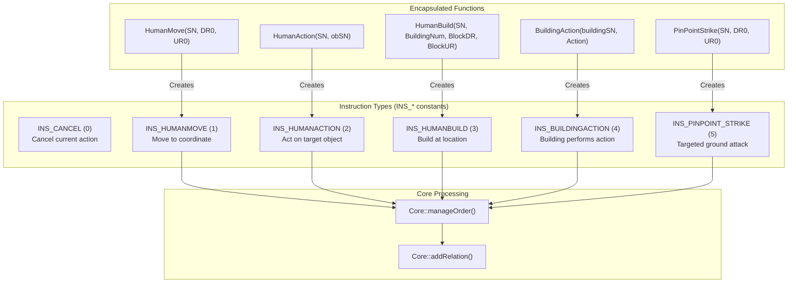
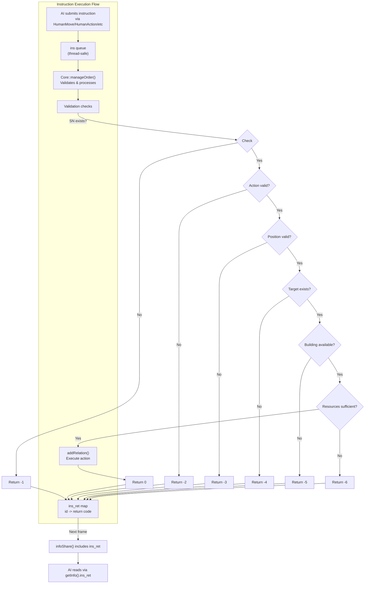
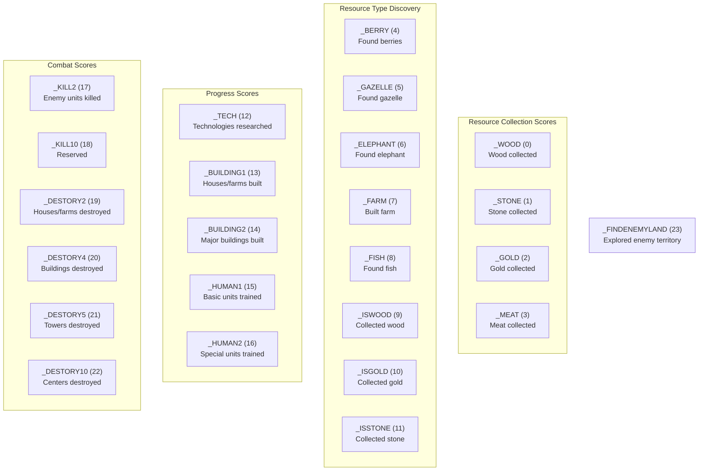
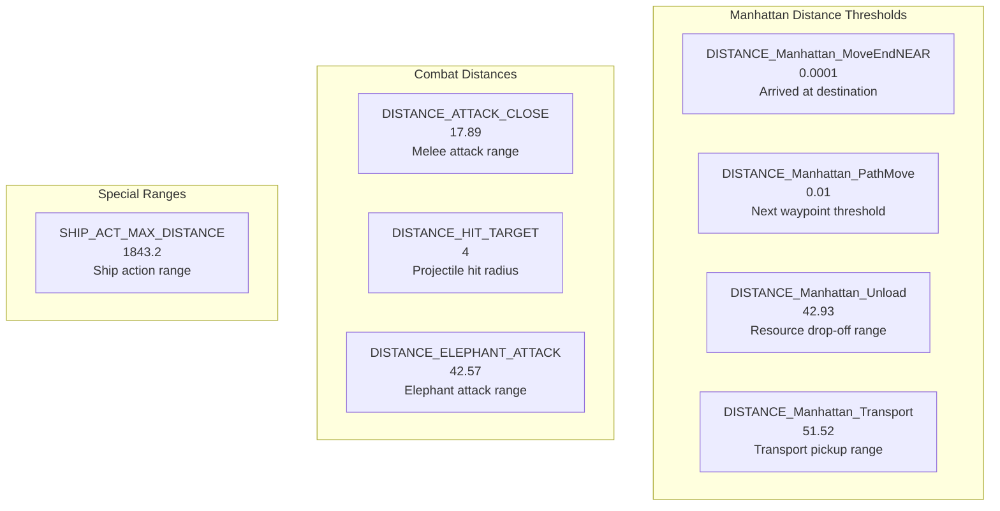
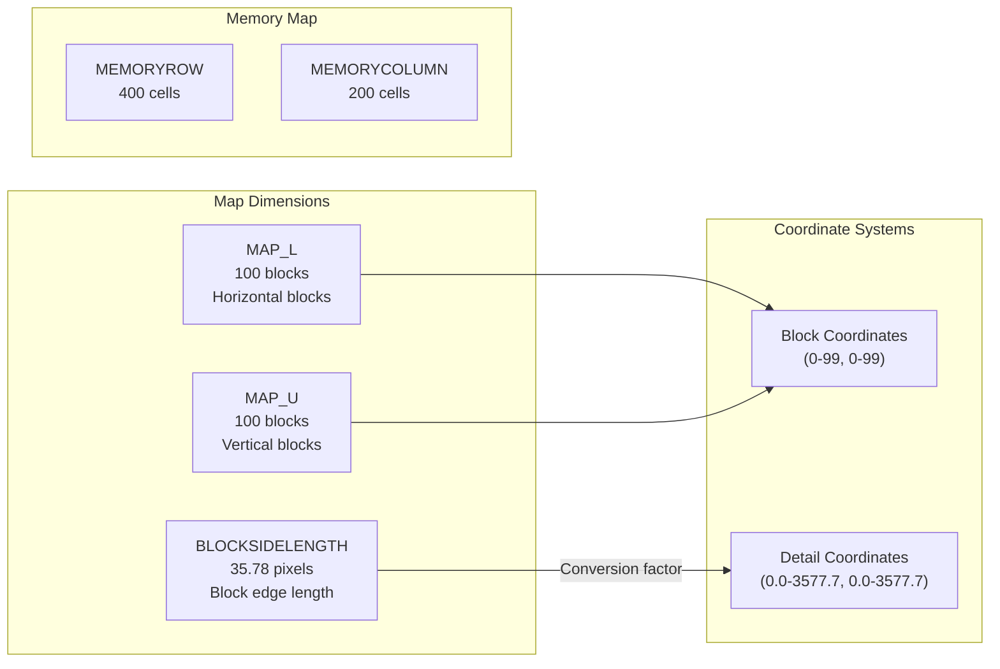

# Constants and Enumerations

<details>
<summary>Relevant source files</summary>

The following files were used as context for generating this wiki page:

- [GlobalVariate.h](GlobalVariate.h)
- [README.md](README.md)
- [config.json](config.json)

</details>


## Purpose and Scope

This page provides a comprehensive reference for all constants and enumerations used throughout the new-aoe codebase. These compile-time and runtime constants define entity types, game states, instruction codes, and numerical parameters that control game behavior. 

For information about the data structures that use these constants, see [Game State Structures](#8.1) and [Development Structures](#8.2). For the configuration system that loads runtime values, see [Configuration System](#2.3).

The constants are defined in two locations:
- **config.h** - Compile-time enumeration definitions and macro constants
- **config.json** + **GlobalVariate.h** - Runtime numerical parameters loaded at startup

---

## Building Type Constants

Building types are defined as enumeration constants in `config.h` and used throughout the codebase to identify building varieties. Each building type has associated properties defined in `config.json`.

### Building Type Enumeration

```mermaid
graph TD
    subgraph "BUILDING_* Constants (config.h)"
        HOME["BUILDING_HOME<br/>Population housing"]
        CENTER["BUILDING_CENTER<br/>Main base building"]
        STOCK["BUILDING_STOCK<br/>Infantry upgrades"]
        GRANARY["BUILDING_GRANARY<br/>Storage & research"]
        ARMYCAMP["BUILDING_ARMYCAMP<br/>Infantry training"]
        RANGE["BUILDING_RANGE<br/>Archer training"]
        STABLE["BUILDING_STABLE<br/>Cavalry training"]
        MARKET["BUILDING_MARKET<br/>Economic upgrades"]
        DOCK["BUILDING_DOCK<br/>Naval units"]
        SIEGE["BUILDING_SIEGE<br/>Siege weapons"]
        COLLAGE["BUILDING_COLLAGE<br/>Special units"]
        FARM["BUILDING_FARM<br/>Food production"]
        ARROWTOWER["BUILDING_ARROWTOWER<br/>Defensive structure"]
        WALL["BUILDING_WALL<br/>Defensive barrier"]
    end
    
    subgraph "Usage Context"
        HUMANBUILD["HumanBuild(SN, BuildingNum, BlockDR, BlockUR)"]
        TAGBUILDING["tagBuilding.Type"]
        PLAYER["Player.build list"]
    end
    
    HOME --> HUMANBUILD
    CENTER --> HUMANBUILD
    STOCK --> TAGBUILDING
    GRANARY --> PLAYER
```



**Building Type Reference Table**

| Constant | Typical Use | Config Parameters | Population Provided |
|----------|-------------|-------------------|---------------------|
| `BUILDING_HOME` | Housing | `BLOOD_BUILD_HOUSE`, `BUILD_HOUSE_WOOD`, `TIME_BUILD_HOME` | `HOUSE_HUMAN_NUM` (4) |
| `BUILDING_CENTER` | Main base | `BLOOD_BUILD_CENTER`, `BUILD_CENTER_WOOD`, `BUILDING_CENTER_CREATEFARMER_FOOD` | 0 |
| `BUILDING_STOCK` | Infantry upgrades | `BLOOD_BUILD_STOCK`, `BUILD_STOCK_WOOD`, various `BUILDING_STOCK_UPGRADE_*` | 0 |
| `BUILDING_GRANARY` | Storage & wall research | `BLOOD_BUILD_GRANARY`, `BUILD_GRANARY_WOOD`, `BUILDING_GRANARY_RESEARCH_WALL_FOOD` | 0 |
| `BUILDING_ARMYCAMP` | Train clubman, slinger, broadswordsman | `BUILD_ARMYCAMP_WOOD`, `BUILDING_ARMYCAMP_CREATE_CLUBMAN_FOOD` | 0 |
| `BUILDING_RANGE` | Train bowman, composite bowman, chariot archer | `BUILD_RANGE_WOOD`, `BUILDING_RANGE_CREATE_BOWMAN_FOOD` | 0 |
| `BUILDING_STABLE` | Train scout, cavalry, chariot | `BUILD_STABLE_WOOD`, `BUILDING_STABLE_CREATE_SCOUT_FOOD` | 0 |
| `BUILDING_MARKET` | Economic technologies | `BUILD_MARKET_WOOD`, `BUILDING_MARKET_WOOD_UPGRADE_FOOD` | 0 |
| `BUILDING_DOCK` | Naval units | `BUILD_DOCK_WOOD`, `BUILDING_DOCK_CREATE_SHIP_WOOD` | 0 |
| `BUILDING_SIEGE` | Stone thrower | `BUILD_SIEGE_WOOD`, `BUILDING_SIEGE_CREATE_STONE_THROWER_WOOD` | 0 |
| `BUILDING_COLLAGE` | Hoplite | `BUILD_COLLAGE_WOOD`, `BUILDING_COLLAGE_CREATE_HOPLITE_FOOD` | 0 |
| `BUILDING_FARM` | Renewable food source | `BUILD_FARM_WOOD`, `CNT_BUILD_FARM` (250 food capacity) | 0 |
| `BUILDING_ARROWTOWER` | Defensive tower | `BUILD_ARROWTOWER_STONE`, `DIS_ARROWTOWER` (7 range) | 0 |
| `BUILDING_WALL` | Defensive wall | `BUILD_WALL_STONE`, `BLOOD_BUILD_WALL` | 0 |

Sources: [README.md:116-121](), [config.json:93-257](), [GlobalVariate.h:30-227]()

---

## Building Action Constants

Building actions represent trainable units, upgrades, and research options available from specific buildings. These are used with the `BuildingAction(buildingSN, Action)` function.



**Unit Creation Actions by Building**

| Building | Action Constant | Creates | Food Cost | Additional Cost |
|----------|----------------|---------|-----------|----------------|
| Center | `BUILDING_CENTER_CREATEFARMER` | Farmer | 50 | - |
| Armycamp | `BUILDING_ARMYCAMP_CREATE_CLUBMAN` | Clubman | 50 | - |
| Armycamp | `BUILDING_ARMYCAMP_CREATE_SLINGER` | Slinger | 40 | 10 stone |
| Armycamp | `BUILDING_ARMYCAMP_CREATE_BROADSWORD` | Broadswordsman | 35 | 15 gold |
| Range | `BUILDING_RANGE_CREATE_BOWMAN` | Bowman | 40 | 20 wood |
| Range | `BUILDING_RANGE_CREATE_COMPOSITE_BOWMAN` | Composite Bowman | 40 | 20 gold |
| Range | `BUILDING_RANGE_CREATE_CHARIOT_ARCHER` | Chariot Archer | 40 | 70 wood |
| Stable | `BUILDING_STABLE_CREATE_SCOUT` | Scout | 60 | - |
| Stable | `BUILDING_STABLE_CREATE_CAVALRY` | Cavalry | 70 | 80 gold |
| Stable | `BUILDING_STABLE_CREATE_CHARIOT` | Chariot | 40 | 60 wood |
| Dock | `BUILDING_DOCK_CREATE_SHIP` | War Ship | - | 135 wood |
| Siege | `BUILDING_SIEGE_CREATE_STONE_THROWER` | Stone Thrower | - | 180 wood + 80 gold |
| Collage | `BUILDING_COLLAGE_CREATE_HOPLITE` | Hoplite | 60 | 40 gold |

**Research/Upgrade Actions**

| Building | Action Constant | Effect | Requirements |
|----------|----------------|--------|--------------|
| Center | `BUILDING_CENTER_UPGRADE_TOOLAGE` | Advance to Tool Age | 500 food |
| Center | `BUILDING_CENTER_UPGRADE_BRONZEAGE` | Advance to Bronze Age | 1000 food + 800 gold |
| Stock | `BUILDING_STOCK_UPGRADE_CLOSER_ATTACK` | +2 melee attack | 100 food |
| Stock | `BUILDING_STOCK_UPGRADE_DEFENSE_INFANTRY` | +2 infantry defense | 75 food |
| Market | `BUILDING_MARKET_WOOD_UPGRADE` | +2 wood carry, +0.2 gather rate | 120 food + 75 wood |
| Market | `BUILDING_MARKET_STONE_UPGRADE` | +3 stone carry, +0.2 gather rate | 100 food + 50 stone |
| Granary | `BUILDING_GRANARY_RESEARCH_WALL` | Unlock wall building | 50 food |
| Granary | `BUILDING_GRANARY_ARROWTOWER` | Unlock arrow tower | 50 food |

Sources: [README.md:120-121](), [config.json:97-469](), [GlobalVariate.h:34-210]()

---

## Unit Type Constants

### Army Type Enumeration (AT_ARMY)

The `AT_ARMY` enumeration defines all military unit types. These values are stored in `tagArmy.Sort` and used to determine unit behavior, stats, and rendering.



**Army Unit Statistics Table**

| Unit Type Constant | Speed | Vision | Attack Range | Blood | Attack | Def (Close/Shoot) | Attack Interval |
|-------------------|-------|--------|--------------|-------|--------|-------------------|-----------------|
| `AT_CLUBMAN` | 2.44 | 4 | 0 (melee) | 40 | 3 | 0/0 | 1.5 |
| `AT_SLINGER` | 2.44 | 5 | 4 | 25 | 2 | 0/2 | 1.5 |
| `AT_BOWMAN` | 2.44 | 7 | 5 | 35 | 3 | 0/0 | 1.4 |
| `AT_SCOUT` | 4.07 | 8 | 0 (melee) | 80 | 5 | 0/0 | 1.5 |
| `AT_SWORDSMAN` | 2.44 | 4 | 0 (melee) | 150 | 9 | 1/0 | 1.5 |
| `AT_CAVALRY` | 4.07 | 4 | 0 (melee) | 150 | 8 | 0/0 | 1.5 |
| `AT_SHIP` | 4.07 | 4 | 10 | 300 | 20 | 0/0 | 1.4 |
| `AT_STONE_THROWER` | 1.12 | 10 | 10 | 300 | 20 | 0/0 | 4.2 |
| `AT_HOPLITE` | 2.44 | 4 | 0 (melee) | 100 | 8 | 2/1 | 1.5 |
| `AT_CHARIOT` | 3.5 | 5 | 0 (melee) | 120 | 10 | 1/0 | 1.2 |
| `AT_CHARIOT_ARCHER` | 3.0 | 7 | 6 | 100 | 6 | 0/0 | 1.4 |
| `AT_BROADSWORDSMAN` | 2.44 | 4 | 0 (melee) | 70 | 9 | 1/0 | 1.5 |
| `AT_COMPOSITE_BOWMAN` | 2.44 | 9 | 7 | 45 | 5 | 0/0 | 1.4 |

### Farmer Type Constants

Farmers are represented by a single type (`SORT_FARMER`) but can be in different states defined by the `HUMAN_STATE_*` constants.

**Farmer State Constants**

| Constant | Meaning | Visible in tagFarmer.NowState |
|----------|---------|-------------------------------|
| `HUMAN_STATE_IDLE` | Standing idle | Yes |
| `HUMAN_STATE_WALKING` | Moving to destination | Yes |
| `HUMAN_STATE_WORKING` | Gathering or constructing | Yes |
| `HUMAN_STATE_ATTACKING` | Combat mode | Yes |

Sources: [config.json:266-470](), [GlobalVariate.h:308-499]()

---

## Resource Type Constants

Resource types identify gatherable materials on the map. These appear in `tagResource.Type` and `tagResource.ProductSort`.



**Resource Type Reference**

| Resource Constant | Initial Count (CNT_*) | Blood/Capacity | ProductSort | Gathering Notes |
|-------------------|-----------------------|----------------|-------------|-----------------|
| `RESOURCE_BUSH` | `CNT_BUSH` (150) | - | `HUMAN_FOOD` | Berry bushes |
| `RESOURCE_TREE` | `CNT_TREE` (75) | `BLOOD_TREE` (25) | `HUMAN_WOOD` | Must chop down |
| `RESOURCE_STONE` | `CNT_STONE` (250) | - | `HUMAN_STONE` | Stone deposits |
| `RESOURCE_GOLD` | `CNT_GOLDORE` (200) | - | `HUMAN_GOLD` | Gold ore |
| `RESOURCE_FISH` | `CNT_FISH` (200) | - | `HUMAN_FOOD` | Ocean only |
| `RESOURCE_GAZELLE` | `CNT_GAZELLE` (150) | `BLOOD_GAZELLE` (8) | `HUMAN_FOOD` | Must hunt |
| `RESOURCE_ELEPHANT` | `CNT_ELEPHANT` (300) | `BLOOD_ELEPHANT` (45) | `HUMAN_FOOD` | Aggressive |
| `RESOURCE_LION` | `CNT_LION` (100) | `BLOOD_LION` (20) | `HUMAN_FOOD` | Aggressive |

Sources: [config.json:44-77](), [GlobalVariate.h:266-298]()

---

## Civilization Age Constants

Civilization stages control which technologies and units are available. Ages are stored in `Development.civilization` and `tagInfo.civilizationStage`.



**Age Progression Table**

| Age Value | Age Name | Unlock Method | Key Unlocks |
|-----------|----------|---------------|-------------|
| 0 | Stone Age | Starting age | Clubman, Bowman, Scout, basic buildings |
| 1 | Tool Age | Center upgrade (500 food) | Cavalry, Slinger, Wall, Arrow Tower, Market upgrades |
| 2 | Bronze Age | Center upgrade (1000 food + 800 gold) | Broadswordsman, Composite Bowman, Chariot Archer, Hoplite, advanced upgrades |
| 3 | Iron Age | (Not implemented) | Reserved for future expansion |

Sources: [config.json:99-102](), [GlobalVariate.h:1108]()

---

## Instruction Type Constants

Instruction types define AI commands sent from AI threads to the Core engine. These are internal constants used by the instruction processing system.



**Instruction Type Details**

| Type Constant | Value | Encapsulated Function | Parameters | Purpose |
|---------------|-------|----------------------|------------|---------|
| `INS_CANCEL` | 0 | (Direct) | `type=0, SN` | Terminate object's current action |
| `INS_HUMANMOVE` | 1 | `HumanMove(SN, DR0, UR0)` | `type=1, SN, DR, UR` | Command unit to walk to coordinate |
| `INS_HUMANACTION` | 2 | `HumanAction(SN, obSN)` | `type=2, SN, obSN` | Set work/attack target object |
| `INS_HUMANBUILD` | 3 | `HumanBuild(SN, BuildingNum, BlockDR, BlockUR)` | `type=3, SN, BlockDR, BlockUR, option=BuildingNum` | Construct new building |
| `INS_BUILDINGACTION` | 4 | `BuildingAction(buildingSN, Action)` | `type=4, SN, option=Action` | Building trains/researches |
| `INS_PINPOINT_STRIKE` | 5 | `PinPointStrike(SN, DR0, UR0)` | `type=5, SN, DR, UR` | Siege weapon ground attack |

Sources: [GlobalVariate.h:765-791](), [README.md:121-127]()

---

## Instruction Return Codes

All AI instructions return status codes through `tagInfo.ins_ret` map. The key is the instruction ID, and the value is one of these return codes.

**Return Code Reference**

| Code | Constant Name | Meaning | Common Causes |
|------|---------------|---------|---------------|
| 0 | Success | Instruction executed successfully | Valid parameters, resources available |
| -1 | SN Not Found | Specified unit/building SN doesn't exist | Unit died, wrong SN, or not owned by player |
| -2 | Action Not Found | Building action doesn't exist | Invalid action number for building type |
| -3 | Out of Bounds | Position outside map | BlockDR/BlockUR or DR/UR exceeds map limits |
| -4 | Target Not Found | Object target (obSN) doesn't exist | Target object was destroyed |
| -5 | Building Invalid | BuildingNum doesn't exist or unavailable | Technology not researched, wrong age |
| -6 | Insufficient Resources | Not enough wood/food/stone/gold | Player resources below requirement |



**Example Return Code Usage**

```cpp
// In AI code (UsrAI::processData)
int moveId = HumanMove(farmerSN, targetDR, targetUR);

// Next frame, check result
tagInfo info = getInfo();
if (info.ins_ret.count(moveId)) {
    int result = info.ins_ret[moveId];
    if (result == 0) {
        // Success
    } else if (result == -1) {
        // Farmer doesn't exist anymore
    } else if (result == -3) {
        // Target position out of bounds
    }
}
```

Sources: [GlobalVariate.h:1291-1299](), [README.md:308-312]()

---

## ScoreType Enumeration

The `ScoreType` enum tracks various player achievements for scoring purposes. Each type corresponds to a different category of accomplishment.



**Score Point Values**

| ScoreType | Points Awarded | Trigger Condition |
|-----------|----------------|-------------------|
| `_WOOD`, `_STONE`, `_GOLD`, `_MEAT` | +1 per 100 collected | Every 100 units of resource |
| `_BERRY`, `_GAZELLE`, `_FISH`, etc. | +5 | First time gathering new resource type |
| `_ISGOLD` | +10 (bonus) | First gold collection |
| `_TECH` | +2 | Each technology researched |
| `_BUILDING1` | +1 | House or farm constructed |
| `_BUILDING2` | +2 | Other buildings constructed |
| `_HUMAN1` | +1 | Basic unit trained |
| `_HUMAN2` | +2 | Special unit trained |
| `_KILL2` | +2 | Enemy unit killed |
| `_DESTORY2` | +2 | House/farm destroyed |
| `_DESTORY4` | +4 | Building destroyed |
| `_DESTORY5` | +5 | Arrow tower destroyed |
| `_DESTORY10` | +10 | Center destroyed |
| `_FINDENEMYLAND` | +10 | First exploration of enemy territory |

Sources: [GlobalVariate.h:555-670]()

---

## Distance and Collision Constants

These constants define spatial relationships, collision detection, and movement thresholds throughout the game.

### Distance Constants



**Distance Constant Reference**

| Constant | Value | Unit | Usage |
|----------|-------|------|-------|
| `DISTANCE_Manhattan_MoveEndNEAR` | 0.0001 | Detail units | Unit considers movement complete |
| `DISTANCE_Manhattan_PathMove` | 0.01 | Detail units | Threshold to advance to next path node |
| `DISTANCE_Manhattan_Unload` | 42.93 | Detail units | Max distance to deposit resources at building |
| `DISTANCE_Manhattan_Transport` | 51.52 | Detail units | Max distance for transport operations |
| `DISTANCE_ATTACK_CLOSE` | 17.89 | Detail units | Melee combat engagement range |
| `DISTANCE_HIT_TARGET` | 4 | Detail units | Projectile hit detection radius |
| `DISTANCE_ELEPHANT_ATTACK` | 42.57 | Detail units | Elephant unit attack range |
| `SHIP_ACT_MAX_DISTANCE` | 1843.2 | Detail units | Maximum operational range for ships |

### Collision Box Constants

Collision boxes (crashbox) define the physical space occupied by objects, used for pathfinding and placement validation.

**Crashbox Size Reference**

| Constant | Value | Used For |
|----------|-------|----------|
| `CRASHBOX_MICRO` | 1.0 | Very small objects (resources) |
| `CRASHBOX_SINGLEBLOCK` | 16.36 | 1x1 block buildings (house) |
| `CRASHBOX_SMALLBLOCK` | 34.21 | Small footprint buildings |
| `CRASHBOX_SMALL` | 32.72 | Small units |
| `CRASHBOX_MIDDLE` | 50.57 | Medium buildings |
| `CRASHBOX_BIG` | 68.42 | Large buildings (center) |
| `CRASHBOX_SINGLEOB` | 5.96 | Small objects |
| `CRASHBOX_SMALLOB` | 8.925 | Medium objects |
| `CRASHBOX_BIGOB` | 17.7 | Large objects |

Sources: [config.json:84-92](), [config.json:258-265](), [GlobalVariate.h:21-29](), [GlobalVariate.h:300-307]()

---

## Missile Speed Constants

Projectile speeds determine how fast different missile types travel across the map.

**Missile Type Speeds**

| Constant | Value | Detail Units/Frame | Used By |
|----------|-------|-------------------|---------|
| `Missile_Speed_Spear` | 8.94 | Spear projectiles | Slinger units |
| `Missile_Speed_Arrow` | 20.12 | Arrow projectiles | Bowman, Composite Bowman |
| `Missile_Speed_Cobblestone` | 20.12 | Stone projectiles | Slinger units |
| `Missile_Speed_Boulders` | 8.94 | Boulder projectiles | Stone Thrower |
| `Missile_Boulders_Range` | 2 | Splash damage radius | Stone Thrower area effect |

Sources: [config.json:398-402](), [GlobalVariate.h:482-486]()

---

## Unit Animation Timer Constants

These constants define animation frame timing for different unit types (NOWRES_TIMER_*).

**Animation Timer Reference**

| Constant | Value | Frames | Unit Type |
|----------|-------|--------|-----------|
| `NOWRES_TIMER_FARMER` | 1 | 1 | Farmer |
| `NOWRES_TIMER_CLUBMAN` | 1 | 1 | Clubman |
| `NOWRES_TIMER_SWORSMAN` | 1 | 1 | Swordsman variants |
| `NOWRES_TIMER_SLINGER` | 1 | 1 | Slinger |
| `NOWRES_TIMER_BOWMAN` | 2 | 2 | Bowman |
| `NOWRES_TIMER_IMPROVEDBOWMAN1` | 2 | 2 | Improved Bowman |
| `NOWRES_TIMER_SCOUT` | 2 | 2 | Scout |
| `NOWRES_TIMER_CAVALRY` | 2 | 2 | Cavalry |
| `NOWRES_TIMER_CHARIOT` | 2 | 2 | Chariot |
| `NOWRES_TIMER_SHIP` | 2 | 2 | Ship |
| `NOWRES_TIMER_STONE_THROWER` | 7 | 7 | Stone Thrower |
| `NOWRES_TIMER_PRIEST` | 7 | 7 | Priest |
| `NOWRES_TIMER_LION` | 1 | 1 | Lion |
| `NOWRES_TIMER_ELEPHANT` | 1 | 1 | Elephant |

Sources: [config.json:403-424](), [GlobalVariate.h:487-499]()

---

## Map and Grid Constants

Map dimensions and block sizing control the game world layout.



**Map Configuration Constants**

| Constant | Value | Description |
|----------|-------|-------------|
| `MAP_L` | 100 | Number of horizontal blocks |
| `MAP_U` | 100 | Number of vertical blocks |
| `BLOCKSIDELENGTH` | 35.78 | Pixel width/height of each block |
| `MEMORYROW` | 400 | Vision/fog-of-war memory rows |
| `MEMORYCOLUMN` | 200 | Vision/fog-of-war memory columns |
| `GAME_WIDTH` | 1920 | Main window width |
| `GAME_HEIGHT` | 1000 | Main window height |
| `GAMEWIDGET_WIDTH` | 1440 | Game canvas width |
| `GAMEWIDGET_HEIGHT` | 751 | Game canvas height |

Sources: [config.json:11-28](), [GlobalVariate.h:228-256]()

---

## Terrain Type Constants

Terrain types define map block characteristics. These are stored in `tagTerrain.type` and affect pathfinding and building placement.

**Terrain Type Values**

| Type Value | Name | Characteristics |
|------------|------|-----------------|
| 0 | Ocean/Water | Cannot build, only ships/boats can traverse |
| 1 | Grassland | Normal terrain, buildable, walkable |
| 2 | Coast | Transition between land and water |
| 3+ | Reserved | Future terrain types (desert, forest, etc.) |

**Height Values**

Heights are stored in `tagTerrain.height` and affect visual rendering and potentially movement costs.

| Height Range | Terrain Feature |
|--------------|-----------------|
| -1 | Ocean depth |
| 0 | Sea level / low land |
| 1-2 | Normal elevation |
| 3+ | Hills / high ground |

Sources: [GlobalVariate.h:828-831](), map generation logic in Map.cpp

---

## Summary Tables

### Complete Enumeration Cross-Reference

| Category | Primary Location | Runtime Config | Key Structures |
|----------|------------------|----------------|----------------|
| Building Types | config.h | config.json `BUILD_*` | `tagBuilding.Type` |
| Building Actions | config.h | config.json `BUILDING_*_CREATE/UPGRADE_*` | Used in `BuildingAction()` |
| Army Types | config.h | config.json `BLOOD_*`, `ATK_*`, etc. | `tagArmy.Sort` |
| Resource Types | config.h | config.json `CNT_*`, `RESOURCE_*` | `tagResource.Type` |
| Instruction Types | config.h | - | `instruction.type` |
| Return Codes | - | - | `tagInfo.ins_ret` values |
| Score Types | GlobalVariate.h | - | `Score.update()` parameter |
| Civilization Ages | Development system | config.json age upgrade costs | `tagInfo.civilizationStage` |

### Configuration File Mapping

| Runtime Parameter Category | Config Prefix | Example |
|---------------------------|---------------|---------|
| Building Blood | `BLOOD_BUILD_*` | `BLOOD_BUILD_CENTER` = 600 |
| Building Wood Cost | `BUILD_*_WOOD` | `BUILD_HOUSE_WOOD` = 30 |
| Building Time | `TIME_BUILD_*` | `TIME_BUILD_HOME` = 20 |
| Unit Creation Cost | `BUILDING_*_CREATE_*_FOOD/WOOD/GOLD/STONE` | `BUILDING_CENTER_CREATEFARMER_FOOD` = 50 |
| Unit Creation Time | `TIME_BUILDING_*_CREATE_*` | `TIME_BUILDING_CENTER_CREATEFARMER` = 20 |
| Upgrade Cost | `BUILDING_*_UPGRADE_*_FOOD/GOLD` | `BUILDING_STOCK_UPGRADE_CLOSER_ATTACK_FOOD` = 100 |
| Upgrade Effects | `BUILDING_*_UPGRADE_*_ADDITION_*` | `BUILDING_STOCK_UPGRADE_CLOSER_ATTACK_ADDITION_ATTACK` = 2 |
| Unit Stats | `BLOOD_*`, `ATK_*`, `DEF*_*`, `SPEED_*`, `VISION_*`, `DIS_*`, `INTERVAL_*` | `BLOOD_CLUBMAN1` = 40, `ATK_CLUBMAN1` = 3 |
| Resource Initial Counts | `CNT_*` | `CNT_TREE` = 75, `CNT_GAZELLE` = 150 |
| Farmer Capabilities | `FARMER_CARRYLIMIT_*`, `FARMER_GATHERSPEED_*` | `FARMER_CARRYLIMIT_WOOD` = 10 |
| Distance Thresholds | `DISTANCE_*` | `DISTANCE_ATTACK_CLOSE` = 17.89 |
| Collision Boxes | `CRASHBOX_*` | `CRASHBOX_MIDDLE` = 50.57 |

Sources: [config.json:1-471](), [GlobalVariate.h:1-525](), [README.md:113-162]()